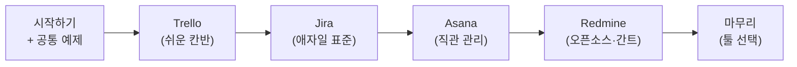

# 📘 시작하기 — 이 가이드 사용법

> 4개 협업툴(Jira·Asana·Redmine·Trello) **참고 가이드 문서**의 안내서입니다. 정해진 수업 일정이나 평가는 없습니다. 필요한 툴을 골라 그 가이드를 따라 하면 됩니다.

---

## 1. 이 가이드는 누구를 위한 것인가

- 게임 개발 **PM을 지망**하며, WBS·Gantt·Kanban **개념은 알지만 현업 툴은 안 써본** 사람
- 목표: 각 툴을 **혼자 직접 만져보고**, 면접에서 "쓸 줄 안다"고 말할 수 있는 수준에 도달

---

## 2. 이 가이드로 익히는 것

| 툴 | 핵심으로 익히는 것 |
|---|---|
| **Trello** | Kanban 보드 만들기·운영, 자동화 맛보기 |
| **Jira** | 에픽→스토리→스프린트(WBS·애자일), 보드·Timeline·리포트 |
| **Asana** | 섹션·태스크·서브태스크, 다중 뷰(List/Board/Calendar), 마일스톤 |
| **Redmine** | 직접 설치(Docker), 상위/하위 이슈(WBS), 버전, 내장 Gantt |
| **마무리** | 상황에 맞는 **툴 선택** 안목 |

---

## 3. 미리 알면 좋은 개념 (이미 안다면 건너뛰기)

WBS(작업분해)·Gantt(일정 막대)·Kanban(상태 보드) 개념을 안다고 가정합니다. 가물가물하면 [개념↔툴 매핑](01_PM_Concepts_to_Tools.md) 1절을 먼저 읽으세요.

---

## 4. 🧰 시작 전 준비 (계정·환경)

가이드를 따라 하려면 계정/환경이 필요합니다. 이메일 1개를 정해 공통으로 쓰면 편합니다.

- [ ] **이메일** (가급적 Google 계정 — 소셜 로그인 편리)
- [ ] **Chrome**(또는 Edge) 최신 브라우저
- [ ] **Trello** — https://trello.com/signup (무료)
- [ ] **Jira(Atlassian)** — https://www.atlassian.com/software/jira/free (무료, 사용자 10명)
- [ ] **Asana** — https://asana.com (무료 Personal)
- [ ] **Redmine** — Docker Desktop 설치 후 로컬 실행 ([Redmine 가이드](../04_Redmine/Guide.md) STEP 0)

> ⚠️ 연습은 **샘플/가짜 데이터**로 하세요. 실제 회사 기밀·타인 개인정보는 입력하지 않습니다.

---

## 5. 🧭 추천 읽는 순서

처음이면 이 순서가 가장 부드럽습니다. (급하면 **필요한 툴 하나만** 봐도 됩니다 — 각 가이드는 독립적입니다.)

1. [개념↔툴 매핑](01_PM_Concepts_to_Tools.md) · [툴 비교](02_Tool_Comparison_Matrix.md) · [공통 예제](03_Game_Project_Scenario.md)
2. [Trello](../01_Trello/Guide.md) → 3. [Jira](../02_Jira/Guide.md) → 4. [Asana](../03_Asana/Guide.md) → 5. [Redmine](../04_Redmine/Guide.md) → 6. [마무리](../05_Capstone/Capstone.md)

---

## 6. 각 가이드를 보는 법

각 툴 폴더에는 두 문서가 있습니다.
- **`Guide.md`** — 개념 + **단계별 따라하기**. 클릭 단위로 안내하고, 막히는 지점마다 해결법이 붙어 있습니다.
- **`Practice.md`** — **직접 손으로 만들어보는 연습**. 같은 게임 예제로, 가이드에서 배운 걸 스스로 재현합니다.

각 `Guide.md` 끝에는 **✅ 셀프 체크**(다 할 수 있는지 스스로 점검)와 **🎤 면접에서 이렇게 말하세요**(실제 멘트 예시)가 있습니다.

---

## 7. 공통 예제로 비교하며 익히기

모든 가이드는 같은 가상 게임 프로젝트 **[Pixel Dungeon](03_Game_Project_Scenario.md)** 을 사용합니다. 같은 작업을 4개 툴에 넣어보면 "이게 Trello에선 카드, Jira에선 스토리, Asana에선 태스크, Redmine에선 이슈" 라는 **대응 관계**가 눈에 들어옵니다 — 이게 이 가이드의 핵심 학습 경험입니다.

---

## 8. 무료 요금제 한계 (정직한 안내)

| 부족한 점 | 어디서 | 어떻게 |
|---|---|---|
| **Gantt가 유료** | Asana·Trello | Gantt는 **Jira(Timeline)·Redmine(내장)** 으로 익히고, Asana/Trello는 무료 뷰로 |
| **Kanban이 코어에 없음** | Redmine | 상태 필터로 의사 칸반, 필요 시 Agile 플러그인 |
| **사용자/보드 제한** | 무료 전반 | 혼자 학습엔 충분 |

> 핵심: **"하나의 무료 툴이 모든 걸 다 해주지 않는다."** 이 빈틈을 이해하는 것이 곧 PM의 **툴 선택 역량**입니다. → [툴 비교 문서](02_Tool_Comparison_Matrix.md)

---

*다음 → [개념↔툴 매핑](01_PM_Concepts_to_Tools.md)*
