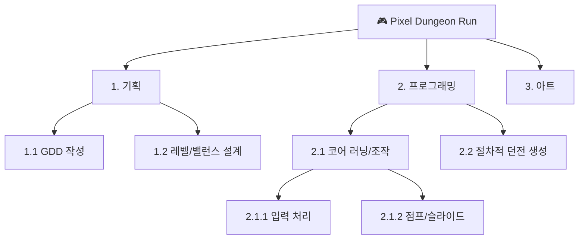
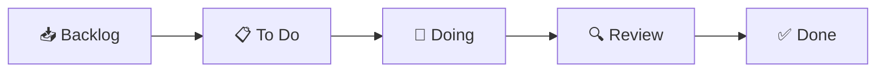
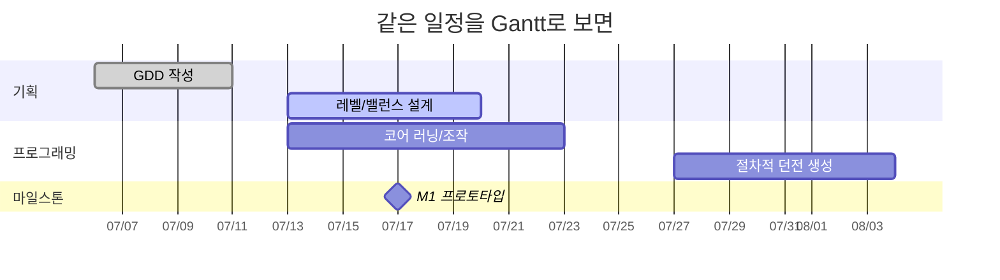

# 🔗 PM 개념 → 4개 툴 용어 매핑 (로제타표)

> 여러분은 이미 **WBS · Gantt · Kanban**을 압니다. 문제는 "현업 툴에서는 이 개념을 **뭐라고 부르고, 어디를 눌러야** 하는가"입니다. 이 문서가 그 다리를 놓아줍니다.

---

## 1. 개념 30초 복습 (이미 안다면 표만 보세요)

| 개념 | 한 줄 정의 | PM에게 의미 |
|---|---|---|
| **WBS** (작업분해구조) | 큰 목표를 *완료 가능한 작은 작업*으로 계층 분해 | "무엇을 해야 하는가"의 전체 지도 |
| **Gantt 차트** | 작업을 **시간축 막대**로 배치(시작~마감, 의존성) | "언제까지 무엇을"의 일정 |
| **Kanban 보드** | 작업 카드를 **상태 컬럼**(할 일→진행→완료)으로 이동 | "지금 흐름이 어디서 막혔는가"의 현황 |
| **Backlog** | 아직 안 한 작업들의 **우선순위 목록** | 다음에 무엇을 할지의 후보 풀 |
| **Sprint** | 1~4주 단위로 **정해진 작업 묶음**을 완수 | 짧은 주기의 실행 단위(스크럼) |
| **Milestone** | 의미 있는 **중간 목표 지점**(프로토타입·알파…) | 진척의 기준점 |

> 게임 개발에서: WBS = "이 게임을 만들려면 해야 할 모든 일", Gantt = "8주를 어떻게 쪼개나", Kanban = "이번 주 작업이 어디서 멈췄나".

---

## 2. 🌐 로제타표 — 같은 개념, 4개 용어

**가장 중요한 표입니다.** 한 개념이 툴마다 어떻게 불리는지 외우지 말고, 필요할 때 여기로 돌아오세요.

| 개념 | **Trello** | **Jira** | **Asana** | **Redmine** |
|---|---|---|---|---|
| 작업 1건 | **Card**(카드) | **Issue**(Story/Task) | **Task**(태스크) | **Issue**(이슈) |
| 하위 작업 | 체크리스트 항목 | **Sub-task** | **Subtask** | **하위 이슈**(상위/하위) |
| 작업 묶음(상위) | 보드/리스트 | **Epic**(에픽) | 섹션 / 포트폴리오 | **상위 이슈** / 카테고리 |
| 작업 분류 표식 | **Label** | **Label / Component** | **Tag / Custom Field** | **Tracker / Category** |
| 상태 컬럼(Kanban) | **List**(리스트) | **Column**(보드 컬럼) | **Section**(Board뷰) | (상태값, 코어엔 보드 없음) |
| 진행 상태값 | 리스트 위치로 표현 | **Status**(워크플로) | 커스텀 필드/섹션 | **Status**(워크플로) |
| 일정/Gantt | Timeline(Premium) | **Timeline**(로드맵) | **Timeline**(유료) | **Gantt**(내장) |
| 중간 목표 | (카드/라벨로 표현) | **Version / Sprint** | **Milestone** | **Version**(=마일스톤) |
| 반복 실행 주기 | (보드로 표현) | **Sprint**(스크럼) | (규칙/섹션으로) | (버전으로) |
| 담당자 | Member | **Assignee** | **Assignee** | **담당자(Assignee)** |
| 자동화 | **Butler** | **Automation** | **Rules** | (워크플로/플러그인) |

> 💡 **핵심 통찰**: 이름만 다를 뿐 *작업 1건 → 묶음 → 상태 → 일정*이라는 **뼈대는 동일**합니다. 한 툴을 제대로 익히면 나머지는 "용어 교체"에 가깝습니다.

---

## 3. WBS는 각 툴에서 이렇게 생깁니다

같은 게임 프로젝트의 작업분해(WBS)를 네 툴은 이렇게 표현합니다.

| 툴 | WBS 구현 방식 |
|---|---|
| **Jira** | `Epic`(1.기획) → `Story/Task`(1.1 GDD) → `Sub-task`(세부) — 계층이 가장 명확 |
| **Redmine** | `상위 이슈` → `하위 이슈`로 트리 구성, **Gantt에 그대로 반영** |
| **Asana** | `섹션`(대분류) → `태스크` → `서브태스크` |
| **Trello** | `보드/리스트`(대분류) → `카드`(작업) → `체크리스트`(세부) — 깊은 계층엔 약함 |

---

## 4. Kanban은 각 툴에서 이렇게 생깁니다

Kanban의 본질은 **상태 컬럼을 따라 작업이 왼쪽→오른쪽으로 흐르는 것**입니다.

| 툴 | Kanban 구현 | 비고 |
|---|---|---|
| **Trello** | 리스트 = 컬럼, 카드를 드래그 | ★ 가장 직관적(네이티브) |
| **Jira** | Kanban/Scrum **보드**, 컬럼=Status | ★ 워크플로와 연동 |
| **Asana** | **Board 뷰**, 섹션 = 컬럼 | ★ 무료 지원 |
| **Redmine** | 코어엔 보드 없음 → 상태 워크플로+필터, 또는 **Agile 플러그인** | △ 별도 설치 |

---

## 5. Gantt는 각 툴에서 이렇게 생깁니다

| 툴 | Gantt 구현 | 무료? |
|---|---|---|
| **Redmine** | **내장 Gantt** (시작/마감/진행률·상위하위 반영) | ✅ 무료 |
| **Jira** | **Timeline**(에픽 막대·의존성·마일스톤) | ✅ 무료(단일 프로젝트) |
| **Asana** | **Timeline / Gantt 뷰** | ❌ Starter 이상(유료) |
| **Trello** | **Timeline 뷰**(Premium) 또는 Power-Up | ❌ 유료/플러그인 |

> 그래서 본 과정의 **Gantt 핵심 실습은 Redmine + Jira**에서, Asana/Trello는 무료 범위(List/Calendar/Board)로 배우고 Gantt는 개념·체험판으로 보완합니다.

---

## 6. 한 장 요약

- **작업(Card/Issue/Task)** 을 만들고 → **계층(Epic/상위이슈/섹션)** 으로 묶고 → **상태 컬럼(Kanban)** 으로 흐름을 보고 → **시간축(Gantt/Timeline)** 으로 일정을 잡는다.
- 네 툴은 이 4단계를 **다른 이름·다른 강점**으로 제공한다.
- PM의 일은 *툴을 외우는 것*이 아니라 *상황에 맞는 툴로 이 4단계를 굴리는 것*이다.

*다음 문서 → [`02_Tool_Comparison_Matrix.md`](02_Tool_Comparison_Matrix.md): 그래서 어떤 상황에 어떤 툴을 고를 것인가.*
