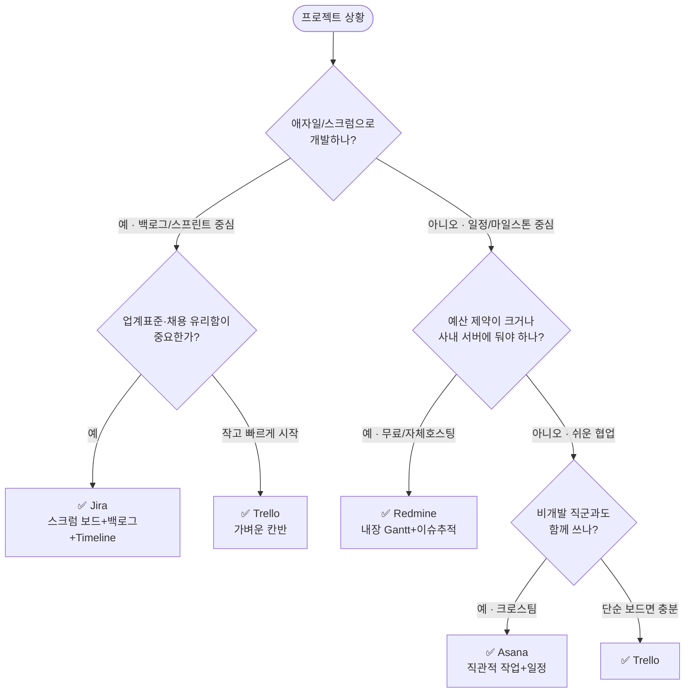

# ⚖️ 4개 툴 비교 & 선택 가이드

> "왜 4개나 배우나요?" — 현업에서는 **회사·팀·프로젝트마다 다른 툴**을 씁니다. PM의 역량은 *한 툴을 외우는 것*이 아니라 *상황에 맞는 툴을 고르고 빠르게 적응하는 것*입니다. 이 문서는 그 판단 기준을 줍니다.

---

## 1. 종합 비교표

| 기준 | **Trello** | **Jira** | **Asana** | **Redmine** |
|---|---|---|---|---|
| **한 줄 정체성** | 가장 쉬운 Kanban 보드 | 업계표준 애자일/스크럼 | 직관적 작업·일정관리 | 오픈소스 자체호스팅 트래커 |
| **잘 맞는 방식** | 단순 칸반·소규모 | 스크럼/칸반·중대형 | 크로스팀·일정중심 | 이슈추적·예산제약 |
| **Kanban** | ★★★ 네이티브 | ★★★ 보드+워크플로 | ★★☆ Board뷰(무료) | ★☆☆ 코어無(플러그인) |
| **Gantt/Timeline** | ★☆☆ Premium 유료 | ★★★ Timeline 무료 | ★★☆ 유료(Starter+) | ★★★ 내장(무료) |
| **WBS(계층)** | ★☆☆ 얕음 | ★★★ Epic→Story→Sub | ★★☆ 섹션→태스크→서브 | ★★★ 상위/하위 이슈 |
| **리포트** | ☆ (Power-Up) | ★★★ 번다운/벨로시티 | ★★ (유료 대시보드) | ★★ 내장 차트/쿼리 |
| **자동화** | ★★ Butler | ★★★ Automation | ★★ Rules | ★ 워크플로 |
| **호스팅** | 클라우드 | 클라우드/데이터센터 | 클라우드 | **자체 설치**(클라우드도 有) |
| **학습 곡선** | 매우 낮음 | 높음 | 낮음 | 중간(설치가 관문) |
| **무료 한도** | 보드10·협업자10 | 사용자10·2GB | 최대10명 | **무제한**(직접 운영) |
| **게임업계 체감** | 인디·소규모 흔함 | **스튜디오 표준급** | 마케팅/퍼블리싱팀 | 예산제약·사내서버 |

> 별점은 *무료 플랜 + 학습 목적* 기준의 상대 평가입니다.

---

## 2. 무료 요금제 — 검증된 사실 (공식 문서 기준)

툴 선택과 직결되는 부분이라 **공식 출처로 확인**했습니다(2026-06 기준).

| 툴 | 무료 플랜 핵심 한도 | 출처 |
|---|---|---|
| **Trello** | 워크스페이스당 **보드 10개**, **협업자 10명**, **Power-Up 무제한**(보드당 1개 제한 폐지), **Butler 250회/월**, 첨부 **파일당 10MB** | [Trello 플랜 안내](https://support.atlassian.com/trello/docs/which-trello-plan-is-best-for-me/) · [협업자 한도](https://support.atlassian.com/trello/docs/workspace-user-limit/) |
| **Jira** | **사용자 10명**, **2GB 저장소**, 이메일 100건/일, 커뮤니티 지원. **Timeline은 무료 포함**(단일 팀/프로젝트) | [Jira Cloud 플랜](https://support.atlassian.com/jira-cloud-administration/docs/explore-jira-cloud-plans/) · [데이터 한도](https://support.atlassian.com/jira-cloud-administration/docs/data-limits-and-guardrails/) |
| **Asana** | **최대 10명**(Personal), **List·Board·Calendar 무료**. **Timeline/Gantt는 Starter 이상(유료)** | [Asana 요금제](https://asana.com/pricing) · [프로젝트 뷰](https://asana.com/features/project-management/project-views) |
| **Redmine** | 오픈소스(GPL), **자체 호스팅 시 모든 한도 무제한**. 최신 안정판 **6.1.2**(2026-03), Docker 공식 이미지 제공 | [Redmine 다운로드](https://www.redmine.org/projects/redmine/wiki/download) · [Docker 이미지](https://hub.docker.com/_/redmine) |

> ⚠️ 요금제·한도는 변경될 수 있습니다. 사용 전 **공식 가격 페이지에서 재확인**하세요. 위 표의 출처 링크가 항상 최신입니다.

---

## 3. Kanban · Gantt · WBS, 무료로 어디까지?

### Kanban
- **무료로 완전 지원**: Trello, Jira, Asana(Board 뷰)
- **보완 필요**: Redmine — 코어에 보드 없음 → ① 상태 워크플로 + 저장된 필터로 의사 칸반, ② 심화 시 **Redmine Agile 플러그인**(무료 커뮤니티판/유료판 존재, 설치는 선택)

### Gantt / Timeline
- **무료로 지원**: **Jira(Timeline)**, **Redmine(내장 Gantt)** ← 이 가이드의 Gantt 핵심
- **유료**: Asana(Timeline=Starter+), Trello(Timeline=Premium)
  - 보완책: Asana는 **Calendar 뷰**로 일정 감각 + 14일 체험판으로 Timeline 1회 체험, Trello는 **Calendar Power-Up** 또는 Butler로 마감일 관리

### WBS(작업분해 계층)
- **가장 명확**: Jira(Epic→Story→Sub-task), Redmine(상위/하위 이슈)
- **충분**: Asana(섹션→태스크→서브태스크)
- **얕음**: Trello(리스트→카드→체크리스트) — 2~3단계 이상 분해엔 부적합

---

## 4. 🧭 "어떤 상황에 어떤 툴?" 의사결정

### 빠른 추천 요약

| 상황 | 1순위 | 이유 |
|---|---|---|
| 게임 스튜디오 정식 개발 | **Jira** | 스크럼·리포트·확장성, 업계 표준 |
| 인디/소규모/해커톤 | **Trello** | 5분 셋업, 학습비용 0 |
| 예산 0·사내서버 필수 | **Redmine** | 무료·오픈소스·내장 Gantt |
| 기획·마케팅·외주 협업 | **Asana** | 비개발자 친화 UX |

---

## 5. 게임업계 현실 맥락 (왜 Jira를 가장 깊게 보나)

- 많은 게임 스튜디오가 **Jira + Confluence(문서) + Bitbucket(코드)** 조합을 표준처럼 사용합니다. PM 채용 공고에 "Jira 사용 경험"이 자주 등장합니다 → **가장 비중 있게 학습**.
- **Trello**는 인디/프로토타이핑/소규모에서 폭넓게 쓰이고, Jira와 같은 Atlassian 계열이라 개념 전이가 쉽습니다 → **입문용 첫 툴**.
- **Redmine**은 라이선스 비용이 없고 자체 서버에 둘 수 있어, 보안·예산 제약이 큰 조직이나 사내 도구로 쓰입니다 → **오픈소스/Gantt 학습**.
- **Asana**는 개발 외 직군(기획·QA·마케팅·퍼블리싱)과의 협업에서 강점 → **크로스팀 협업 학습**.

> 결론: 4개를 모두 다뤄 본 PM은 *어느 팀에 가도* 빠르게 적응하고, *툴을 고를 줄 아는* PM이 됩니다.

---

## Sources (확인한 공식 문서)

- Jira: [플랜 비교](https://support.atlassian.com/jira-cloud-administration/docs/explore-jira-cloud-plans/), [데이터 한도](https://support.atlassian.com/jira-cloud-administration/docs/data-limits-and-guardrails/), [가격](https://www.atlassian.com/software/jira/pricing)
- Asana: [요금제](https://asana.com/pricing), [프로젝트 뷰](https://asana.com/features/project-management/project-views)
- Trello: [플랜 안내](https://support.atlassian.com/trello/docs/which-trello-plan-is-best-for-me/), [협업자 한도](https://support.atlassian.com/trello/docs/workspace-user-limit/)
- Redmine: [다운로드/버전](https://www.redmine.org/projects/redmine/wiki/download), [Docker 이미지](https://hub.docker.com/_/redmine), [사용자 가이드](https://www.redmine.org/projects/redmine/wiki/Guide)

*다음 문서 → [`03_Game_Project_Scenario.md`](03_Game_Project_Scenario.md): 모든 가이드에 공통으로 쓰는 게임 예제.*
