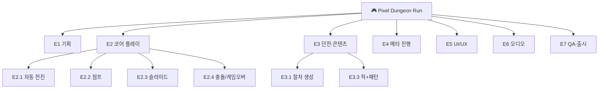
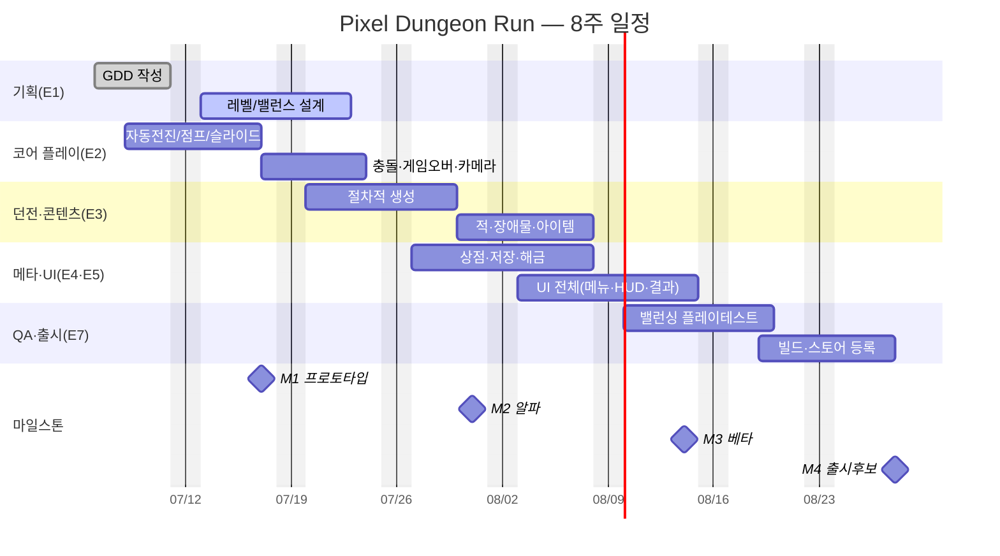

# 🎮 공통 실습 시나리오 — "Pixel Dungeon Run"

> **모든 툴 실습(Trello·Jira·Asana·Redmine)은 이 하나의 게임 프로젝트를 사용합니다.** 같은 데이터를 네 툴에 넣어보기 때문에, 학생은 "같은 일을 툴마다 어떻게 표현하는지"를 직접 비교하게 되고, 산출물도 서로 비교·평가가 가능합니다.

---

## 1. 게임 한눈에

| 항목 | 내용 |
|---|---|
| **제목(가제)** | Pixel Dungeon Run |
| **장르** | 캐주얼 로그라이트 러너 (세로형 모바일) |
| **한 줄 소개** | 매번 바뀌는 던전을 한 손으로 달리며 최대한 멀리 살아남는 게임 |
| **플랫폼** | iOS / Android |
| **핵심 조작** | 탭=점프, 길게누르기=슬라이드 (원버튼) |
| **개발 기간** | **8주** (2026-07-06 월 ~ 2026-08-28 금) |
| **개발 방식** | 2주 단위 스프린트 4회 + 마일스톤 4개 |

---

## 2. 팀 구성 (5명)

| 역할 | 약칭 | 책임 영역 |
|---|---|---|
| **PM / 기획리드** | PM | 일정·백로그·진행관리(= **여러분의 역할**) |
| 클라이언트 프로그래머 | DEV | 코어 플레이·시스템 구현 |
| 게임 디자이너 | GD | 레벨·밸런스·콘텐츠 설계 |
| 아티스트 | ART | 캐릭터·타일·UI·이펙트 |
| QA | QA | 테스트·버그추적·밸런싱 검증 |

> 실습에서 **담당자(Assignee)** 지정 시 위 5개 역할을 사용하세요. 혼자 실습할 때도 카드/이슈에 역할을 배정해 "누가 무엇을" 감각을 익힙니다.

---

## 3. 마일스톤 (= Jira Version/Sprint, Asana Milestone, Redmine Version)

| 마일스톤 | 시점 | 완료 기준(Definition of Done) |
|---|---|---|
| **M1 프로토타입** | 2주차 말 · 07/17(금) | 코어 러닝 1분 플레이 가능(점프·슬라이드·게임오버) |
| **M2 알파(수직 슬라이스)** | 4주차 말 · 07/31(금) | 던전 생성 + 적 + 아이템으로 1스테이지 완주 |
| **M3 베타(콘텐츠 완성)** | 6주차 말 · 08/14(금) | 메타 진행(상점·해금·저장) + UI 전체 완성 |
| **M4 출시 후보(RC)** | 8주차 말 · 08/28(금) | 밸런싱 + 빌드 + 스토어 등록 자료 완료 |

---

## 4. 에픽(대분류) — WBS의 최상위 7개

| # | 에픽 | 설명 |
|:--:|---|---|
| E1 | **기획** | GDD, 레벨/밸런스 설계 문서 |
| E2 | **코어 플레이** | 자동 전진·점프·슬라이드·카메라·충돌 |
| E3 | **던전 & 콘텐츠** | 절차적 생성, 적, 장애물, 아이템 |
| E4 | **메타 진행** | 상점, 업그레이드 해금, 저장/로드 |
| E5 | **UI/UX** | 메인메뉴, HUD, 결과화면, 상점 UI |
| E6 | **오디오** | BGM, 효과음(SFX) |
| E7 | **QA & 출시** | 테스트 계획, 버그추적, 밸런싱, 빌드, 스토어 |

---

## 5. 📋 표준 WBS (작업분해구조)

> **이 표가 백로그의 원천입니다.** 각 툴에서 이 항목들을 이슈/카드/태스크로 만듭니다. 코드(E2.1 등)는 추적·비교용입니다.

```
E1. 기획
   E1.1 GDD(게임 디자인 문서) 작성
   E1.2 레벨 난이도 곡선 설계
   E1.3 밸런스 수치표(속도·점수·코인) 작성
E2. 코어 플레이
   E2.1 플레이어 자동 전진
   E2.2 점프(탭) 입력 처리
   E2.3 슬라이드(길게누르기) 입력 처리
   E2.4 충돌/게임오버 판정
   E2.5 따라가는 카메라
E3. 던전 & 콘텐츠
   E3.1 절차적 바닥/플랫폼 생성
   E3.2 장애물 배치 규칙
   E3.3 적 1종 + 이동 패턴
   E3.4 코인/아이템 획득
   E3.5 난이도 점증 로직
E4. 메타 진행
   E4.1 코인 재화 저장/로드
   E4.2 업그레이드 상점(속도·부활 등)
   E4.3 캐릭터 스킨 해금
E5. UI/UX
   E5.1 메인 메뉴
   E5.2 인게임 HUD(점수·코인·거리)
   E5.3 게임오버/결과 화면
   E5.4 상점 화면
E6. 오디오
   E6.1 BGM 1곡
   E6.2 핵심 SFX(점프·획득·충돌)
E7. QA & 출시
   E7.1 테스트 계획서
   E7.2 버그 추적/수정
   E7.3 밸런싱 플레이테스트
   E7.4 안드로이드/iOS 빌드
   E7.5 스토어 등록 자료(아이콘·스크린샷·설명)
```



---

## 6. 📅 표준 일정 (Gantt 실습의 기준 데이터)

Redmine·Jira의 Gantt/Timeline 실습은 아래 일정을 입력합니다.



---

## 7. 🏃 표준 Sprint 1 백로그 (Kanban/스크럼 실습의 기준 데이터)

> **Sprint 1 (2주, 07/06~07/17) 목표 = M1 프로토타입.** Trello 보드, Jira 백로그/스프린트, Asana Board뷰 실습에서 아래 스토리를 사용합니다.

| ID | 사용자 스토리 (User Story) | 에픽 | 담당 | 포인트 | 우선순위 |
|---|---|:--:|:--:|:--:|:--:|
| US-01 | 플레이어 캐릭터가 자동으로 전진한다 | E2 | DEV | 3 | High |
| US-02 | 화면을 탭하면 캐릭터가 점프한다 | E2 | DEV | 2 | High |
| US-03 | 길게 누르면 슬라이드한다 | E2 | DEV | 2 | High |
| US-04 | 장애물에 부딪히면 게임오버된다 | E2 | DEV | 3 | High |
| US-05 | 바닥/플랫폼이 절차적으로 생성된다(기초) | E3 | DEV | 5 | High |
| US-06 | 달린 거리·코인이 점수로 집계된다 | E3 | DEV | 2 | Medium |
| US-07 | 게임오버 시 결과 화면이 표시된다 | E5 | DEV/ART | 3 | Medium |
| US-08 | 점프·획득·충돌 효과음이 재생된다 | E6 | ART | 2 | Low |
| US-09 | 1분 플레이 가능한 프로토타입 빌드를 만든다 | E7 | DEV | 3 | High |

- **스프린트 용량 예시**: 합계 25포인트. 팀 벨로시티를 22로 가정하면 US-08(Low)은 다음 스프린트로 미룰 후보.
- **칸반 컬럼(워크플로)**: `Backlog → To Do → In Progress → Review → Done`

---

## 8. 이 시나리오를 각 툴 실습에서 쓰는 법

| 툴 | 이 시나리오로 만드는 것 |
|---|---|
| **Trello** (Day1) | Sprint 1 백로그(US-01~09)를 카드로, 워크플로를 리스트로 → **Kanban 보드** |
| **Jira** (Day2~3) | 에픽 E1~E7 + 스토리(WBS)를 백로그로 → **Sprint 1** 생성, **Timeline**에 일정 |
| **Asana** (Day3) | 에픽=섹션, 작업=태스크, 마일스톤 M1~M4 → **List/Board/Calendar** |
| **Redmine** (Day4) | E*를 상위/하위 이슈(WBS), M1~M4를 버전 → **내장 Gantt** |

> 같은 US-05("절차적 생성")가 Trello에선 카드, Jira에선 Story, Asana에선 Task, Redmine에선 Issue가 됩니다. **이 일대일 대응을 눈으로 확인하는 것이 이 과정의 핵심 학습 경험입니다.**

---

*기반 문서 끝. 이제 [`01_Trello/Guide.md`](../01_Trello/Guide.md)부터 실제 툴 실습을 시작합니다.*
