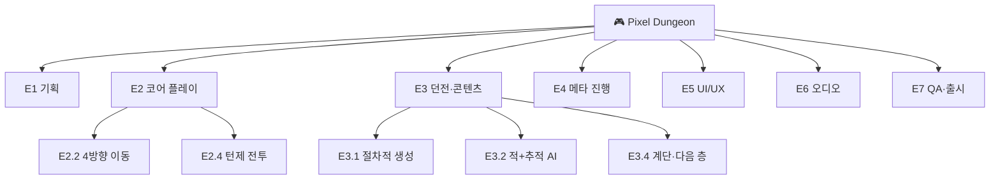
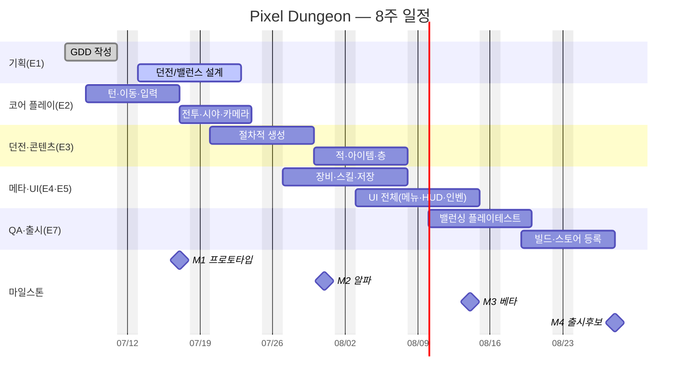

# 🎮 공통 예제 시나리오 — "Pixel Dungeon"

> **모든 가이드(Trello·Jira·Asana·Redmine)는 이 하나의 게임 프로젝트를 사용합니다.** 같은 데이터를 네 툴에 넣어보면 "같은 일을 툴마다 어떻게 표현하는지"가 한눈에 비교됩니다.

---

## 1. 게임 한눈에

| 항목 | 내용 |
|---|---|
| **제목** | Pixel Dungeon |
| **장르** | **로그라이크** (턴제 던전 탐험) |
| **한 줄 소개** | 매번 새로 생성되는 던전을 한 칸씩 탐험하며, 적과 싸우고 아이템을 모아 더 깊이 내려가는 게임. **죽으면 처음부터(영구 죽음).** |
| **플랫폼** | PC / 모바일 |
| **핵심 루프** | 이동(턴제) → 전투 → 아이템 획득 → 계단으로 다음 층 → (사망 시 처음부터) |
| **개발 기간** | **8주** (2026-07-06 월 ~ 2026-08-28 금) |
| **개발 방식** | 2주 단위 스프린트 4회 + 마일스톤 4개 |

---

## 2. 팀 구성 (5명)

| 역할 | 약칭 | 책임 영역 |
|---|---|---|
| **PM / 기획리드** | PM | 일정·백로그·진행관리(= **여러분의 역할**) |
| 클라이언트 프로그래머 | DEV | 턴 시스템·전투·던전 생성 구현 |
| 게임 디자이너 | GD | 던전·밸런스·콘텐츠 설계 |
| 아티스트 | ART | 캐릭터·타일·UI·이펙트 |
| QA | QA | 테스트·버그추적·밸런싱 검증 |

> 가이드를 따라 할 때 **담당자(Assignee)** 지정에는 위 5개 역할을 사용하세요.

---

## 3. 마일스톤

| 마일스톤 | 시점 | 완료 기준(Definition of Done) |
|---|---|---|
| **M1 프로토타입** | 2주차 말 · 07/17(금) | 1층에서 이동·전투·게임오버가 되는 플레이 가능 빌드 |
| **M2 알파(수직 슬라이스)** | 4주차 말 · 07/31(금) | 던전 3층 + 적 2종 + 아이템/인벤토리 |
| **M3 베타(콘텐츠 완성)** | 6주차 말 · 08/14(금) | 메타 진행(장비·스킬·해금·저장) + UI 전체 완성 |
| **M4 출시 후보(RC)** | 8주차 말 · 08/28(금) | 밸런싱 + 빌드 + 스토어 등록 자료 완료 |

---

## 4. 에픽(대분류) — WBS의 최상위 7개

| # | 에픽 | 설명 |
|:--:|---|---|
| E1 | **기획** | GDD, 던전/밸런스 설계 |
| E2 | **코어 플레이** | 턴 시스템·이동·전투·시야 |
| E3 | **던전 & 콘텐츠** | 절차적 생성, 적, 아이템, 층 |
| E4 | **메타 진행** | 장비, 스킬, 해금, 저장/로드 |
| E5 | **UI/UX** | 메인메뉴, HUD, 인벤토리, 게임오버 |
| E6 | **오디오** | BGM, 효과음(SFX) |
| E7 | **QA & 출시** | 테스트, 버그추적, 밸런싱, 빌드, 스토어 |

---

## 5. 📋 표준 WBS (작업분해구조)

```
E1. 기획
   E1.1 GDD(게임 디자인 문서) 작성
   E1.2 던전 난이도 곡선 설계
   E1.3 밸런스 수치표(HP·공격력·드롭률) 작성
E2. 코어 플레이
   E2.1 턴 시스템(플레이어→적 순서)
   E2.2 플레이어 4방향 이동
   E2.3 공격/상호작용 입력
   E2.4 턴제 전투(공격·피격·HP)
   E2.5 시야(FOV)·카메라
E3. 던전 & 콘텐츠
   E3.1 절차적 방·복도 생성
   E3.2 적 1종 + 추적 AI
   E3.3 아이템 줍기 & 인벤토리
   E3.4 계단 & 다음 층 이동
   E3.5 층별 난이도 점증
E4. 메타 진행
   E4.1 장비 장착(무기·방어구)
   E4.2 스킬/직업
   E4.3 해금 & 저장/로드
E5. UI/UX
   E5.1 메인 메뉴
   E5.2 인게임 HUD(HP·층·미니맵)
   E5.3 인벤토리 화면
   E5.4 게임오버(사망) 화면
E6. 오디오
   E6.1 BGM 1곡
   E6.2 핵심 SFX(이동·공격·획득)
E7. QA & 출시
   E7.1 테스트 계획서
   E7.2 버그 추적/수정
   E7.3 밸런싱 플레이테스트
   E7.4 안드로이드/iOS 빌드
   E7.5 스토어 등록 자료(아이콘·스크린샷·설명)
```



---

## 6. 📅 표준 일정 (Gantt 연습의 기준 데이터)



---

## 7. 🏃 표준 Sprint 1 백로그 (Kanban/스크럼 연습의 기준 데이터)

> **Sprint 1 (2주, 07/06~07/17) 목표 = M1 프로토타입.** Trello 보드, Jira 백로그/스프린트, Asana Board뷰 연습에서 아래 스토리를 사용합니다.

| ID | 사용자 스토리 (User Story) | 에픽 | 담당 | 포인트 | 우선순위 |
|---|---|:--:|:--:|:--:|:--:|
| US-01 | 플레이어가 한 칸씩 이동한다(턴제) | E2 | DEV | 3 | High |
| US-02 | 공격/상호작용 입력을 처리한다 | E2 | DEV | 2 | High |
| US-03 | 벽·이동 충돌을 처리한다 | E2 | DEV | 2 | High |
| US-04 | 적과 턴제 전투로 HP를 주고받는다 | E2 | DEV | 3 | High |
| US-05 | 던전(방·복도)이 절차적으로 생성된다 | E3 | DEV | 5 | High |
| US-06 | 적 1종이 플레이어를 추적한다 | E3 | DEV | 2 | Medium |
| US-07 | 사망 시 게임오버 화면이 표시된다 | E5 | DEV/ART | 3 | Medium |
| US-08 | 이동·공격·획득 효과음이 재생된다 | E6 | ART | 2 | Low |
| US-09 | 1층 플레이 가능한 프로토타입 빌드를 만든다 | E7 | DEV | 3 | High |

- **스프린트 용량 예시**: 합계 25포인트. 팀 벨로시티를 22로 가정하면 US-08(Low)은 다음 스프린트로 미룰 후보.
- **칸반 컬럼(워크플로)**: `Backlog → To Do → In Progress → Review → Done`

---

## 8. 이 시나리오를 각 가이드에서 쓰는 법

| 툴 | 이 시나리오로 만드는 것 |
|---|---|
| **Trello** | Sprint 1 백로그(US-01~09)를 카드로, 워크플로를 리스트로 → **Kanban 보드** |
| **Jira** | 에픽 E1~E7 + 스토리(WBS)를 백로그로 → **Sprint 1** 생성, **Timeline**에 일정 |
| **Asana** | 에픽=섹션, 작업=태스크, 마일스톤 M1~M4 → **List/Board/Calendar** |
| **Redmine** | E*를 상위/하위 이슈(WBS), M1~M4를 버전 → **내장 Gantt** |

> 같은 US-05("던전 생성")가 Trello에선 카드, Jira에선 Story, Asana에선 Task, Redmine에선 Issue가 됩니다. **이 일대일 대응을 눈으로 확인하는 것이 이 가이드의 핵심 학습 경험입니다.**

---

*여기까지가 공통 안내입니다. 이제 [`01_Trello/Guide.md`](../01_Trello/Guide.md)부터 각 툴 가이드를 시작하세요.*
