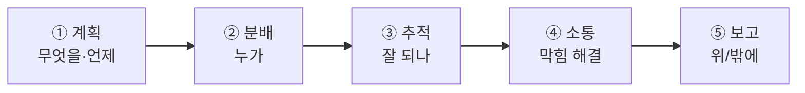

# 📚 PM 기초 · 1단계 — 게임 PM의 일

> 🎯 **개요** — 게임 개발 PM이 **무슨 일**을 하고 **무엇을 책임**지는지 이해합니다. 코딩이나 그림이 아니라 **팀이 제때 만들도록 돕는 사람**입니다.

🎬 상황 · Pixelforge Studio · Day 1, 오전
첫 팀 회의가 30분 뒤다. 대표가 말한다. "<b>Pixel Dungeon Run</b>, 8주 안에 출시했으면 해요. 일정과 진행은 PM님이 챙겨주세요." 개발자·아티스트·기획자·QA가 당신을 본다. 당신이 할 일은 <b>게임을 직접 만드는 것이 아니라, 이 팀이 8주 안에 만들도록 굴러가게 하는 것</b>이다.
👥 <b>팀 미션</b> — 지금 우리 팀의 역할(PM 1 · 개발 · 아트 · 기획 · QA)을 정하세요.

---

## 🧑‍💼 PM이 하는 5가지 일

| 일 | 한 줄 |
|---|---|
| **① 계획** | 할 일을 쪼개고(WBS) 일정을 잡는다 |
| **② 분배** | 누가 무엇을 할지 정한다 |
| **③ 추적** | 진행 상황을 본다(보드·번다운) |
| **④ 소통** | 막힌 곳을 풀고 팀을 연결한다 |
| **⑤ 보고** | 경영진·외부에 진척을 알린다 |

## ⚖️ PM의 책임 vs PM이 하지 않는 일

- ✅ **책임**: 일정·우선순위·진행 가시화, 리스크 조기 발견, 팀 커뮤니케이션
- ❌ **하지 않음**: 직접 코딩/아트(전문가의 몫). PM은 **판단하고 돕는** 사람

> 💡 한 문장: **"PM은 만드는 사람이 아니라, 잘 만들어지게 하는 사람."**

---

## ✅ 확인

- [ ] PM의 5가지 일을 말할 수 있다
- [ ] 우리 팀의 역할을 정했다

---

👉 다음: **[2단계 · 기본 용어](Step2.md)**
