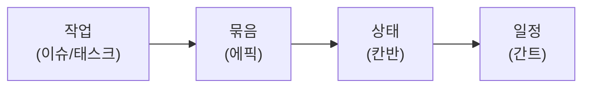

# 📚 PM 기초 · 2단계 — 기본 용어

> 🎯 **개요** — 회의에서 쏟아지는 PM 핵심 용어를 익힙니다. 외우지 말고 **"작업 → 묶음 → 상태 → 일정"** 흐름으로 이해하세요.

🎬 상황 · 입사 첫날, 첫 회의
<ul>
<li>회의가 시작되자 낯선 말이 쏟아집니다.</li>
<li>"이번 <b>스프린트</b>엔 <b>백로그</b> 상위 5개만 합시다."</li>
<li>"그 기능은 <b>에픽</b>이 너무 커요. <b>WBS</b>로 쪼개죠."</li>
<li>절반은 못 알아듣겠습니다. 다음 회의 전까지 이 용어들을 내 것으로 만듭니다.</li>
</ul>
👥 <b>팀 미션</b> — 각자 용어 1~2개를 맡아 30초로 설명해보세요.

---

## 📖 꼭 아는 8개 용어

| 용어 | 한 줄 뜻 | 게임 예 |
|---|---|---|
| **WBS** | 큰 일을 작은 작업으로 쪼갠 구조 | "던전 생성"을 5개 작업으로 |
| **에픽(Epic)** | 여러 작업을 묶는 큰 덩어리 | "코어 플레이" |
| **이슈/태스크/스토리** | 작업 1건 | "플레이어 한 칸 이동" |
| **백로그(Backlog)** | 할 일 우선순위 목록 | 아직 안 한 기능들 |
| **스프린트(Sprint)** | 1~4주짜리 작업 묶음 | 이번 2주에 할 것 |
| **마일스톤(Milestone)** | 중요한 중간 목표 지점 | M1 프로토타입(2주차) |
| **칸반(Kanban)** | 상태로 흐르는 작업 보드 | 할 일→하는 중→완료 |
| **간트(Gantt)** | 시간축 막대 일정표 | 8주 로드맵 |

## 🔗 이 4개가 뼈대입니다

> 💡 툴마다 이름이 조금씩 다릅니다(카드/이슈/태스크…). 그 대응표는 [개념 → 툴 매핑](../00_Overview/01_PM_Concepts_to_Tools.md) 에서 확인하세요.

---

## ✅ 확인

- [ ] 8개 용어를 한 줄로 설명할 수 있다
- [ ] "작업→묶음→상태→일정" 흐름을 말할 수 있다

---

👉 다음: **[3단계 · 협업툴 한눈에](Step3.md)**
