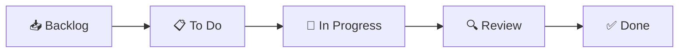
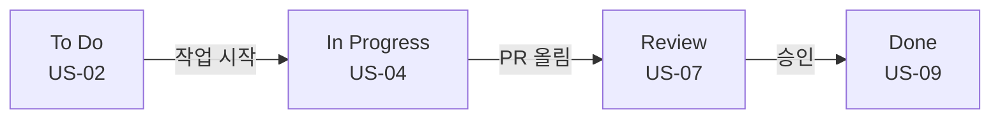

# 🟦 Day 1 — Trello 가이드 (Kanban 입문)

> **오늘의 목표**: Trello로 게임 프로젝트의 **Kanban 보드**를 만들고, 카드를 워크플로에 따라 흐르게 하며, 자동화(Butler) 1개를 설정한다.
> **산출물(D1)**: "Pixel Dungeon Run · Sprint 1" Kanban 보드 → 실습은 [`Practice.md`](Practice.md)

---

## 1. Trello를 언제 쓰나

- **가장 쉬운 Kanban 보드.** 카드를 끌어다 놓는 것만으로 작업 흐름이 보입니다.
- 셋업 5분, 학습비용 거의 0 → **인디·소규모·프로토타입·해커톤**에 최적.
- 한계: 깊은 WBS 계층, 본격 Gantt, 스프린트 리포트는 약함(→ 그건 Jira/Redmine에서).
- Atlassian 계열이라 **Jira로 가는 디딤돌**로도 좋습니다.

---

## 2. 핵심 구조 — 이 4단어면 끝

```
Workspace(워크스페이스)
   └─ Board(보드)        ← 프로젝트 1개 = 보드 1개
        └─ List(리스트)   ← 워크플로 단계 (Backlog/To Do/Doing/Review/Done)
             └─ Card(카드) ← 작업 1건 (라벨·체크리스트·마감·담당자)
```

완성하면 이런 모습이 됩니다 👇 (목업)


> 🖼️ 공식 스크린샷 자리 — Trello: 실제 보드 화면
> 캡션: "리스트(컬럼)와 카드로 구성된 실제 Trello 보드"
> 공식 출처: https://trello.com/guide/trello-101 ← 이 페이지의 보드 화면을 캡처

| 구조 | 개념(로제타) | 게임 프로젝트에서 |
|---|---|---|
| Board | 프로젝트 | "Pixel Dungeon Run · Sprint 1" |
| List | Kanban 상태 컬럼 | Backlog → To Do → In Progress → Review → Done |
| Card | 작업 1건(Issue/Task) | US-01 자동 전진, US-04 충돌… |
| Label | 분류 | 에픽(E2 코어, E3 던전…) |
| Checklist | 하위 작업 | US-05의 세부 단계 |

---

## 3. STEP 0 — 계정 만들기 (무료)

1. https://trello.com/signup 접속
2. 이메일(또는 Google 계정)로 가입 → 이메일 인증
3. 로그인하면 첫 **워크스페이스** 생성 화면이 나옵니다. 이름 예: `GameDev Academy`, 유형 `Education` 또는 `Other`

> 🖼️ 공식 스크린샷 자리 — Trello: 가입/첫 워크스페이스 생성
> 공식 출처: https://support.atlassian.com/trello/docs/creating-a-new-board/

> ✅ **확인 포인트**: 좌측 상단에 워크스페이스 이름이 보이면 성공.
> ⚠️ 무료 워크스페이스는 **보드 10개·협업자 10명** 한도. 학습엔 충분합니다.

---

## 4. STEP 1 — 보드 만들기

1. 워크스페이스 화면에서 **`Create` → `Create board`**
2. **Board title**: `Pixel Dungeon Run - Sprint 1`
3. Background(배경)·Visibility(공개범위: Workspace) 설정 후 **Create**

> 🖼️ 공식 스크린샷 자리 — Trello: 보드 생성 다이얼로그
> 공식 출처: https://trello.com/guide/create-project

---

## 5. STEP 2 — 리스트로 워크플로 만들기

리스트 = **Kanban 컬럼**입니다. 왼쪽→오른쪽이 작업의 진행 방향입니다.

1. `Add a list` 클릭 → 아래 5개를 차례로 추가:
   `Backlog` · `To Do` · `In Progress` · `Review` · `Done`
2. 리스트 제목을 클릭하면 이름 수정/이동 가능



> 💡 워크플로는 팀이 합의한 만큼만. 처음엔 `To Do / Doing / Done` 3개로 시작해도 됩니다.

---

## 6. STEP 3 — 카드(작업) 추가

1. `Backlog` 리스트 하단 **`Add a card`** 클릭
2. 공통 시나리오의 Sprint 1 스토리를 카드 제목으로 입력
   예: `US-01 플레이어 자동 전진`, `US-02 점프(탭)` …
3. Enter로 연속 추가 가능

> 🖼️ 공식 스크린샷 자리 — Trello: 카드 추가
> 공식 출처: https://support.atlassian.com/trello/docs/creating-cards/

---

## 7. STEP 4 — 카드 디테일 (현업 감각의 핵심)

카드를 **클릭**하면 상세 패널이 열립니다. 여기서 PM이 관리하는 정보를 채웁니다.

| 기능 | 위치 | 게임 프로젝트 활용 |
|---|---|---|
| **Labels(라벨)** | 카드 우측 `Labels` | 에픽 색상 분류(E2 파랑, E3 초록…) |
| **Checklist(체크리스트)** | `Checklist` | 하위 작업(US-05: 바닥생성→플랫폼→난이도) |
| **Due date(마감일)** | `Dates` | 스프린트 종료일(07/17) |
| **Members(담당자)** | `Members` | DEV/ART/QA 배정 |
| **Attachment(첨부)** | `Attachment` | 기획서·레퍼런스 링크 |

1. 라벨: `Labels` → 색상 선택 후 이름(`E2 코어`) 지정 → 체크
2. 체크리스트: `Checklist` → 항목 추가 → 완료 시 체크(진행률 % 자동)
3. 마감: `Dates` → Due date 지정
4. 담당자: `Members` → 팀원 선택(혼자면 본인)

> 🖼️ 공식 스크린샷 자리 — Trello: 카드 상세(라벨·체크리스트·마감)
> 공식 출처: https://support.atlassian.com/trello/docs/adding-checklists-to-cards/

> ✅ **확인 포인트**: 카드 앞면에 라벨 색·체크리스트(☑1/3)·마감일 배지가 보이면 성공.

---

## 8. STEP 5 — 칸반 운영: 카드를 흐르게 하기

- 작업을 시작하면 카드를 **드래그**해서 `To Do → In Progress`로 이동
- 리뷰 요청 시 `Review`, 완료 시 `Done`
- 이 "이동"이 곧 **진척 보고**입니다. 매일 보드만 보면 누가·무엇이·어디서 막혔는지 한눈에.



> 💡 **WIP 제한**(In Progress에 카드 N개 이하) 개념을 소개하세요. 무료에선 List Limits Power-Up로 시각적 경고를 줄 수 있습니다.

---

## 9. STEP 6 — Butler 자동화 1개 만들기

반복 작업을 자동화합니다. 무료는 **월 250회 실행** 한도(학습에 충분).

**예제: "카드를 Done으로 옮기면 완료 표시 + 모든 체크리스트 완료"**

1. 보드 우측 **`Automation`(Butler)** 열기 → `Rules` → `Create Rule`
2. **Trigger**: `when a card is moved to list "Done"`
3. **Action**: `mark the due date as complete` (+ 원하면 `check all items in checklist`)
4. `Save`

**또 다른 쉬운 예제**: `매주 월요일 오전 9시, "To Do" 리스트 상단에 "주간 회의" 카드 추가`(Scheduled command).

> 🖼️ 공식 스크린샷 자리 — Trello: Butler 규칙 생성
> 공식 출처: https://trello.com/butler-automation

> ✅ **확인 포인트**: 카드를 Done으로 옮겼을 때 규칙이 동작하면 성공.

---

## 10. STEP 7 — Power-Up & 무료 한도

- **Power-Up** = 보드 확장 기능. 보드 메뉴 → `Power-Ups`에서 추가. 무료도 **개수 제한 없음**.
- 일정 감각이 필요하면 **Calendar Power-Up**으로 마감일을 달력에 표시(무료 범위 내).
- 본격 **Timeline(Gantt) 뷰**는 **Premium(유료)**. → Gantt는 Jira/Redmine에서 배웁니다.

> 🖼️ 공식 스크린샷 자리 — Trello: Power-Ups 갤러리
> 공식 출처: https://trello.com/power-ups

---

## 11. 개념 매핑 복습

| 오늘 배운 것 | = PM 개념 |
|---|---|
| 리스트로 카드 이동 | **Kanban** |
| 라벨로 에픽 분류 / 체크리스트 | **WBS(얕은 계층)** |
| 마감일 + Calendar Power-Up | 일정(간이) |
| Butler 규칙 | 자동화/프로세스 |

---

## 12. ⚠️ 자주 막히는 곳 (함정 노트)

- **보드를 너무 잘게 쪼갬**: 프로젝트 1개 = 보드 1개. 스프린트는 리스트나 라벨로 구분.
- **리스트를 작업으로 착각**: 리스트는 *상태*, 작업은 *카드*입니다.
- **무료 한도**: 보드 10·협업자 10. 조별 실습은 한 명의 워크스페이스에 모두 초대.
- **Gantt 기대 금지**: Trello 무료엔 Gantt 없음. 마감일+Calendar로 대체.

---

## 13. 다음 단계

이제 [`Practice.md`](Practice.md)에서 **직접** Sprint 1 보드를 완성하세요.

### 📚 참고한 공식 문서
- [Trello 101 가이드](https://trello.com/guide/trello-101) · [프로젝트 만들기](https://trello.com/guide/create-project)
- [카드/체크리스트 추가](https://support.atlassian.com/trello/docs/adding-checklists-to-cards/)
- [Butler 자동화](https://trello.com/butler-automation) · [Power-Ups](https://trello.com/power-ups)
- [플랜/한도 안내](https://support.atlassian.com/trello/docs/which-trello-plan-is-best-for-me/)
