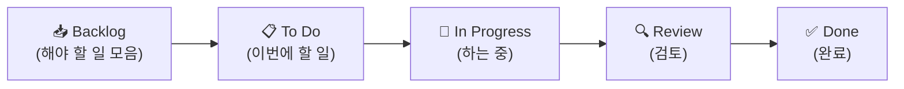
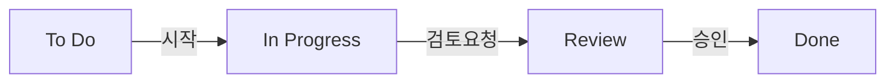

# 🟦 Trello 완전 가이드 — 처음이라면 이대로 따라오세요

> 📌 **이 문서는 수업 교안이 아니라, 혼자 보고 그대로 따라 하는 참고 가이드입니다.**
> Trello를 한 번도 안 써봤어도, 이 문서대로만 따라 하면 **면접에서 "Trello로 칸반 보드를 직접 만들고 운영할 줄 안다"** 고 말할 수 있는 수준까지 갑니다.
>
> ⏱️ 예상 시간: 처음이면 **40~60분** · 🧰 준비물: 인터넷, 이메일 1개 · 💳 비용: **무료**

---

## 🎯 이 가이드를 끝내면 할 수 있게 되는 것

- [ ] Trello 계정을 만들고 **보드(프로젝트)** 를 생성한다
- [ ] **리스트(워크플로 단계)** 와 **카드(작업)** 로 칸반 보드를 구성한다
- [ ] 카드에 **라벨·체크리스트·마감일·담당자** 를 붙여 관리한다
- [ ] 카드를 드래그해 **작업 상태를 흐르게** 한다
- [ ] **Butler 자동화** 규칙을 1개 만든다

> 이 5가지가 곧 아래 [🎤 면접에서 이렇게 말하세요](#-면접에서-이렇게-말하세요) 의 근거가 됩니다.

---

## 🧭 시작 전에 — Trello가 뭐예요? (1분만 읽기)

화이트보드에 **포스트잇을 붙였다 뗐다** 하는 걸 상상하세요. 그게 Trello입니다.
- 보드(화이트보드) 위에 **세로 줄(리스트)** 을 만들고, 그 줄에 **포스트잇(카드)** 을 붙입니다.
- 일이 진행되면 포스트잇을 **오른쪽 줄로 옮깁니다.** 이게 전부예요.

세상에서 **가장 쉬운 칸반 도구**라 처음 배우기에 딱 좋습니다. (그래서 이 가이드의 1번 툴입니다.)

**기억할 단어 딱 4개:**
```
Workspace(작업공간)
   └─ Board(보드)      = 프로젝트 하나
        └─ List(리스트)  = 진행 단계 (할 일 → 하는 중 → 완료)
             └─ Card(카드) = 작업 하나
```

완성하면 이런 모습이 됩니다 👇


> 🖼️ 공식 스크린샷 자리 — Trello: 실제 보드 화면
> 캡션: "리스트(세로 줄)와 카드(포스트잇)로 구성된 실제 Trello 보드"
> 공식 출처: https://trello.com/guide/trello-101 ← 이 페이지의 보드 화면을 캡처해 넣으세요

> 💡 **이 가이드는 무슨 프로젝트로 연습하나요?** 모든 툴 실습은 같은 가상 게임 프로젝트 **[Pixel Dungeon Run](../00_Overview/03_Game_Project_Scenario.md)** 을 씁니다. 먼저 안 읽어도 따라올 수 있게, 필요한 부분은 이 문서에 다시 적어두었습니다.

---

## STEP 0. 계정 만들기 (5분)

1. 브라우저(크롬 권장)에서 **https://trello.com/signup** 으로 들어갑니다.
2. 이메일을 입력하거나, **"Continue with Google"** 버튼으로 구글 계정으로 가입합니다. (구글이 더 빠릅니다)
3. 비밀번호를 만들고, 메일로 온 **인증 링크**를 누릅니다.
4. 로그인되면 "**무엇을 관리하시겠어요?**" 같은 안내가 나옵니다. 적당히 넘기거나 `Work` 등을 고르면 됩니다.
5. **워크스페이스(Workspace)** 이름을 물으면 `GameDev Academy` 라고 적습니다.

> 🙋 **여기서 막히면**
> - 인증 메일이 안 오면 스팸함을 확인하세요.
> - 영어가 부담되면 브라우저(크롬) 우클릭 → **"한국어로 번역"** 을 켜세요. 이 가이드의 영어 버튼 이름과 함께 보면 됩니다.

> 🖼️ 공식 스크린샷 자리 — Trello: 가입/첫 워크스페이스
> 공식 출처: https://support.atlassian.com/trello/docs/creating-a-new-board/

> ✅ **여기까지 됐으면**: 화면 왼쪽 위에 워크스페이스 이름이 보입니다.
> ℹ️ 무료 워크스페이스는 **보드 10개·협업자 10명**까지. 학습엔 차고 넘칩니다.

---

## STEP 1. 보드(프로젝트) 만들기 (2분)

1. 화면에서 **`Create`**(만들기) 버튼을 찾습니다. 보통 **왼쪽 위 또는 상단**에 있습니다.
2. **`Create board`**(보드 만들기)를 클릭합니다.
3. **Board title**(보드 제목)에 `Pixel Dungeon Run - Sprint 1` 을 입력합니다.
4. (선택) 배경 색/사진을 고르고, **Create** 를 누릅니다.

> 🙋 **안 보이면**: `+` 모양 아이콘을 눌러도 같은 메뉴가 나옵니다.

> 🖼️ 공식 스크린샷 자리 — Trello: 보드 생성 다이얼로그
> 공식 출처: https://trello.com/guide/create-project

> ✅ **여기까지 됐으면**: 비어 있는 보드 화면이 열립니다.

---

## STEP 2. 리스트(워크플로 단계) 만들기 (3분)

리스트 = 칸반의 **세로 줄**입니다. **왼쪽 → 오른쪽** 방향이 일의 진행 순서예요.

1. 보드 안의 **`+ Add a list`**(리스트 추가)를 클릭합니다.
2. 첫 리스트 이름으로 `Backlog` 를 입력하고 **Enter**.
3. 곧바로 다음 칸이 나오니, 같은 방식으로 **5개**를 차례로 만듭니다:
   `Backlog` → `To Do` → `In Progress` → `Review` → `Done`



> 💡 **처음이라면**: 단계를 너무 많이 만들지 마세요. 헷갈리면 `To Do / Doing / Done` 3개로 시작해도 100% 정상입니다.
> 🙋 **순서를 잘못 만들었다면**: 리스트 제목 부분을 잡고 **좌우로 드래그**하면 순서가 바뀝니다.

> ✅ **여기까지 됐으면**: 빈 세로 줄 5개가 나란히 보입니다.

---

## STEP 3. 카드(작업) 추가하기 (5분)

이제 줄에 포스트잇(카드)을 붙입니다. 우리 게임 프로젝트의 **첫 스프린트 작업 9개**를 넣어볼게요.

1. `Backlog` 리스트 맨 아래 **`+ Add a card`**(카드 추가)를 클릭합니다.
2. 아래 제목들을 **한 줄씩** 입력하고 Enter로 연속 추가합니다:

| 카드 제목 (그대로 입력) |
|---|
| US-01 플레이어 자동 전진 |
| US-02 점프(탭) |
| US-03 슬라이드(길게 누르기) |
| US-04 충돌/게임오버 |
| US-05 절차적 바닥/플랫폼 생성 |
| US-06 점수 집계(거리·코인) |
| US-07 게임오버 결과 화면 |
| US-08 핵심 효과음 |
| US-09 1분 플레이 프로토타입 빌드 |

3. 다 넣으면 `Backlog` 줄에 카드 9개가 쌓입니다.

> 🙋 **막히면**: 카드 추가 칸에서 줄바꿈하지 말고 **제목만** 쓰고 Enter. 자세한 내용은 다음 STEP에서 카드 안에 적습니다.

> 🖼️ 공식 스크린샷 자리 — Trello: 카드 추가
> 공식 출처: https://support.atlassian.com/trello/docs/creating-cards/

> ✅ **여기까지 됐으면**: Backlog에 카드 9장이 보입니다.

---

## STEP 4. 카드 자세히 채우기 — 현업 PM의 핵심 (10분)

카드를 **한 번 클릭**하면 큰 상세 창이 열립니다. 여기서 진짜 관리가 시작됩니다.
`US-05 절차적 바닥/플랫폼 생성` 카드를 예로 하나씩 해봅시다.

### ① 라벨(Label) — 색으로 분류하기
1. 카드를 열고, 오른쪽 메뉴에서 **`Labels`**(라벨)를 클릭합니다.
2. 초록색을 고르고 연필 아이콘으로 이름을 `E3 던전` 으로 지정 → 체크합니다.
3. 같은 방식으로 에픽별 색을 정합니다: `E2 코어`(파랑), `E3 던전`(초록), `E5 UI`(보라), `E6 오디오`(주황), `E7 출시`(빨강).

> 왜? 라벨은 "이 작업이 어느 큰 덩어리(에픽)에 속하는지"를 한눈에 보여줍니다. 색만 봐도 분류가 됩니다.

### ② 체크리스트(Checklist) — 작은 할 일 쪼개기
1. 카드 상세에서 **`Checklist`** 를 클릭 → 이름 `세부 작업` 입력.
2. 항목 3개 추가: `바닥 생성` / `플랫폼 배치` / `난이도 점증`.
3. 하나를 체크해보면 카드에 **진행률(예: 1/3)** 이 자동 표시됩니다.

### ③ 마감일(Due date)
1. **`Dates`** 클릭 → Due date에 `2026-07-17` 지정 → Save.

### ④ 담당자(Members)
1. **`Members`** 클릭 → 팀원을 선택합니다. 혼자면 본인을 넣으세요. (실습이니 `DEV` 역할이라 생각하고 본인 지정)

> 🖼️ 공식 스크린샷 자리 — Trello: 카드 상세(라벨·체크리스트·마감)
> 공식 출처: https://support.atlassian.com/trello/docs/adding-checklists-to-cards/

> ✅ **여기까지 됐으면**: 카드 앞면에 **색 라벨 · ☑1/3 · 날짜 배지**가 보입니다. 나머지 카드에도 최소한 **라벨**은 달아주세요.

---

## STEP 5. 칸반 운영하기 — 카드를 "흐르게" (3분)

이게 칸반의 핵심이자, 사실상 **매일 하는 진척 보고**입니다.

1. 작업을 시작한 카드는 잡아서 **`To Do` → `In Progress`** 로 드래그합니다.
2. 검토가 필요하면 `Review`, 끝나면 `Done` 으로 옮깁니다.
3. 연습 삼아 이렇게 배치해 보세요(목업과 동일):
   - `Done` ← US-09 / `Review` ← US-07 / `In Progress` ← US-04 / `To Do` ← US-01·02·03 / 나머지는 Backlog



> 💡 **왜 중요한가**: 보드만 보면 "지금 무엇이 진행 중이고, 어디서 막혔는지"가 즉시 보입니다. PM은 이 그림으로 회의를 합니다.

> ✅ **여기까지 됐으면**: 카드가 여러 줄에 흩어져, 한눈에 현황이 읽힙니다.

---

## STEP 6. Butler로 자동화 1개 만들기 (5분)

반복 작업을 자동으로 처리하는 기능입니다. 무료도 **월 250회** 실행돼서 연습엔 충분합니다.

**만들 규칙: "카드를 Done으로 옮기면 → 마감일을 '완료'로 표시"**

1. 보드 오른쪽 위 메뉴에서 **`Automation`** (또는 `Butler`)를 클릭합니다.
2. **`Rules`**(규칙) → **`Create Rule`**(규칙 만들기)를 누릅니다.
3. **Trigger(언제)** 설정: `when a card is moved to list "Done"` 를 선택합니다.
4. **Action(무엇을)** 추가: `mark the due date as complete` 를 선택합니다.
5. **Save**(저장).
6. 테스트: 아무 카드나 `Done`으로 옮겨 규칙이 동작하는지 봅니다.

> 🙋 **막히면**: Trigger(방아쇠=언제) 먼저, Action(행동=무엇을) 나중. "언제 → 무엇을" 순서만 기억하면 됩니다.

> 🖼️ 공식 스크린샷 자리 — Trello: Butler 규칙 생성
> 공식 출처: https://trello.com/butler-automation

> ✅ **여기까지 됐으면**: 규칙 목록에 방금 만든 규칙이 보이고, 카드 이동 시 동작합니다.

---

## STEP 7. (보너스) 일정 보기 & 무료 한계 알기 (3분)

- 보드 메뉴 → **`Power-Ups`** 에서 **Calendar(달력)** 를 켜면 마감일을 달력으로 볼 수 있습니다. (무료 범위)
- 본격 **간트차트(Timeline)** 는 Trello에선 **유료(Premium)** 입니다. → 간트는 이후 **Jira·Redmine** 가이드에서 무료로 배웁니다. 지금은 "Trello엔 무료 간트가 없다"만 알면 됩니다.

> 🖼️ 공식 스크린샷 자리 — Trello: Power-Ups 갤러리
> 공식 출처: https://trello.com/power-ups

---

## 🆘 막혔을 때 (자주 묻는 것)

| 증상 | 해결 |
|---|---|
| 화면이 온통 영어라 어렵다 | 크롬 우클릭 → "한국어로 번역". 단, 버튼 영어 이름도 익혀두면 면접·현업에 유리 |
| 리스트를 작업처럼 만들었다 | 리스트=**단계(상태)**, 작업=**카드**. 작업은 항상 카드로 |
| 카드를 잘못 만들었다 | 카드 열기 → 맨 아래 `Archive`(보관) → 필요하면 복구 |
| 팀원을 초대하고 싶다 | 보드 우상단 `Share` → 이메일 입력. 무료는 워크스페이스당 10명 |
| 보드가 사라졌다 | 왼쪽 메뉴 `Boards`에서 다시 선택. 보관했다면 워크스페이스 설정에서 복구 |

---

## 📖 용어 미니사전 (이 단어만 알면 됨)

| 영어 | 우리말 | 쉽게 말하면 |
|---|---|---|
| Board | 보드 | 프로젝트 화이트보드 |
| List | 리스트 | 세로 줄 = 진행 단계 |
| Card | 카드 | 포스트잇 = 작업 1개 |
| Label | 라벨 | 색 분류 스티커 |
| Checklist | 체크리스트 | 카드 안의 작은 할 일 |
| Due date | 마감일 | 언제까지 |
| Power-Up | 파워업 | 보드 확장 기능 |
| Butler | 버틀러 | 자동화(집사) |

---

## ✅ 셀프 체크 — 다 할 수 있나요?

아래에 모두 "네"라고 답할 수 있으면 Trello는 합격입니다.
- [ ] 보드를 새로 만들 수 있다
- [ ] 리스트로 워크플로 단계를 만들 수 있다
- [ ] 카드를 만들고 라벨·체크리스트·마감일을 붙일 수 있다
- [ ] 카드를 드래그해 상태를 옮길 수 있다
- [ ] Butler 규칙을 1개 만들 수 있다

> 직접 손으로 만들어 보는 미션은 → [`Practice.md`](Practice.md)

---

## 🎤 면접에서 이렇게 말하세요

> 면접관이 "Trello 써봤어요?"라고 물으면, 아래처럼 **구체적으로** 답하면 됩니다. (외우지 말고, 직접 만든 보드를 떠올리며 말하세요)

- *"네, Trello로 게임 프로젝트의 **스프린트 백로그를 칸반 보드**로 구성해봤습니다. 리스트를 Backlog→To Do→In Progress→Review→Done 워크플로로 만들고, 작업을 카드로 등록했습니다."*
- *"카드에 **라벨로 에픽을 분류**하고, **체크리스트로 세부 작업**을 쪼개고, **마감일과 담당자**를 지정해 관리했습니다."*
- *"반복 작업은 **Butler 자동화**로 처리했습니다. 예를 들어 카드가 Done으로 가면 자동으로 완료 처리되도록 규칙을 만들었습니다."*
- *"Trello는 칸반에 특화돼 가볍고 빠른 반면, **간트나 깊은 백로그 관리는 약해서** 그런 경우엔 Jira를 쓴다는 것도 압니다."* ← **이 한마디가 "툴을 비교할 줄 안다"는 인상을 줍니다.**

> 🔑 면접 팁: 마지막 문장처럼 **"이 툴의 한계와 대안"** 까지 말하면 단순 사용자가 아니라 **판단할 줄 아는 PM**으로 보입니다.

---

## ➡️ 다음으로

- 직접 만들어 보기: [`Practice.md`](Practice.md)
- 다음 툴(업계 표준): [`02_Jira/Guide.md`](../02_Jira/Guide.md) — Trello에서 **라벨**로 표현한 에픽이 Jira에선 진짜 **Epic 객체**가 됩니다.

### 📚 참고한 공식 문서
- [Trello 101 가이드](https://trello.com/guide/trello-101) · [프로젝트 만들기](https://trello.com/guide/create-project)
- [카드/체크리스트 추가](https://support.atlassian.com/trello/docs/adding-checklists-to-cards/)
- [Butler 자동화](https://trello.com/butler-automation) · [Power-Ups](https://trello.com/power-ups) · [플랜/한도](https://support.atlassian.com/trello/docs/which-trello-plan-is-best-for-me/)
