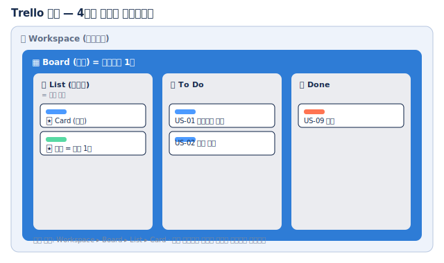

# 🟦 Trello · 1단계 — 계정과 보드 만들기

> 🎯 **개요** — 가입하고, 프로젝트를 담을 **보드**를 만듭니다. 가장 쉬운 협업툴이라 1분이면 돼요.

🎬 상황 · 빠르게 시작
<ul>
<li>인디 게임팀이 "복잡한 툴 말고 <b>지금 당장</b> 쓸 걸로 시작하자"고 합니다.</li>
<li>화이트보드에 포스트잇 붙이듯, 가장 가벼운 <b>Trello 보드</b>를 만듭니다.</li>
</ul>

📍 [← 개요](Guide.md) · [2단계 →](Step2.md)

---

## A. 계정 만들기

1. **https://trello.com/signup** 접속
2. **`Continue with Google`** 또는 이메일로 가입
3. 워크스페이스 이름 `GameDev Academy` 입력

> 🙋 **영어가 부담되면** 크롬 우클릭 → "한국어로 번역". 버튼 위치는 같습니다.
> 💳 무료는 워크스페이스당 **보드 10개·협업자 10명**. 연습엔 충분합니다.

> 🖼️ 공식 스크린샷 자리 — Trello 가입
> 출처: https://support.atlassian.com/trello/docs/creating-a-new-board/

---

## B. 보드 만들기

보드 = **프로젝트 하나**를 담는 화이트보드입니다.

1. **`Create`**(만들기) → **`Create board`**
2. 제목 `Pixel Dungeon - Sprint 1` 입력 → **`Create`**

> 위 그림처럼, 앞으로 이 **보드** 안에 리스트와 카드를 채워갑니다.

---

## 🎮 현장 감각 — 게임 PM은 이렇게

> **Pixel Dungeon 맥락** — Trello의 강점은 **"진입장벽 0"** 입니다. 비개발자도 5분이면 적응하니, 외주 아티스트·사운드 같은 **단기 협업자**와 일을 나눌 때 특히 빠릅니다. 무료로 **칸반 보드 전체**가 열려요.

**⚠️ 흔한 실수**
- 작업마다 보드를 새로 만듦 → 한 프로젝트 = **보드 1개**, 그 안을 리스트로 나눔.
- 처음부터 유료 뷰(Calendar·Timeline)를 찾음 → 무료는 **보드(칸반) 뷰** 중심.

**🎤 면접 한 줄**
> *"가볍고 빠른 협업이 필요한 상황에 **Trello 보드**로 즉시 칸반 환경을 세팅했습니다."*

---

## ✅ 확인

- [ ] 워크스페이스 이름이 보인다
- [ ] 빈 보드 `Pixel Dungeon - Sprint 1`이 열렸다

---

👉 다음: **[2단계 · 리스트로 워크플로 짜기](Step2.md)**
