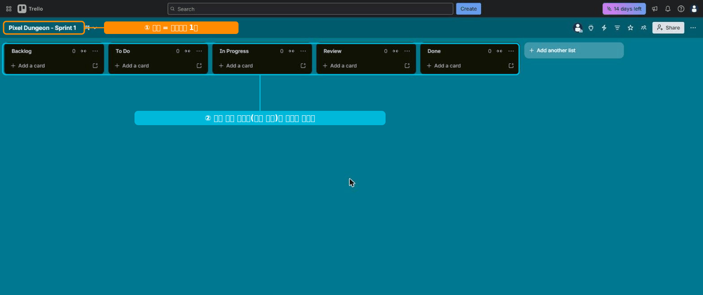

# 🟦 Trello · 1단계 — 계정과 보드 만들기

> 🎯 **개요** — 가입하고, 프로젝트를 담을 **보드**를 만듭니다. 가장 쉬운 협업툴이라 1분이면 돼요.

🎬 상황 · 빠르게 시작
<ul>
<li>인디 게임팀이 "복잡한 툴 말고 <b>지금 당장</b> 쓸 걸로 시작하자"고 합니다.</li>
<li>화이트보드에 포스트잇 붙이듯, 가장 가벼운 <b>Trello 보드</b>를 만듭니다.</li>
</ul>

📍 [← 개요](Guide.md) · [2단계 →](Step2.md)

---

## A. 계정 만들기

1. **https://trello.com/signup** 접속
2. **`Continue with Google`** 또는 이메일로 가입
3. 워크스페이스 이름 `GameDev Academy` 입력

> 🙋 **영어가 부담되면** 크롬 우클릭 → "한국어로 번역". 버튼 위치는 같습니다.
> 💳 무료는 워크스페이스당 **보드 10개·협업자 10명**. 연습엔 충분합니다.

> 🙋 가입은 **구글 로그인**이면 1분, 워크스페이스 이름만 정하면 끝이에요.

---

## B. 보드 만들기

보드 = **프로젝트 하나**를 담는 화이트보드입니다.

1. **`Create`**(만들기) → **`Create board`**
2. 제목 `Pixel Dungeon - Sprint 1` 입력 → **`Create`**

> 위 그림처럼, 앞으로 이 **보드** 안에 리스트와 카드를 채워갑니다.

---

## C. 보드에 팀 초대 + 공개 범위

혼자 쓰는 보드가 아니라면 **함께 볼 사람을 초대**합니다.

1. 보드 오른쪽 위 **`공유`(Share)** 클릭
2. 이메일이나 이름으로 **멤버 초대** (초대 링크를 보내도 됩니다)
3. 권한은 **관리자(Admin) / 일반 멤버 / 보기 전용(Observer)** 중에 고릅니다

**공개 범위(가시성)** — `공유` 창 위쪽에서 누가 이 보드를 볼 수 있는지 정합니다:

| 범위 | 누가 봄 | 언제 |
|---|---|---|
| **비공개(Private)** | 초대된 멤버만 | 기본값·권장 |
| **워크스페이스(Workspace)** | 같은 워크스페이스 팀 전체 | 사내 공용 보드 |
| **공개(Public)** | 링크만 있으면 누구나(검색 노출) | 거의 안 씀 ⚠️ |

> 🙋 게임팀은 외주 아티스트·사운드를 **일반 멤버**로 초대해 자기 카드만 챙기게 하고, 보드는 **비공개**로 둡니다. **공개(Public)** 는 검색에 노출되니 기획·일정 보드엔 쓰지 마세요.

---

## 🎮 현장 감각 — 게임 PM은 이렇게

> **Pixel Dungeon 맥락** 
> Trello의 강점은 "진입장벽 0"입니다. 
> 비개발자도 5분이면 적응하니, 외주 아티스트·사운드 같은 단기 협업자와 일을 나눌 때 특히 빠릅니다. 
> 무료로 칸반 보드 전체가 열립니다.

**⚠️ 흔한 실수**
- 작업마다 보드를 새로 만듦 → 한 프로젝트 = **보드 1개**, 그 안을 리스트로 나눔.
- 처음부터 유료 뷰(Calendar·Timeline)를 찾음 → 무료는 **보드(칸반) 뷰** 중심.

**🎤 면접 한 줄**
> *"가볍고 빠른 협업이 필요한 상황에 **Trello 보드**로 즉시 칸반 환경을 세팅했습니다."*

---

## ✅ 확인

- [ ] 워크스페이스 이름이 보인다
- [ ] 빈 보드 `Pixel Dungeon - Sprint 1`이 열렸다
- [ ] 보드 **공유(초대)** 와 **공개 범위**(비공개 권장)를 안다

---

👉 다음: **[2단계 · 리스트로 워크플로 짜기](Step2.md)**
