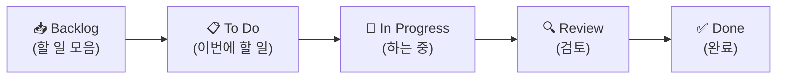

# 🟦 Trello · 2단계 — 리스트로 워크플로 짜기

> 🎯 **개요** — 칸반의 **세로 줄(리스트)** 로 일의 진행 단계를 만듭니다.

🎬 상황 · 일의 흐름 정하기
<ul>
<li>팀이 묻습니다. "작업이 어떤 단계를 거쳐 '완료'가 되나요?"</li>
<li>할 일 → 하는 중 → 검토 → 완료. 이 <b>흐름</b>을 리스트로 그립니다.</li>
</ul>

📍 [← 1단계](Step1.md) · [3단계 →](Step3.md)

---

## 리스트 = 진행 단계

리스트는 칸반의 **세로 줄**입니다. 왼쪽 → 오른쪽이 일의 진행 방향이에요.

1. 보드에서 **`+ Add a list`** 클릭
2. 이름 입력 후 Enter, 이렇게 **5개**를 차례로:

> 💡 헷갈리면 `To Do / Doing / Done` 3개로 시작해도 정상입니다.

> 🖼️ 공식 스크린샷 자리 — 리스트 만들기

---

## 🎮 현장 감각 — 게임 PM은 이렇게

> **Pixel Dungeon 맥락** — 리스트(워크플로)는 **팀의 약속**입니다. "Review를 거쳐야 Done" 같은 규칙이 리스트로 보이면 코드리뷰·아트 컨펌을 건너뛰는 일이 줄어요. 게임팀의 Review엔 보통 **QA·플레이테스트**가 들어갑니다.

**⚠️ 흔한 실수**
- 리스트를 **상태가 아니라 사람/날짜**로 만듦 → 칸반은 **진행 단계**로.
- 단계가 너무 많음 → 5개 이하로, 안 쓰면 3개(To Do/Doing/Done).

**🎤 면접 한 줄**
> *"보드의 리스트를 **워크플로(Backlog→In Progress→Review→Done)** 로 설계해 팀의 진행 기준을 통일했습니다."*

---

## ✅ 확인

- [ ] 리스트가 진행 순서대로 5개 있다
- [ ] 왼→오른쪽이 "진행 방향"임을 안다

---

👉 다음: **[3단계 · 카드로 작업 등록](Step3.md)**
