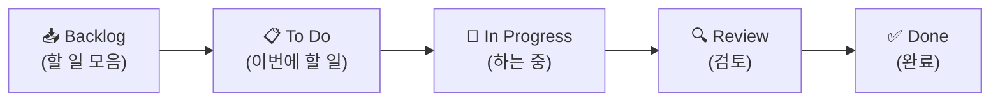
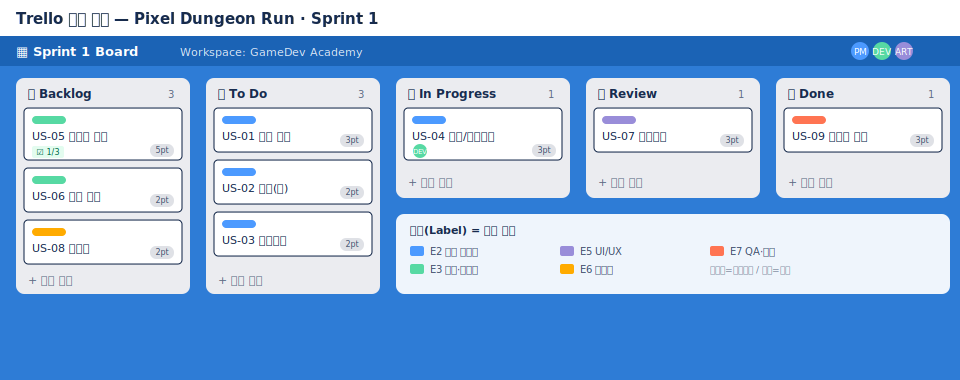

# 🟦 Trello · 2단계 — 리스트와 카드

> 🎯 이번 단계 목표: **워크플로(리스트)를 짜고, 작업(카드)을 올린다.**
> 📍 [← 1단계](Step1.md) · 다음 [3단계 →](Step3.md)

---

## A. 리스트 = 진행 단계 만들기

리스트는 칸반의 **세로 줄**이에요. 왼쪽 → 오른쪽이 일의 진행 방향입니다.

1. 보드에서 **`+ Add a list`** 클릭
2. 이름 입력 후 Enter, 이렇게 **5개**를 차례로:

> 💡 헷갈리면 `To Do / Doing / Done` 3개로 시작해도 정상입니다.

---

## B. 카드 = 작업 올리기

1. `Backlog` 리스트 아래 **`+ Add a card`** 클릭
2. 아래 9개를 **제목만** 한 줄씩 입력 (Enter로 연속 추가):

| 카드 제목 |
|---|
| US-01 플레이어 이동(턴제) |
| US-02 공격 입력 |
| US-03 이동 처리 |
| US-04 턴제 전투(HP) |
| US-05 절차적 던전 생성 |
| US-06 적 추적 AI |
| US-07 사망/게임오버 화면 |
| US-08 핵심 효과음 |
| US-09 1층 플레이 프로토타입 빌드 |

완성하면 이런 모습이 됩니다 👇

> 🖼️ 공식 스크린샷 자리 — 실제 보드 화면
> 출처: https://trello.com/guide/trello-101

---

## ✅ 확인

- [ ] 리스트 5개가 순서대로 있다
- [ ] Backlog에 카드 9장이 쌓였다

---

👉 다음: **[3단계 · 카드 꾸미기](Step3.md)**
