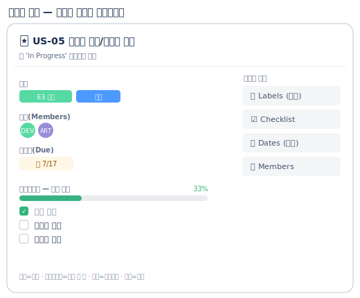

# 🟦 Trello · 3단계 — 카드 꾸미기

> 🎯 이번 단계 목표: **카드에 정보를 채워 진짜 작업처럼 관리한다.** (약 10분)
> 📍 [← 2단계](Step2.md) · 다음 [4단계 →](Step4.md)

---

카드를 **한 번 클릭**하면 큰 상세 창이 열립니다. 여기서 4가지를 채웁니다.

`US-05 절차적 생성` 카드를 예로 하나씩 해봅시다.

### ① 라벨 (색으로 분류)
- 우측 **`Labels`** → 초록색 선택 → 연필로 이름 `E3 던전` 지정 → 체크
- 에픽별 색: E2 코어(파랑), E3 던전(초록), E5 UI(보라), E6 오디오(주황), E7 출시(빨강)

### ② 체크리스트 (작은 할 일)
- **`Checklist`** → 이름 `세부 작업` → 항목 3개: `바닥 생성` / `플랫폼 배치` / `난이도 점증`
- 하나 체크하면 카드에 **진행률(1/3)** 이 자동 표시

### ③ 마감일
- **`Dates`** → Due date `2026-07-17` → Save

### ④ 담당자
- **`Members`** → 팀원 선택 (혼자면 본인 = DEV 역할이라 생각)

> 🖼️ 공식 스크린샷 자리 — 카드 상세(라벨·체크리스트)
> 출처: https://support.atlassian.com/trello/docs/adding-checklists-to-cards/

---

## ✅ 확인

- [ ] 카드 앞면에 **색 라벨**이 보인다
- [ ] 체크리스트 진행률(☑1/3)과 마감일 배지가 보인다
- [ ] 나머지 카드에도 최소한 **라벨**은 달았다

---

👉 다음: **[4단계 · 칸반 운영](Step4.md)**
