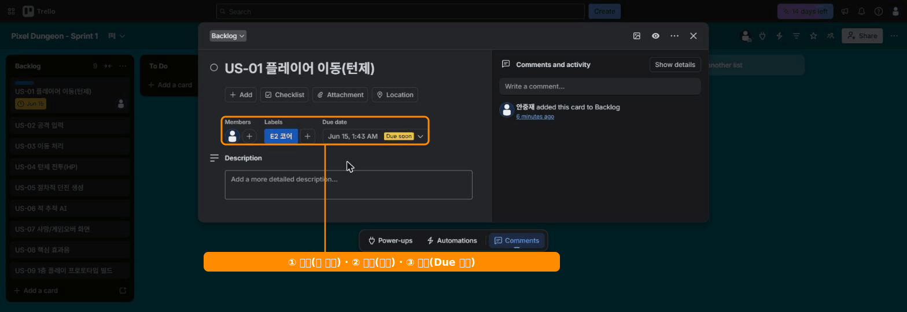

# 🟦 Trello · 4단계 — 카드 꾸미기 (라벨·멤버·마감)

> 🎯 **개요** — 카드 앞면에 **라벨·담당·마감**을 달아 한눈에 읽히게 만듭니다.

🎬 상황 · 카드가 다 똑같아 보임
<ul>
<li>카드가 9장 쌓이니 "뭐가 급한지, 누구 건지" 안 보입니다.</li>
<li>카드 앞면에 <b>색(라벨)·담당·마감</b>을 달아 구분합니다.</li>
</ul>

📍 [← 3단계](Step3.md) · [5단계 →](Step5.md)

---

카드를 **한 번 클릭**하면 상세 창이 열립니다. 여기서 채웁니다. (모두 무료)

### ① 라벨 (색으로 분류)
- 우측 **`Labels`** → 색 선택 → 연필로 이름 지정
- 에픽별 색: E2 코어(파랑), E3 던전(초록), E5 UI(보라), E6 오디오(주황), E7 출시(빨강)

> 🙋 **E1·E4는 왜 없나요?** 
> 전체 기획서 에픽은 E1~E7로 7개입니다. 
> **E1 기획**과 **E4 메타 진행**(장비·스킬·저장/로드)은 이번 프로토타입 범위가 아닙니다. 
> 만들 카드가 없으니 라벨도 만들지 않습니다. 
> 번호는 기획서 기준 그대로 둡니다 → **`US-07=E5`** 가 Jira·Asana와 똑같이 맞습니다.

### ② 멤버 (담당)
- **`Members`** → 담당자 선택 (혼자면 본인 = DEV 역할이라 생각)

### ③ 마감일
- **`Dates`** → Due date 지정 → Save. 카드 앞면에 **마감 배지**가 뜹니다.

> 🙋 위 그림처럼 **라벨·멤버·마감**은 카드 앞면(리스트)에도 색·아바타·배지로 바로 표시됩니다.

---

## 🎮 현장 감각 — 게임 PM은 이렇게

> **Pixel Dungeon 맥락** 
> Trello의 핵심은 "카드 앞면만 봐도 읽힌다"입니다. 
> 라벨 색은 에픽, 아바타는 담당, 배지는 마감을 나타냅니다. 
> 스탠드업에서 보드만 띄우면 회의가 끝납니다. 
> 게임팀은 라벨로 DEV/ART/SOUND를 색으로 구분하기도 합니다.

**⚠️ 흔한 실수**
- 라벨을 너무 많이 만듦 → 5~6색으로 제한하고 색=의미를 고정.
- 마감만 넣고 담당 공란 → "누가"가 빠지면 안 굴러감.

**🎤 면접 한 줄**
> *"카드에 **라벨(분류)·담당·마감**을 달아 보드만 봐도 현황이 읽히게 했습니다."*

---

## ✅ 확인

- [ ] 카드 앞면에 **색 라벨**이 보인다
- [ ] 주요 카드에 담당·마감이 있다

---

👉 다음: **[5단계 · 체크리스트·첨부·코멘트](Step5.md)**
