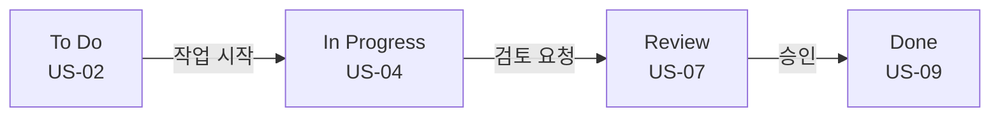

# 🟦 Trello · 4단계 — 칸반으로 일 흐르게

> 🎯 이번 단계 목표: **카드를 옮겨 "지금 무엇이 진행 중인지"를 한눈에 보이게 한다.**
> 📍 [← 3단계](Step3.md) · 다음 [5단계 →](Step5.md)

---

## 카드를 드래그하세요

작업이 진행되면 카드를 **잡아서 오른쪽 리스트로** 옮깁니다. 이 "이동"이 곧 **진척 보고**예요.

연습 삼아 이렇게 배치해 보세요:
- `Done` ← US-09
- `Review` ← US-07
- `In Progress` ← US-04
- `To Do` ← US-01·02·03
- 나머지는 `Backlog`

완성하면 목업과 같아집니다 👇

---

## 💡 한 가지 더 — WIP 제한

"하는 중(In Progress)"에 카드가 너무 많이 쌓이면 다 늦어집니다. 그래서 현업에서는 **"동시에 진행은 3개까지"** 같은 규칙(WIP 제한)을 둡니다. 무료의 *List Limits* Power-Up으로 시각 경고를 줄 수 있어요. (지금은 개념만 알면 충분)

---

## ✅ 확인

- [ ] 카드가 여러 리스트에 흩어져 있다
- [ ] 보드만 봐도 "무엇이 진행 중인지" 읽힌다

---

👉 다음: **[5단계 · 자동화 & 마무리](Step5.md)**
