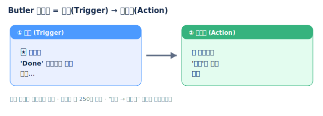

# 🟦 Trello · 5단계 — 자동화 & 마무리

> 🎯 이번 단계 목표: **반복 작업을 자동화하고, Trello를 정리한다.** (약 8분)
> 📍 [← 4단계](Step4.md) · 다음 [직접 해보기 →](Practice.md)

---

## A. Butler 자동화 1개 만들기 (5분)

반복 작업을 자동으로 처리하는 기능입니다. **언제(Trigger) → 무엇을(Action)** 순서로 규칙을 만듭니다.

1. 보드 오른쪽 위 **`Automation`**(Butler) → **`Rules`** → **`Create Rule`**
2. **Trigger**: `when a card is moved to list "Done"` 선택
3. **Action**: `mark the due date as complete` 추가
4. **Save** → 카드를 Done으로 옮겨 동작 확인

> 🙋 순서만 기억: **"언제 → 무엇을"**. Trigger 먼저, Action 나중.

> 🖼️ 공식 스크린샷 자리 — Butler 규칙 생성
> 출처: https://trello.com/butler-automation

---

## B. Trello의 한계도 알아두기 (1분)

- Trello 무료엔 **간트차트(Timeline)가 없습니다**(유료). → 간트는 **Jira·Redmine** 에서 배웁니다.
- 깊은 작업 분해(WBS)도 약합니다. → 그건 Jira의 강점입니다.

이런 **강점·약점을 아는 것**이 면접에서 "툴을 비교할 줄 안다"는 인상을 줍니다.

---

## ✅ 셀프 체크 — Trello 합격선

모두 "네"면 Trello는 끝!
- [ ] 보드 + 리스트 5개 + 카드 9개를 만들 수 있다
- [ ] 카드에 라벨·체크리스트·마감·담당을 넣을 수 있다
- [ ] 카드를 드래그해 상태를 옮길 수 있다
- [ ] Butler 규칙을 1개 만들 수 있다

---

## 🎤 면접에서 이렇게 말하세요

- *"Trello로 게임 프로젝트의 **스프린트 백로그를 칸반 보드**로 구성했습니다. 리스트를 워크플로(Backlog→…→Done)로 만들고, 카드에 **라벨·체크리스트·마감**을 넣어 관리했습니다."*
- *"반복 작업은 **Butler 자동화**로 처리했습니다(예: Done 이동 시 자동 완료)."*
- *"Trello는 가볍고 빠른 대신 **간트·깊은 WBS는 약해서**, 그런 경우엔 Jira를 씁니다."* ← 이 한마디가 핵심!

---

## ➡️ 다음

- 손으로 직접: **[직접 해보기](Practice.md)**
- 다음 툴: **[Jira 가이드](../02_Jira/Guide.md)** — Trello의 라벨이 Jira에선 진짜 **Epic**이 됩니다.
