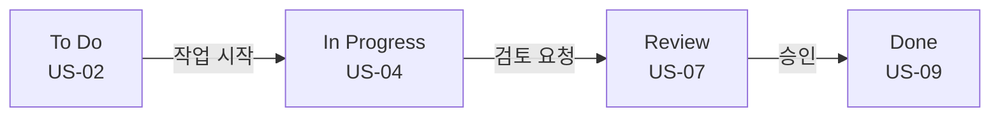
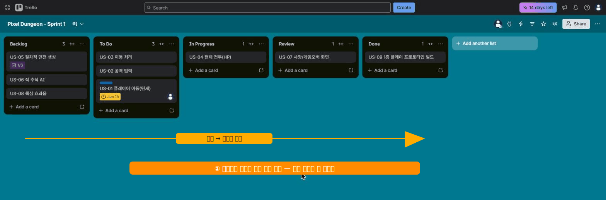

# 🟦 Trello · 6단계 — 칸반 운영 (드래그·WIP·필터)

> 🎯 **개요** — 카드를 옮겨 진척을 보이고, **WIP·필터**로 보드를 다스립니다.

🎬 상황 · 일이 돌아가기 시작
<ul>
<li>작업이 시작됩니다. 카드를 오른쪽으로 옮겨 "진행 중"을 보여줍니다.</li>
<li>보드가 복잡해지면 필터로 "내 것만", "급한 것만" 봅니다.</li>
</ul>

📍 [← 5단계](Step5.md) · [7단계 →](Step7.md)

---

## A. 카드를 드래그하세요

작업이 진행되면 카드를 **잡아서 오른쪽 리스트로** 옮깁니다. 이 "이동"이 곧 **진척 보고**예요.

연습 삼아 이렇게 배치해 보세요: `Done`←US-09, `Review`←US-07, `In Progress`←US-04, `To Do`←US-01·02·03, 나머지는 `Backlog`.

## B. WIP 제한 (동시 진행 줄이기)

"하는 중"에 카드가 너무 쌓이면 다 늦어집니다. 현업은 **"동시 진행 3개까지"** 같은 규칙(WIP)을 둡니다. 무료 **List Limits** Power-Up으로 시각 경고를 줄 수 있어요.

## C. 필터·검색 (무료)

- 보드 우측 **`Filter`** → 라벨·멤버·마감으로 **이 보드** 카드를 거릅니다("내 카드만" 보기).
- 상단 **검색**은 **내 모든 보드**를 가로질러 찾습니다. **검색 연산자**로 콕 집어요: `@me`(내 카드) · `label:red`(빨강 라벨) · `due:week`(이번 주 마감) · `list:Doing`.
- **Watch(👁 구독)**: 담당이 아니어도 **변경 알림**을 받고 싶은 카드는 카드 상세 `Watch`. 외주 의존·블로커처럼 리스크 큰 카드를 구독해두면 바뀔 때 알림이 와요.

> 🙋 **보드 `Filter` = 이 보드만**, **상단 검색 = 전체 보드**. "이 보드에서 빨강만"은 Filter로, "내 모든 보드에서 이번 주 마감"은 검색 `@me due:week`로.

> ▲ 카드를 **드래그**해 진행 단계(To Do→In Progress→Review→Done)로 옮긴 모습입니다. 카드 분포가 곧 진척이에요.

---

## D. 끝난 카드는 보관(Archive) — 삭제(Delete) 아님

`Done`에 카드가 쌓이면 보드가 길어집니다. 스프린트가 끝나면 **보관(Archive)** 으로 치웁니다.

| 동작 | 어떻게 | 되살리기 |
|---|---|---|
| **보관(Archive)** | 카드 열기 → 맨 아래 **`보관`(Archive)** | ✅ 됨 (보드 메뉴 → `보관된 항목`에서 복원) |
| **삭제(Delete)** | 보관한 카드에서 한 번 더 **`삭제`** | ❌ 영구 삭제 — 못 되살림 |

- **보관**은 보드에서 숨길 뿐, 검색·복원이 됩니다. 이력이 남아요.
- **삭제**는 완전히 사라집니다. 웬만하면 **보관**만 쓰세요.

> 🙋 초보가 가장 많이 하는 실수: 끝난 카드를 **삭제**해 기록을 날리는 것. 회고·통계를 위해 **"끝 = 보관"** 을 습관으로. (7단계 Butler로 `Done → 보관`을 자동화할 수 있어요.)

> 📦 **이월(carry over)** — 스프린트가 끝났는데 안 끝난 카드는 삭제·보관 대신 카드 상세 **`Move`(이동)** 로 다음 스프린트 리스트(또는 다른 보드)로 보냅니다. 같은 카드를 **`Copy`(복사)** 하면 체크리스트까지 복제돼 템플릿처럼 재사용돼요.

---

## 🎮 현장 감각 — 게임 PM은 이렇게

> **Pixel Dungeon 맥락** 
> 보드의 카드 분포가 곧 번다운 대용입니다. 
> Done이 안 늘면 위험 신호입니다. 
> WIP 제한은 "이것저것 동시에"를 막아 실제 완료를 늘립니다. 
> 게임팀에서 In Progress가 막히면 보통 에셋 대기(아트)가 원인입니다.

**⚠️ 흔한 실수**
- 카드를 옮기지 않고 머릿속으로만 진행 → 보드가 거짓말이 됨. **옮겨야 보고**.
- WIP 무시하고 다 In Progress → 아무것도 안 끝남.

**🎤 면접 한 줄**
> *"카드 이동으로 진척을 가시화하고 **WIP 제한·필터**로 보드를 운영했습니다."*

---

## ✅ 확인

- [ ] 카드가 여러 리스트에 흩어져 있다
- [ ] 필터로 "내 카드만" 볼 수 있다
- [ ] 끝난 카드를 **보관(Archive)** 하고 되살릴 수 있다 (삭제와 구분)

---

👉 다음: **[7단계 · Butler 자동화](Step7.md)**
