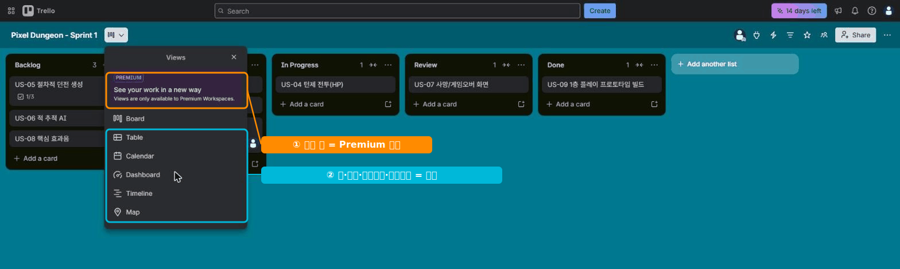

# 🟦 Trello · 8단계 — Power-Up·한계·마무리

> 🎯 **개요** — Power-Up으로 기능을 더하고, **무료의 한계**를 알고, Trello를 정리합니다.

🎬 상황 · 더 필요한 게 생긴다
<ul>
<li>"달력으로 마감 보고 싶다", "간트로 일정 보고 싶다"는 요구가 나옵니다.</li>
<li>무엇이 무료고 무엇이 Premium인지 알아야 똑똑하게 결정합니다.</li>
</ul>

📍 [← 7단계](Step7.md) · [직접 해보기 →](Practice.md)

---

## A. Power-Up — 기능 더하기 (무료도 사용 가능)

보드 우측 **`Power-Ups`** 에서 기능을 추가합니다. 무료에서 유용한 것:
- **List Limits**: WIP 제한 시각 경고
- **Card Repeater**: 반복 카드 자동 생성
- **Calendar**(Power-Up): 마감을 달력 팝업으로 (※ 정식 Calendar **뷰**는 Premium)

## B. 무료의 한계 — 이건 Premium

> ▲ 보드 좌측 위 **뷰 전환** 메뉴 — `Board`(칸반)만 무료, **Table·Calendar·Dashboard·Timeline·Map은 Premium**입니다. (지금은 14일 체험이라 보여요.)

| 기능 | 무료? | 대안 |
|---|:--:|---|
| **보드(칸반) 뷰** | ✅ | Trello의 본체 |
| **Butler 자동화** | ✅ (월 250회) | — |
| **Calendar·Timeline·Table·Dashboard 뷰** | ❌ Premium | 간트·달력은 **Jira·Redmine** |
| 깊은 WBS·리포트 | ❌ 약함 | **Jira**의 강점 |

> 💡 Trello는 **빠른 칸반**이 본업입니다. 다른 뷰(간트·달력)나 깊은 분해가 필요하면 그건 **Jira/Redmine** 신호예요.

## C. 언제 다른 툴로?

- **간트·다중 뷰·리포트가 필수** → Jira/Redmine
- **비개발 협업·뷰 전환** → Asana
- **가볍고 빠른 칸반** → Trello 그대로

---

## ✅ 셀프 체크 — Trello 합격선

- [ ] 보드 + 리스트 5개 + 카드 9개를 만들 수 있다
- [ ] 카드에 라벨·멤버·마감·체크리스트를 넣을 수 있다
- [ ] 카드를 드래그해 상태를 옮기고 필터로 거를 수 있다
- [ ] Butler 규칙을 1개 만들 수 있다
- [ ] 무료/Premium 경계를 설명할 수 있다

---

## 🎤 면접에서 이렇게 말하세요

- *"Trello로 스프린트 백로그를 **칸반 보드**로 구성하고, 카드에 **라벨·체크리스트·마감**을 넣어 관리했습니다."*
- *"반복 작업은 **Butler 자동화**로 처리했습니다(무료 월 250회)."*
- *"Trello는 가볍고 빠른 대신 **간트·다중 뷰·깊은 WBS가 약해서**, 그런 경우엔 Jira를 씁니다."* ← 이 한마디가 핵심!

---

## ➡️ 다음

- 손으로 직접: **[Trello 직접 해보기](Practice.md)**
- 다음 툴: **[Redmine 가이드](../04_Redmine/Guide.md)** — 직접 서버를 띄워 무료 **내장 간트**를 경험합니다.
