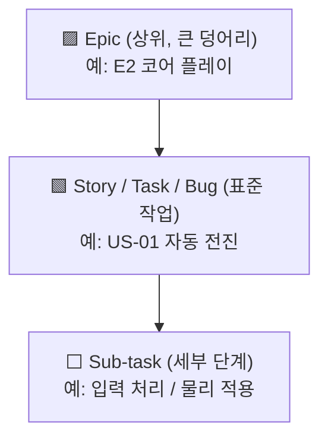

# 🟦 Day 2~3 — Jira 가이드 (애자일·스크럼 표준)

> **목표**: 게임 프로젝트를 Jira에서 **에픽→스토리→서브태스크(WBS)** 로 분해하고, **백로그→스프린트→보드**로 운영하며, **Timeline(로드맵)** 으로 일정을 계획한다.
> **산출물**: D2 = 제품 백로그 + Sprint 1 / D3a = Timeline. 실습은 [`Practice.md`](Practice.md)

> 💡 Jira는 게임 스튜디오에서 사실상 표준급으로 쓰여 **PM 채용 1순위 역량**입니다. 본 과정에서 가장 비중 있게 다룹니다(1.5일).

---

## 1. 핵심 구조 — 한 장 지도

```
Atlassian 사이트 (yourname.atlassian.net)
   └─ Project(프로젝트)  ← "Pixel Dungeon Run" (키: PDR)
        ├─ Backlog(백로그)  ← 할 일 목록 + 스프린트 계획
        ├─ Board(보드)      ← 현재 스프린트의 칸반
        └─ Timeline(타임라인) ← 에픽 일정/의존성(=로드맵·간트)
```

### 이슈 계층 (WBS의 핵심) — 공식 기본 3단계



- **Epic**(레벨 1): 여러 스토리를 묶는 큰 작업 → 우리 시나리오의 **E1~E7**
- **Story / Task / Bug**(레벨 0): 실제 작업 1건 → **US-01~09**
- **Sub-task**(레벨 -1): 스토리를 쪼갠 세부 → 자식 없음
- (참고) Initiative 등 상위 레벨은 유료 **Plans**(구 Advanced Roadmaps) 기능

> 🖼️ 공식 스크린샷 자리 — Jira: 이슈 타입/계층
> 공식 출처: https://support.atlassian.com/jira-cloud-administration/docs/what-are-issue-types/

### 팀관리형 vs 회사관리형

| | **팀관리형(Team-managed)** | 회사관리형(Company-managed) |
|---|---|---|
| 대상 | 자율적인 단일 팀 (**학습에 적합**) | 표준을 공유하는 여러 팀 |
| 설정 | 프로젝트 안에서 간단히 | 관리자(admin)가 전역 설정 |
| 본 과정 | ✅ **이걸로 진행** | 개념만 소개 |

---

# PART A — Day 2: 백로그와 스프린트

## STEP 0 — 계정·사이트 만들기 (무료)

1. https://www.atlassian.com/software/jira/free → **Get it free**
2. 이메일/구글로 가입 → 사이트 주소 생성: `여러분이름.atlassian.net`
3. 제품은 **Jira** 선택 (무료: 사용자 10명·2GB)

> ✅ **확인 포인트**: `https://(내사이트).atlassian.net` 로 로그인되면 성공.

---

## STEP 1 — 스크럼 프로젝트 생성

1. 좌측 상단 **Projects → Create project**
2. 템플릿 **Scrum**(소프트웨어 개발) 선택 → **Use template**
3. 프로젝트 유형 **Team-managed** 선택
4. 이름 `Pixel Dungeon Run`, **Key** `PDR` → **Create**

> 🖼️ 공식 스크린샷 자리 — Jira: 스크럼 프로젝트 생성
> 공식 출처: https://www.atlassian.com/software/jira/templates/scrum

> ✅ 좌측 메뉴에 **Backlog · Board · Timeline**이 보이면 성공. (없으면 Project settings → Features에서 Backlog/Sprints/Timeline 켜기)

---

## STEP 2 — 에픽 만들기 (WBS 상위 7개)

에픽은 시나리오의 대분류 E1~E7입니다. **Timeline** 화면에서 만들면 가장 쉽습니다.

1. 좌측 **Timeline** 열기 → 좌측 하단 **+ Create epic**
2. 에픽 7개 입력: `E1 기획` `E2 코어 플레이` `E3 던전·콘텐츠` `E4 메타 진행` `E5 UI/UX` `E6 오디오` `E7 QA·출시`
3. (대안) Backlog 화면 상단 **EPIC** 패널에서도 생성 가능

> 🖼️ 공식 스크린샷 자리 — Jira: 에픽 생성(Timeline)
> 공식 출처: https://www.atlassian.com/agile/project-management/epics-stories-themes

---

## STEP 3 — 스토리/태스크로 백로그 채우기

이제 시나리오의 US-01~09를 **Story**(빌드 작업은 Task)로 만듭니다.

1. 좌측 **Backlog** 열기
2. **Backlog** 섹션의 **+ Create** 로 항목 추가 → 제목에 `US-01 플레이어 자동 전진` …
3. 각 항목을 만들면서 **Epic 연결**(우측 Epic 필드 또는 EPIC 패널에서 드래그)

완성된 백로그는 이런 모습입니다 👇


> 🖼️ 공식 스크린샷 자리 — Jira: 스크럼 백로그
> 공식 출처: https://support.atlassian.com/jira-software-cloud/docs/use-your-scrum-backlog/

| 시나리오 | Jira 이슈 타입 | 에픽 |
|---|---|---|
| US-01~07 | **Story** | E2/E3/E5 |
| US-08 | Story | E6 |
| US-09 빌드 | **Task** | E7 |

---

## STEP 4 — 스토리 포인트·우선순위·담당자

1. 각 이슈 클릭 → **Story point estimate** 입력 (시나리오 포인트표 사용: US-01=3, US-05=5 …)
2. **Priority**(High/Medium/Low), **Assignee**(DEV/ART/QA) 지정
3. (팀관리형) 포인트 필드가 안 보이면 Project settings → Features에서 **Estimation** 켜기

> ✅ 백로그 우측에 포인트 숫자가 보이면 성공. 합계가 자동 계산됩니다.

---

## STEP 5 — 스프린트 생성·시작

1. Backlog 화면 상단 **Create sprint** → 빈 **Sprint 1** 칸 생성
2. 백로그에서 **US-01·02·04·05·09**(합 15pt)를 Sprint 1로 **드래그**
3. 스프린트 이름/기간 편집: `Sprint 1`, 2026-07-06 ~ 07-17 (2주)
4. **Start sprint** 클릭 → 목표(Sprint goal) `M1 프로토타입` 입력

> 🖼️ 공식 스크린샷 자리 — Jira: 스프린트 생성/시작
> 공식 출처: https://support.atlassian.com/jira-software-cloud/docs/enable-sprints/

> ✅ **확인 포인트**: 스프린트가 시작되면 화면이 **Board**로 전환됩니다.

---

## STEP 6 — 보드에서 운영(상태 이동)

- **Board**에서 카드(이슈)를 `To Do → In Progress → Done` 컬럼으로 드래그
- 컬럼은 워크플로 상태입니다. 팀관리형은 Board 설정에서 컬럼 추가/이름변경 가능(예: `Review` 추가)
- 이 이동이 곧 **번다운 차트**에 반영됩니다.


---

# PART B — Day 3 오전: 일정·리포트·검색

## STEP 7 — Timeline(로드맵)으로 일정 계획

Timeline은 **무료로 제공되는 Gantt형 일정 뷰**입니다(단일 프로젝트).

1. 좌측 **Timeline** 열기
2. 각 **에픽 막대**의 시작/끝을 드래그해 기간 설정 (시나리오 8주 일정 사용)
3. 막대 끝을 다른 에픽 앞에 연결해 **의존성**(dependency) 표시
4. **Sprint/마일스톤** 표시 켜기 → M1~M4 확인


> 🖼️ 공식 스크린샷 자리 — Jira: Timeline(에픽 일정·의존성)
> 공식 출처: https://www.atlassian.com/agile/tutorials/how-to-do-scrum-with-jira

| 시나리오 에픽 | 기간 | 마일스톤 |
|---|---|---|
| E1 기획 | 7/06–7/17 | |
| E2 코어 | 7/06–7/24 | **M1**(7/17) |
| E3 던전 | 7/20–7/31 | **M2**(7/31) |
| E5 UI·메타 | 7/27–8/14 | **M3**(8/14) |
| E7 QA·출시 | 8/10–8/28 | **M4**(8/28) |

---

## STEP 8 — 리포트 (진행 추적)

스프린트가 진행되면 좌측 **Reports**에서:
- **Burndown chart**: 남은 작업이 0으로 수렴하는지 (지연 조기 감지)
- **Velocity**: 스프린트별 완료 포인트 (다음 스프린트 용량 예측)
- **Sprint report**: 완료/미완료 항목 요약

> 🖼️ 공식 스크린샷 자리 — Jira: 번다운 차트
> 공식 출처: https://www.atlassian.com/agile/tutorials/sprints

> 💡 번다운이 평평하면(작업이 안 줄면) 병목이 있다는 신호. PM이 매일 확인할 지표.

---

## STEP 9 — JQL 기초 (강력한 검색)

상단 검색 → **Filters → Advanced search**에서 JQL(Jira Query Language) 사용:

```
project = PDR AND status = "In Progress"            # 진행 중인 작업
project = PDR AND assignee = currentUser()           # 내 작업
project = PDR AND "Epic Link" = "E2 코어 플레이"      # 특정 에픽의 작업
project = PDR AND sprint in openSprints()             # 현재 스프린트
```

> 외울 필요 없습니다. "필터를 저장해 재사용한다"는 감각만 익히세요.

---

## STEP 10 — 버전/릴리스 (선택)

- 좌측 **Releases**(또는 Project settings)에서 버전 `M1~M4` 생성 → 이슈에 **Fix version** 지정
- 릴리스 단위로 진척·완료를 묶어 관리(Redmine의 Version과 동일 개념).

---

## 개념 매핑 복습

| Jira 기능 | = PM 개념 | Trello에선 |
|---|---|---|
| Epic→Story→Sub-task | **WBS** | 리스트→카드→체크리스트 |
| Board 컬럼 이동 | **Kanban** | 리스트 드래그 |
| Sprint | **스프린트(스크럼)** | (라벨/보드로 흉내) |
| Timeline | **Gantt/로드맵** | (Premium) |
| Burndown/Velocity | 진척 추적 | 없음 |

---

## ⚠️ 함정 노트

- **Backlog/Timeline이 안 보임** → Project settings → **Features**에서 켜기.
- **포인트 필드 없음** → Features에서 **Estimation(Story points)** 켜기.
- **에픽을 상태로 착각** → 에픽은 *분류/묶음*, 상태는 *워크플로 컬럼*.
- **스프린트 무한정 끌기** → 2주 권장. 못 끝낸 건 다음 스프린트로 이월(carry over).
- **팀관리형/회사관리형 혼동** → 메뉴 구성이 다름. 학습은 **팀관리형** 고정.

---

## 다음 단계

[`Practice.md`](Practice.md)에서 백로그+Sprint 1+Timeline을 직접 만듭니다.

### 📚 참고한 공식 문서
- [스크럼 템플릿](https://www.atlassian.com/software/jira/templates/scrum) · [Jira로 스크럼하기](https://www.atlassian.com/agile/tutorials/how-to-do-scrum-with-jira)
- [스크럼 백로그 사용](https://support.atlassian.com/jira-software-cloud/docs/use-your-scrum-backlog/) · [스프린트 활성화](https://support.atlassian.com/jira-software-cloud/docs/enable-sprints/)
- [이슈 타입이란](https://support.atlassian.com/jira-cloud-administration/docs/what-are-issue-types/) · [이슈 계층 구성](https://support.atlassian.com/jira-cloud-administration/docs/configure-the-issue-type-hierarchy/)
- [에픽·스토리·테마](https://www.atlassian.com/agile/project-management/epics-stories-themes) · [스프린트 튜토리얼](https://www.atlassian.com/agile/tutorials/sprints)
