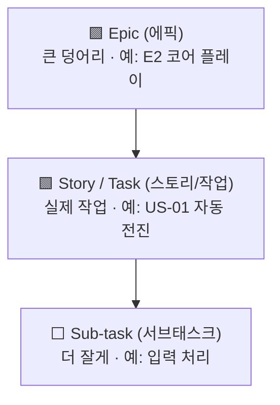
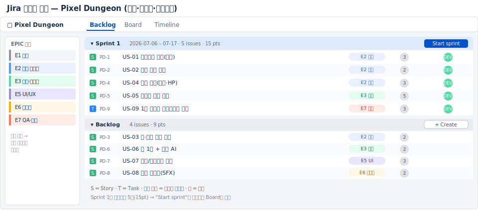
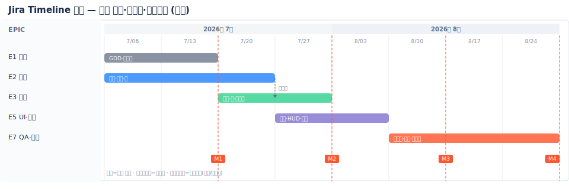
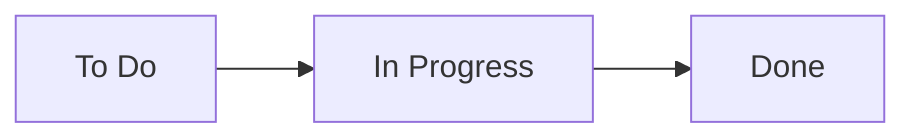

# 🟦 Jira 완전 가이드 — 업계 표준, 처음이라면 이대로

> 📌 **수업 교안이 아니라 혼자 따라 하는 참고 가이드입니다.** 이 문서대로 따라 하면 **면접에서 "Jira로 백로그·스프린트·보드·로드맵을 직접 운영할 줄 안다"** 고 말할 수 있는 수준이 됩니다.
>
> ⏱️ 예상 시간: 처음이면 **90~120분**(가장 비중 큼) · 🧰 준비물: 인터넷, 이메일 1개 · 💳 무료(사용자 10명)
>
> 💪 **왜 가장 공들여 배우나요?** 게임/IT 스튜디오가 가장 많이 쓰는 도구라, **PM 채용 공고에 "Jira 경험"이 자주 등장**합니다. 4개 툴 중 이게 제일 중요합니다.

---

## 🎯 이 가이드를 끝내면 할 수 있게 되는 것

- [ ] Jira 사이트와 **스크럼 프로젝트**를 만든다
- [ ] **에픽 → 스토리 → 서브태스크** 계층(=WBS)으로 작업을 분해한다
- [ ] **백로그**를 채우고 **스프린트**를 만들어 시작한다
- [ ] **보드**에서 작업 상태를 옮기며 운영한다
- [ ] **Timeline(로드맵)** 으로 일정·마일스톤을 계획한다
- [ ] 번다운 등 **리포트**의 의미를 안다

---

## 🧭 시작 전에 — Jira가 뭐예요? (1분)

Trello가 "포스트잇 보드"라면, Jira는 그 위에 **체계(계층·스프린트·리포트)** 를 얹은 **본격 업무 도구**입니다. 처음엔 메뉴가 많아 어려워 보이지만, 핵심 지도는 단순합니다.

```
내 사이트 (이름.atlassian.net)
   └─ Project(프로젝트)  = "Pixel Dungeon Run"
        ├─ Backlog(백로그)  = 할 일 목록 + 스프린트 계획하는 곳
        ├─ Board(보드)      = 지금 스프린트의 칸반
        └─ Timeline(타임라인) = 일정/로드맵(=간트)
```

**작업의 계층(가장 중요!)** — 큰 것 → 작은 것:



> 쉽게: **에픽**(큰 목표) 안에 **스토리**(할 일)들이 있고, 스토리는 다시 **서브태스크**로 쪼갤 수 있습니다. 이게 곧 **WBS(작업분해)** 입니다.

완성된 백로그·타임라인은 이렇게 생겼습니다 👇




> 💡 연습 프로젝트는 [Pixel Dungeon Run](../00_Overview/03_Game_Project_Scenario.md). 필요한 데이터는 이 문서에 다시 적어두었습니다.

---

# PART A — 백로그와 스프린트 만들기

## STEP 0. 계정·사이트 만들기 (10분)

1. 브라우저에서 **https://www.atlassian.com/software/jira/free** 로 갑니다.
2. **`Get it free`** 또는 **`Sign up`** 을 누르고, 이메일/구글로 가입합니다.
3. **사이트 주소**를 정하라고 합니다. 예: `내이름.atlassian.net` (영문/숫자). 한 번 정하면 이게 내 Jira 주소입니다.
4. 제품 선택에서 **Jira** 를 고릅니다. (무료: 사용자 10명, 저장소 2GB)
5. 몇 가지 설문(팀 규모 등)은 적당히 넘기면 됩니다.

> 🙋 **막히면**: 가입 후 다시 들어올 땐 항상 **`https://(내사이트).atlassian.net`** 으로 접속하세요. 북마크 해두면 편합니다.

> ✅ **여기까지 됐으면**: Jira 기본 화면(왼쪽에 메뉴들)이 보입니다.

---

## STEP 1. 스크럼 프로젝트 만들기 (5분)

1. 왼쪽 위 **`Projects`**(프로젝트) → **`Create project`**(프로젝트 만들기)를 누릅니다.
2. 템플릿 목록에서 **`Scrum`** 을 찾아 선택하고 **`Use template`** 을 누릅니다.
3. **프로젝트 유형**을 물으면 **`Team-managed`**(팀 관리형) 를 고릅니다. ← **초보는 무조건 이걸로** (메뉴가 단순함)
4. 이름 `Pixel Dungeon Run`, **Key**(키)는 자동으로 `PDR` 정도가 됩니다. → **Create**.

> 🙋 **`Team-managed`가 안 보이면**: "Choose a project type" 화면에서 좌우로 Team-managed / Company-managed 두 카드가 나옵니다. **왼쪽(Team-managed)** 을 고르세요. 회사관리형은 설정이 복잡해 지금은 부적합합니다.

> 🖼️ 공식 스크린샷 자리 — Jira: 스크럼 프로젝트 생성
> 공식 출처: https://www.atlassian.com/software/jira/templates/scrum

> ✅ **여기까지 됐으면**: 왼쪽 메뉴에 **Backlog · Board · Timeline** 이 보입니다.
> 🙋 **안 보이면** → STEP 1.5로.

### STEP 1.5. (안 보일 때만) 기능 켜기
1. 왼쪽 맨 아래 **`Project settings`**(프로젝트 설정) → **`Features`**(기능)로 갑니다.
2. **Backlog, Sprints, Timeline, Estimation(포인트)** 토글을 **켭니다(ON)**.
3. 왼쪽 메뉴로 돌아오면 항목들이 나타납니다.

> 이 단계에서 절반이 막힙니다. **포인트 입력칸이 없거나 백로그가 안 보이면 여기서 켜면 됩니다.**

---

## STEP 2. 에픽 7개 만들기 (WBS의 큰 덩어리) (8분)

에픽은 우리 프로젝트의 대분류입니다. **Timeline** 화면에서 만드는 게 가장 쉽습니다.

1. 왼쪽 **`Timeline`** 을 엽니다.
2. 화면 왼쪽 아래 **`+ Create epic`**(에픽 만들기)을 누릅니다.
3. 아래 7개를 하나씩 입력합니다:
   `E1 기획` · `E2 코어 플레이` · `E3 던전·콘텐츠` · `E4 메타 진행` · `E5 UI/UX` · `E6 오디오` · `E7 QA·출시`

> 🖼️ 공식 스크린샷 자리 — Jira: 에픽 생성(Timeline)
> 공식 출처: https://www.atlassian.com/agile/project-management/epics-stories-themes

> ✅ **여기까지 됐으면**: Timeline 왼쪽에 에픽 7줄이 생깁니다.

---

## STEP 3. 스토리로 백로그 채우기 (15분)

이제 실제 작업(스토리)을 만듭니다.

1. 왼쪽 **`Backlog`** 를 엽니다.
2. **Backlog** 섹션의 **`+ Create`** 를 눌러 아래 9개를 입력합니다. (US-09만 타입을 Task로)

| 요약(그대로 입력) | 타입 | 연결할 에픽 | 포인트 | 담당 |
|---|---|---|:--:|:--:|
| US-01 플레이어 자동 전진 | Story | E2 코어 플레이 | 3 | DEV |
| US-02 점프(탭) | Story | E2 코어 플레이 | 2 | DEV |
| US-03 슬라이드 | Story | E2 코어 플레이 | 2 | DEV |
| US-04 충돌/게임오버 | Story | E2 코어 플레이 | 3 | DEV |
| US-05 절차적 생성 | Story | E3 던전·콘텐츠 | 5 | DEV |
| US-06 점수 집계 | Story | E3 던전·콘텐츠 | 2 | DEV |
| US-07 결과 화면 | Story | E5 UI/UX | 3 | ART |
| US-08 효과음 | Story | E6 오디오 | 2 | ART |
| US-09 프로토타입 빌드 | Task | E7 QA·출시 | 3 | DEV |

3. **에픽 연결 방법**: 각 이슈를 클릭해 오른쪽 패널의 **`Epic`** 필드에서 해당 에픽을 고릅니다. (또는 Backlog 상단 **EPIC 패널**을 열고 이슈를 에픽 위로 드래그)

> 🙋 **막히면**: 에픽 연결을 빼먹으면 나중에 Timeline·필터가 비어 보입니다. **모든 스토리에 에픽을 꼭** 연결하세요.

> 🖼️ 공식 스크린샷 자리 — Jira: 스크럼 백로그
> 공식 출처: https://support.atlassian.com/jira-software-cloud/docs/use-your-scrum-backlog/

> ✅ **여기까지 됐으면**: Backlog에 이슈 9개가 보입니다.

---

## STEP 4. 포인트·담당자 넣기 (8분)

1. 이슈를 클릭하면 오른쪽에 상세 패널이 열립니다.
2. **`Story point estimate`**(스토리 포인트) 칸에 위 표의 숫자를 넣습니다. (US-05=5 등)
3. **`Assignee`**(담당자)와 **`Priority`**(우선순위: High/Medium/Low)도 지정합니다.

> 🙋 **포인트 칸이 없으면**: STEP 1.5처럼 Project settings → Features → **Estimation** 을 켜세요.

> ✅ **여기까지 됐으면**: 백로그 오른쪽에 포인트 숫자가 보이고, 합계가 자동 계산됩니다.

---

## STEP 5. 스프린트 만들고 시작하기 (10분)

스프린트 = **2주 동안 끝낼 작업 묶음**입니다.

1. Backlog 화면 위쪽 **`Create sprint`**(스프린트 만들기)를 누르면 빈 **Sprint 1** 칸이 생깁니다.
2. 백로그에서 **US-01·02·04·05·09**(합 15포인트)를 **Sprint 1 칸으로 드래그**합니다.
3. **Sprint 1** 이름 옆 **`Start sprint`**(스프린트 시작)를 누릅니다.
4. 기간(2026-07-06 ~ 07-17)과 **Sprint goal**(목표)에 `M1 프로토타입` 을 적고 시작합니다.

> 🙋 **`Start sprint` 버튼이 비활성화면**: 스프린트 안에 이슈가 0개입니다. 먼저 이슈를 드래그해 넣으세요.

> 🖼️ 공식 스크린샷 자리 — Jira: 스프린트 시작
> 공식 출처: https://support.atlassian.com/jira-software-cloud/docs/enable-sprints/

> ✅ **여기까지 됐으면**: 화면이 자동으로 **Board** 로 바뀝니다. (스프린트가 시작됐다는 뜻)

---

## STEP 6. 보드에서 운영하기 (3분)

1. 왼쪽 **`Board`** 에서 이슈 카드를 **`To Do` → `In Progress` → `Done`** 으로 드래그합니다.
2. 연습: US-09를 `Done`, US-04를 `In Progress` 로 옮겨보세요.

> 💡 컬럼을 더 만들고 싶으면(예: Review) Board의 **`+`** 또는 Board 설정에서 추가할 수 있습니다.



---

# PART B — 일정과 리포트

## STEP 7. Timeline(로드맵)으로 일정 잡기 (12분)

Timeline은 **무료로 쓰는 간트형 일정 뷰**입니다. (Asana·Trello는 이게 유료라, 간트는 여기서 배우는 게 이득)

1. 왼쪽 **`Timeline`** 을 엽니다.
2. 각 **에픽 막대**의 좌우 끝을 **드래그**해 기간을 정합니다. (아래 표대로)
3. 한 에픽 막대 끝을 다음 에픽 앞에 연결하면 **의존성(화살표)** 이 생깁니다.
4. 마일스톤(M1~M4) 표시를 켜서 확인합니다.

| 에픽 | 기간 | 마일스톤 |
|---|---|---|
| E1 기획 | 7/06–7/17 | |
| E2 코어 | 7/06–7/24 | **M1** (7/17) |
| E3 던전 | 7/20–7/31 | **M2** (7/31) |
| E5 UI·메타 | 7/27–8/14 | **M3** (8/14) |
| E7 QA·출시 | 8/10–8/28 | **M4** (8/28) |

> 🖼️ 공식 스크린샷 자리 — Jira: Timeline
> 공식 출처: https://www.atlassian.com/agile/tutorials/how-to-do-scrum-with-jira

> ✅ **여기까지 됐으면**: 에픽들이 시간축 막대로 배치되고 마일스톤이 표시됩니다.

---

## STEP 8. 리포트 읽는 법 (5분)

스프린트가 돌아가면 왼쪽 **`Reports`** 에서:
- **Burndown(번다운)**: 남은 작업이 0으로 줄어드는 그래프. **평평하면 = 일이 안 줄고 있다(위험 신호).**
- **Velocity(벨로시티)**: 스프린트마다 끝낸 포인트. 다음 스프린트 용량 예측에 씀.

> 💡 외울 필요 없습니다. "PM은 번다운으로 지연을 조기에 잡는다" 정도만 이해하면 충분합니다.

> 🖼️ 공식 스크린샷 자리 — Jira: 번다운 차트
> 공식 출처: https://www.atlassian.com/agile/tutorials/sprints

---

## 🆘 막혔을 때 (Jira는 여기서 많이 막힙니다)

| 증상 | 해결 |
|---|---|
| Backlog/Timeline 메뉴가 없다 | Project settings → **Features** 에서 켜기 |
| 포인트 입력칸이 없다 | Features → **Estimation** 켜기 |
| `Start sprint`가 안 눌린다 | 스프린트에 이슈를 먼저 드래그 |
| 에픽이 Timeline에 안 보인다 | 스토리에 에픽을 연결했는지 확인 |
| 메뉴가 너무 달라요 | **회사관리형**을 골랐을 수 있음. 새로 **팀관리형**으로 만들기 |
| 영어가 어렵다 | 우상단 톱니 → Personal settings → Language 한국어, 또는 크롬 번역 |

---

## 📖 용어 미니사전

| 영어 | 우리말 | 쉽게 |
|---|---|---|
| Epic | 에픽 | 큰 덩어리(여러 스토리를 묶음) |
| Story / Task | 스토리/작업 | 실제 할 일 1개 |
| Sub-task | 서브태스크 | 스토리를 더 쪼갠 것 |
| Backlog | 백로그 | 할 일 목록(우선순위) |
| Sprint | 스프린트 | 2주짜리 작업 묶음 |
| Board | 보드 | 지금 스프린트의 칸반 |
| Timeline | 타임라인 | 일정/로드맵(간트) |
| Story point | 스토리 포인트 | 일의 크기(숫자) |
| Burndown | 번다운 | 남은 일 줄어드는 그래프 |

---

## ✅ 셀프 체크

- [ ] 팀관리형 스크럼 프로젝트를 만들 수 있다
- [ ] 에픽→스토리(→서브태스크)로 작업을 분해할 수 있다
- [ ] 백로그를 채우고 포인트·담당자를 넣을 수 있다
- [ ] 스프린트를 만들어 **시작**할 수 있다
- [ ] 보드에서 상태를 옮기고, Timeline에 일정을 그릴 수 있다

> 직접 만들어 보는 미션 → [`Practice.md`](Practice.md)

---

## 🎤 면접에서 이렇게 말하세요

- *"Jira로 게임 프로젝트를 **팀관리형 스크럼**으로 세팅했습니다. **에픽 7개 아래 스토리·서브태스크**로 작업을 분해해 WBS를 만들었습니다."*
- *"스토리에 **스토리 포인트와 담당자**를 지정하고, **2주 스프린트**를 구성해 시작한 뒤 **보드**에서 상태를 관리했습니다."*
- *"**Timeline(로드맵)** 으로 에픽 일정과 **마일스톤·의존성**을 잡고, **번다운 차트**로 진척을 추적했습니다."*
- *"Jira는 **백로그·스프린트·리포트가 강해 중대형 개발에 적합**하고, 가볍게 시작할 땐 Trello가 낫다는 차이도 압니다."*

> 🔑 면접 팁: "**에픽→스토리→스프린트→번다운**" 흐름을 한 문장으로 말할 수 있으면 애자일을 이해한 PM으로 보입니다.

---

## ➡️ 다음으로
- 직접 만들기: [`Practice.md`](Practice.md)
- 다음 툴: [`03_Asana/Guide.md`](../03_Asana/Guide.md) — 같은 작업을 **더 직관적인 Asana**로 관리해보고 차이를 느껴봅니다.

### 📚 참고한 공식 문서
- [스크럼 템플릿](https://www.atlassian.com/software/jira/templates/scrum) · [Jira로 스크럼하기](https://www.atlassian.com/agile/tutorials/how-to-do-scrum-with-jira)
- [스크럼 백로그](https://support.atlassian.com/jira-software-cloud/docs/use-your-scrum-backlog/) · [스프린트 활성화](https://support.atlassian.com/jira-software-cloud/docs/enable-sprints/)
- [이슈 타입](https://support.atlassian.com/jira-cloud-administration/docs/what-are-issue-types/) · [에픽·스토리](https://www.atlassian.com/agile/project-management/epics-stories-themes)
