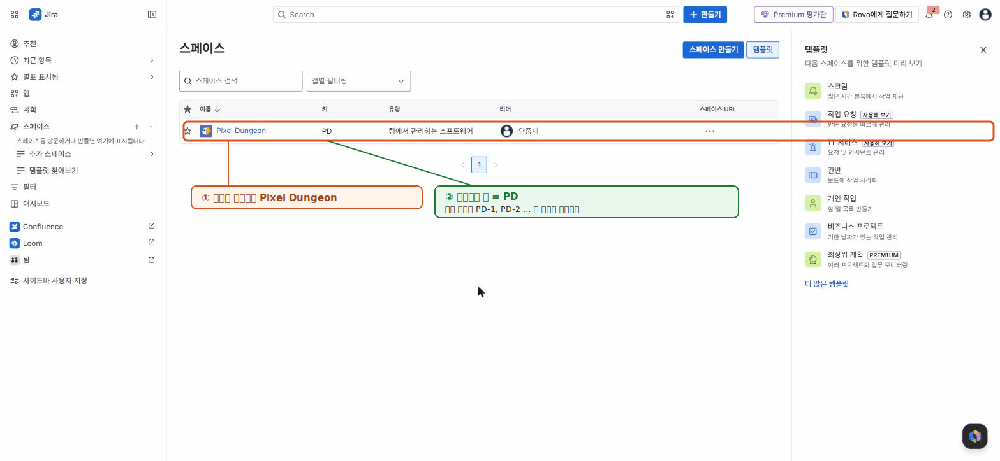

# 🟦 Jira · 1단계 — 계정과 프로젝트 만들기

> 🎯 **개요** — Jira에서 팀이 함께 쓸 **작업 공간(프로젝트)** 을 만듭니다. 첫 세팅이라 가장 쉬워요.

🎬 상황 · 입사 첫날
<ul>
<li>오늘은 입사 첫날입니다.</li>
<li>팀(개발·아트·기획·QA)이 함께 쓸 작업 공간이 아직 없습니다.</li>
<li>대표가 말합니다. "PM님, <b>Jira에 프로젝트부터 만들어</b> 주세요."</li>
<li>여러분의 첫 임무입니다.</li>
</ul>

📍 [← 개요](Guide.md) · [2단계 →](Step2.md)

---

## A. 계정·사이트 만들기

1. **https://www.atlassian.com/software/jira/free** 접속 → **`Get it free`**
2. 이메일/구글로 가입
3. **사이트 주소**를 정합니다: `내이름.atlassian.net` (앞으로 이 주소로 접속)
4. 제품은 **Jira** 선택

> 🙋 다시 들어올 땐 항상 `https://(내사이트).atlassian.net` 으로. 북마크 추천!

> 🖼️ 공식 스크린샷 자리 — Jira 가입/사이트 생성
> 출처: https://www.atlassian.com/software/jira/free

---

## B. 스크럼 프로젝트 만들기

> 💡 **화면 언어/버전 안내** — 사이트가 영어면 괄호 속 영어 버튼을, 한국어면 한글 버튼을 누르세요. 또 **최신 Jira는 `Projects`가 `스페이스(Spaces)`로 표시**됩니다(같은 기능).

1. 왼쪽 메뉴 **`스페이스`(Spaces) 옆 `+`** 클릭 → **스페이스 템플릿** 창이 열립니다
   - 예전 화면이면 **`Projects` → `Create project`**
2. 템플릿 **`스크럼`(Scrum)** 선택 → **`템플릿 사용`(Use template)**
3. 관리 방법 **`팀이 관리`(Team-managed)** 선택 ← 초보는 무조건 이것!
4. **이름** `Pixel Dungeon` 입력 → **키(Key)** 가 `PD` 로 자동 생성됩니다 (`액세스`는 기본값 그대로) → **`다음`**
5. 이어지는 **4단계 마법사**: 설정·보기는 기본값으로 **`다음`**, **멤버 초대·도구 연결은 `나중에`로 건너뛰고** 마지막에 **`완료`**

> ⚠️ **두 가지 함정**
> - **`회사가 관리`(Company-managed)를 고르면 메뉴가 완전히 달라집니다.** 꼭 **`팀이 관리`** 로.
> - 신규 가입 사이트는 위처럼 **4단계 마법사**입니다(예전엔 이름+Key 한 번으로 끝). 기본값으로 **다음→완료** 하면 됩니다.

> 📷 실제 생성 화면을 본떠 만든 안내 그림 · 공식 문서: https://www.atlassian.com/software/jira/templates/scrum

---

## 🎮 현장 감각 — 게임 PM은 이렇게

> **Pixel Dungeon 맥락** — 게임 스튜디오는 클라이언트·서버·아트·사운드·QA가 **한 보드**를 함께 봐야 합니다. 첫 세팅에서 **팀이 관리(Team-managed)** 를 고르는 이유는, 별도 Jira 관리자 없이 **PM이 직접** 워크플로·권한을 빠르게 바꿀 수 있어 소규모 게임팀에 맞기 때문입니다.

**⚠️ 흔한 실수**
- 사이트 주소를 개인 이름으로 지어 팀 공유 때 헷갈림 → **스튜디오/게임명**으로.
- (위 '두 가지 함정' 참고) 회사관리형을 골라 메뉴가 달라짐, 4단계 마법사에 당황.

**🎤 면접 한 줄**
> *"팀 규모와 권한 요구에 맞춰 **팀관리형 스크럼**으로 프로젝트를 세팅했습니다. 관리자 없이 PM이 직접 워크플로를 조정할 수 있어 소규모 게임팀에 적합했습니다."*

---

## ✅ 확인

- [ ] `내사이트.atlassian.net` 으로 로그인된다
- [ ] **상단 탭**(요약·목록·보드·백로그·타임라인…)에 **백로그(Backlog)·보드(Board)·타임라인(Timeline)** 이 보인다

> 🙋 **안 보이면**: **Project settings(프로젝트 설정) → Features(기능)** 에서 Backlog·Sprints·Timeline·Estimation 을 **켜세요(ON)**. (여기서 많이 막힙니다)
> 🙋 새 UI에선 이 메뉴들이 **왼쪽이 아니라 프로젝트 이름 아래 상단 탭**에 가로로 놓입니다.

---

👉 다음: **[2단계 · 작업 계층 이해](Step2.md)**
