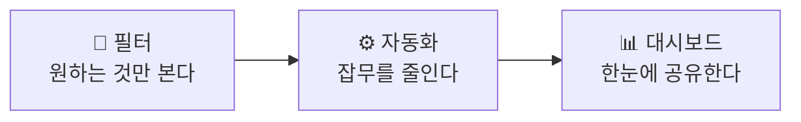

# 🟦 Jira · 10단계 — 대시보드 & 마무리

> 🎯 **개요** — 현황을 한 화면에 모으는 **대시보드**를 만들고, Jira 전체를 정리합니다.

🎬 상황 · 경영진 보고 주간
<ul>
<li>대표가 "매주 현황을 한 화면으로 보고 싶다"고 합니다.</li>
<li>이슈를 일일이 캡처하는 대신, <b>대시보드에 가젯</b>을 배치합니다.</li>
<li>번다운·담당 현황·우선순위 분포를 한눈에 공유합니다.</li>
</ul>

📍 [← 9단계](Step9.md) · [직접 해보기 →](Practice.md)

---

## A. 대시보드 만들기

1. 좌측 **`대시보드`(Dashboards) → `대시보드 만들기`(Create dashboard)** (이름: `Pixel Dungeon 현황`)
2. **`가젯 추가`(Add gadget)** 로 위젯을 올립니다 (가젯 검색창에 한글명 입력):
   - **Sprint Burndown**(한글: `스프린트 번다운 차트 가젯`) — 스프린트 진척
   - **Pie Chart**(한글: `파이 차트`) — 우선순위/담당자 분포
   - **Filter Results**(한글: `결과 필터`) — 8단계에서 저장한 필터(`내 미완료` 등)
3. 대시보드를 **공유(Share)** → 팀·경영진이 같은 화면을 봅니다

> 🐞 **QA 활용** — 같은 대시보드에 **심각도별 버그 파이 차트** + **미해결 버그(결과 필터)** 가젯을 올리면 그대로 **QA 현황판**이 됩니다 → [7단계 · QA](Step7.md)

> 출처: https://support.atlassian.com/jira-software-cloud/docs/configure-a-dashboard/

## B. 효율적 관리 한 장 요약

---

## 🎮 현장 감각 — 게임 PM은 이렇게

> **Pixel Dungeon 맥락** — 경영진·퍼블리셔는 Jira를 직접 보지 않습니다. **대시보드 한 화면**(번다운·우선순위 분포·미완료)으로 주간 현황을 공유하면, 매주 캡처하던 보고가 **링크 하나**로 끝납니다.

**⚠️ 흔한 실수**
- 가젯을 너무 많이 올려 핵심이 묻힘 → **3~5개**로 압축.
- 필터 기반 가젯인데 **필터 공유 권한이 없어** 남에겐 빈 화면 → 필터도 함께 공유.

---

## ✅ 셀프 체크 — Jira 전체

- [ ] **기초**: 프로젝트를 만들고, 에픽→스토리로 작업을 분해한다
- [ ] **실무**: 백로그·스프린트·보드·Timeline·번다운을 운영한다
- [ ] **응용**: 저장 필터·자동화·대시보드로 효율을 높인다

---

## 🎤 면접에서 이렇게 말하세요

- *"Jira로 **기초(프로젝트·이슈 계층) → 실무(백로그·스프린트·Timeline·리포트) → 응용(JQL 필터·Automation·대시보드)** 까지 다뤄봤습니다."*
- *"단순히 이슈만 등록한 게 아니라, **필터로 보고 자동화로 줄이고 대시보드로 공유**하는 흐름까지 경험했습니다."*
- *"그래서 회사가 Jira를 쓰면 **바로 실무 투입**이 가능하다고 자신 있게 말할 수 있습니다."*

---

## ➡️ 다음

- 손으로 직접: **[Jira 직접 해보기](Practice.md)**
- 다음 툴: **[Asana 가이드](../03_Asana/Guide.md)**
