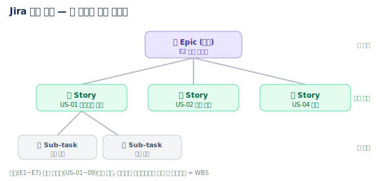
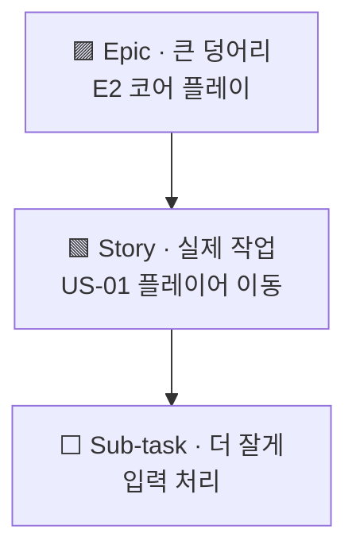
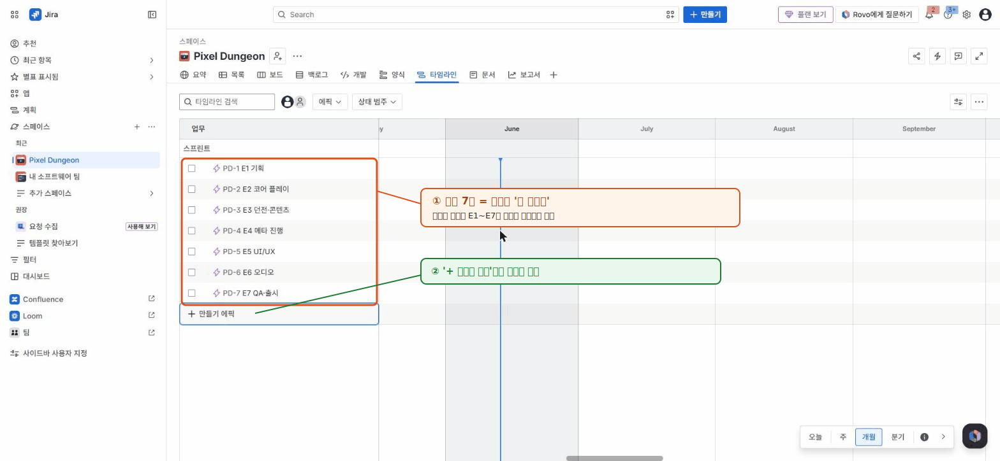

# 🟦 Jira · 2단계 — 작업 계층 이해 + 에픽 만들기

> 🎯 **개요** — 작업을 **에픽→스토리→서브태스크**로 쪼개는 법을 이해하고, 큰 덩어리(에픽) 7개를 만듭니다.

🎬 상황 · 둘째 날
<ul>
<li>기획팀이 문서를 넘겼습니다.</li>
<li>"만들 기능은 크게 7덩어리예요 — 기획·코어플레이·던전·메타·UI·오디오·QA."</li>
<li>이 큰 덩어리들을 먼저 <b>에픽</b>으로 등록해 전체 그림을 잡습니다.</li>
</ul>

📍 [← 1단계](Step1.md) · [3단계 →](Step3.md)

---

## 먼저 개념 — 큰 것에서 작은 것으로

- **에픽**은 여러 스토리를 묶는 큰 작업 → 우리 게임의 **대분류 E1~E7**
- **스토리**는 실제 할 일 → **US-01~09**
- **서브태스크**는 스토리를 쪼갠 것

---

## 에픽 7개 만들기

Timeline 화면에서 만들면 가장 쉽습니다.

1. 상단 탭 **`타임라인`(Timeline)** 열기 → 왼쪽 목록 아래 **`+ 만들기 에픽`(+ Create epic)**
2. 아래 7개를 입력:

`E1 기획` · `E2 코어 플레이` · `E3 던전·콘텐츠` · `E4 메타 진행` · `E5 UI/UX` · `E6 오디오` · `E7 QA·출시`

---

## 🎮 현장 감각 — 게임 PM은 이렇게

> **Pixel Dungeon 맥락** — 에픽은 게임을 이루는 **큰 덩어리**예요. '코어 플레이', '던전', '메타 진행'처럼요. 기획서에 적힌 큰 항목을 그대로 에픽으로 옮기면, 기획팀과 **똑같은 단어로** "이번엔 여기까지 만들자"를 정할 수 있어요. 또 '던전 에픽이 끝나면 데모를 찍자'처럼 **덩어리 단위로 일정**을 잡기도 좋고요.

**⚠️ 흔한 실수**
- 에픽을 스토리처럼 너무 잘게 쪼갬 → 에픽은 **2~4주짜리 기능 묶음** 감각.
- 반대로 게임 전체를 에픽 1개로 뭉뚱그림 → 진척·일정이 안 보임.

**🎤 면접 한 줄**
> *"기획 문서를 **에픽 7개**로 분해해 전체 범위를 먼저 합의한 뒤, 각 에픽을 스토리로 내려 **WBS**를 만들었습니다."*

---

## ✅ 확인

- [ ] 에픽 → 스토리 → 서브태스크 순서를 말할 수 있다
- [ ] Timeline 왼쪽에 에픽 7줄이 생겼다

---

👉 다음: **[3단계 · 백로그 채우기](Step3.md)**
