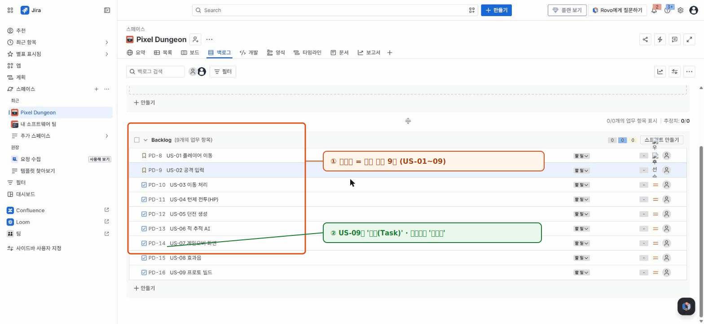

# 🟦 Jira · 3단계 — 백로그 채우기

> 🎯 **개요** — 에픽을 개발자가 바로 손댈 수 있는 **스토리**로 쪼개 백로그를 채우고, 포인트·담당을 넣습니다.

🎬 상황 · 셋째 날
<ul>
<li>개발자가 묻습니다. "에픽 'E2 코어 플레이'… 너무 큰데, 뭘 먼저 하면 되죠?"</li>
<li>맞습니다. 에픽만으로는 일을 시작할 수 없습니다.</li>
<li>개발 가능한 단위(<b>스토리</b>)로 쪼개 백로그를 만들고 우선순위를 매깁니다.</li>
</ul>
👥 <b>팀 미션</b> — 팀원이 에픽을 나눠 맡아 스토리를 함께 채워보세요.

📍 [← 2단계](Step2.md) · [4단계 →](Step4.md)

---

## A. 스토리 9개 만들기

1. 상단 **`백로그`(Backlog)** 탭 열기
2. **Backlog** 섹션의 **`+ 만들기`(+ Create)** 로 아래 9개 입력 (US-09만 타입 Task):

| 요약 | 타입 | 에픽 | 포인트 | 담당 |
|---|---|---|:--:|:--:|
| US-01 플레이어 이동 | Story | E2 | 3 | DEV |
| US-02 공격 입력 | Story | E2 | 2 | DEV |
| US-03 이동 처리 | Story | E2 | 2 | DEV |
| US-04 턴제 전투(HP) | Story | E2 | 3 | DEV |
| US-05 던전 생성 | Story | E3 | 5 | DEV |
| US-06 적 추적 AI | Story | E3 | 2 | DEV |
| US-07 게임오버 화면 | Story | E5 | 3 | ART |
| US-08 효과음 | Story | E6 | 2 | ART |
| US-09 프로토 빌드 | **Task** | E7 | 3 | DEV |

> 💡 **새 항목이 자동으로 `작업(Task)` 타입으로 만들어질 수 있어요.** 그러면 항목을 열고 **제목 줄(또는 패널 상단)의 타입 아이콘 클릭 → `스토리(Story)`** 로 바꾸세요. (US-09만 `작업/Task` 그대로 둡니다.)

## B. 에픽 연결 + 포인트 + 담당

- 각 이슈를 클릭 → 오른쪽 패널의 **`Epic`** 필드에서 해당 에픽 선택
- **`Story point estimate`**(포인트)와 **`Assignee`**(담당) 입력

완성된 백로그는 이런 모습입니다 👇

> 🙋 **에픽 연결을 빼먹으면** Timeline·필터가 비어 보입니다. **모든 스토리에 에픽** 꼭!
> 🙋 **포인트 칸이 없으면** Project settings → Features → **Estimation** 켜기.

> 📷 위 그림은 데모 사이트에서 직접 캡처한 실제 화면입니다 · 공식 문서: https://support.atlassian.com/jira-software-cloud/docs/use-your-scrum-backlog/

---

## ✅ 확인

- [ ] 이슈 9개가 모두 에픽에 연결돼 있다
- [ ] 각 이슈에 포인트·담당자가 있다 (합계가 자동 계산됨)

---

👉 다음: **[4단계 · 스프린트 시작](Step4.md)**
