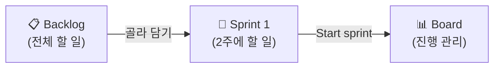
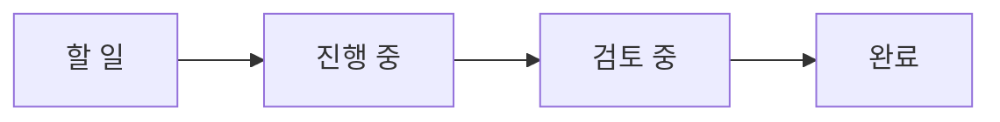
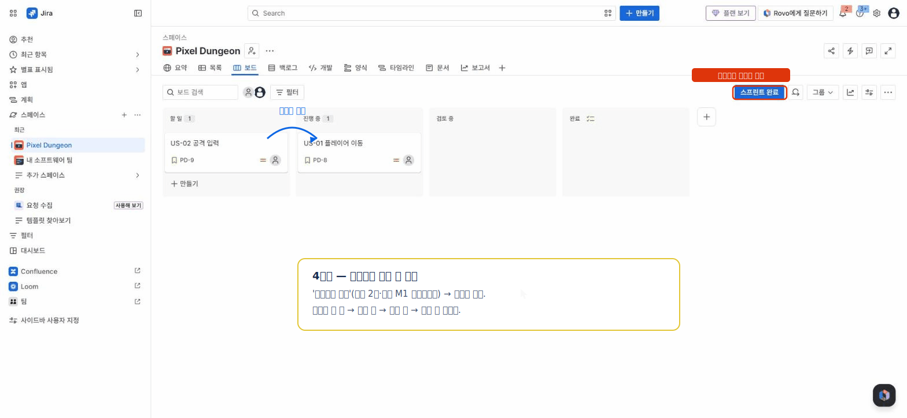
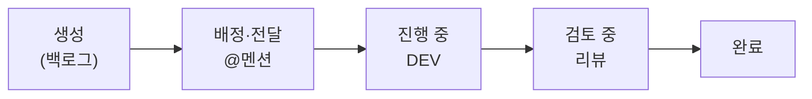

# 🟦 Jira · 4단계 — 스프린트 시작 + 보드 운영

> 🎯 **개요** — **스프린트**를 시작하고 **보드**에서 진행 상황을 옮기며, 작업을 **담당자 사이로 전달(이관)** 해 완료까지 흐르게 합니다.

🎬 상황 · 1주차 월요일
<ul>
<li>대표가 못 박습니다. "<b>2주 뒤, 플레이 되는 프로토타입</b>을 보여주세요."</li>
<li>백로그 전부를 2주에 하는 건 무리입니다.</li>
<li>이번 2주에 끝낼 핵심만 골라 <b>스프린트</b>로 묶어 시작합니다.</li>
<li>목표는 <b>M1 프로토타입</b>입니다.</li>
</ul>

📍 [← 3단계](Step3.md) · [5단계 →](Step5.md)

---

## 스프린트란?

**2주 동안 끝낼 작업 묶음**입니다. 백로그에서 이번에 할 것만 골라 담습니다.

## A. 스프린트 만들고 시작

1. Backlog 위쪽 **`스프린트 만들기`(Create sprint)** → 빈 Sprint 1 칸 생성
   - 🙋 스크럼 프로젝트는 **빈 스프린트(`PD 1 스프린트`)가 이미 만들어져 있을 수 있어요.** 있으면 그대로 사용(또 만들지 않아도 됩니다).
2. 백로그에서 **US-01·02·04·05·09**(합 15pt)를 Sprint 1로 **드래그**
   - 🙋 드래그가 잘 안 되면 **이슈 우클릭 → `업무 항목 이동`(Move work item) → `(스프린트 이름)`** 으로 넣어도 됩니다.
3. **`스프린트 시작`(Start sprint)** 클릭 → 기간(기본 **2주**), Sprint goal `M1 프로토타입` 입력 → **시작**

> 🙋 **`스프린트 시작`이 안 눌리면**: 스프린트에 이슈를 먼저 넣으세요(드래그 또는 위 우클릭 메뉴).

## B. 보드에서 운영

- 스프린트를 시작하면 화면이 **Board(보드)**로 바뀝니다.
- 카드를 **`할 일`(To Do) → `진행 중`(In Progress) → `검토 중`(In Review) → `완료`(Done)** 로 드래그하면 됩니다. (컬럼 구성은 프로젝트마다 다를 수 있어요)

> 🧠 **백로그와 보드는 같은 데이터의 두 화면입니다.** 백로그는 "전체 할 일 목록", 보드는 "이번 스프린트의 진행 상태" — 한쪽에서 상태를 바꾸면 다른 쪽에도 그대로 반영됩니다. 새 화면이 아니라 **같은 이슈를 다르게 보는 것**이에요.

> 📷 실제 보드 화면을 본떠 만든 안내 그림

### 보드를 읽기 쉽게 — 필터 바·스윔레인 (무료)

보드가 카드로 빽빽해지면:
- **필터 바**(보드 위쪽): 담당자 아바타를 누르면 "그 사람 카드만", 에픽 드롭다운으로 "그 에픽만", 검색으로 카드 찾기.
- **스윔레인(Swimlanes)**: `보드 설정`에서 **에픽별·담당별**로 가로줄을 나눠 보면, "어느 에픽이 막혔나"가 한눈에 보입니다.

---

## C. 작업(Task) 상태 전환 — 담당 이관까지

보드 드래그 말고 **작업 상세에서도** 상태를 바꿀 수 있고, 역할이 바뀌면 **담당을 넘깁니다(이관)**.

1. 작업 열기 → 상단 **상태 버튼**(`할 일` ▾ → `진행 중`) 클릭 — 보드 이동과 같은 효과.
2. **담당 이관**: 개발이 끝나 검토가 필요하면 **`Assignee`를 리뷰어로 변경** + 상태를 **`검토 중`** 으로 → 코드리뷰·검수 요청.
3. 통과하면 **`완료`** 로. 이게 작업 하나가 흐르는 길(워크플로)입니다.

> 🔸 여기까지는 **계획된 작업(Task/Story)** 의 흐름입니다. **QA 기간에 QA팀이 발견해 등록하는 버그 '이슈'** 는 결이 다른 별도 프로세스예요 → **[7단계 · QA·이슈 관리](Step7.md)**

---

## D. 스프린트 종료 & 미완료 이월

2주가 끝나면 스프린트를 **닫습니다**.

1. 보드 오른쪽 위 **`스프린트 완료`(Complete sprint)** 클릭
2. 완료된 이슈는 정리되고, **남은(미완료) 이슈**를 어디로 보낼지 물어봅니다 → **백로그** 또는 **다음 스프린트**로 **이월(carry over)**
3. 다음 스프린트를 만들 때 이월된 이슈가 먼저 담깁니다.

> 🧠 **스크럼 vs 칸반** — 지금처럼 2주 단위로 끊어 **시작·종료**하면 **스크럼**입니다. 끊지 않고 카드가 **계속 흐르게** 두면 **칸반**이에요. 출시 후 운영·라이브 대응처럼 "계속 들어오는 일"엔 칸반이 더 맞습니다.

> 🙋 미완료가 매번 많으면 스프린트에 **과하게 담은 신호**예요 — 다음엔 줄여 담으세요.

---

## 🎮 현장 감각 — 게임 PM은 이렇게

> **Pixel Dungeon 맥락** 
> 게임에서 스프린트의 목표는 늘 '직접 플레이되는 것'입니다. 
> 문서나 반쪽짜리 기능이 아니라, M1 프로토타입처럼 손으로 만져볼 수 있는 데모를 2주마다 하나씩 냅니다. 
> 보드의 '검토 중'은 게임팀에선 보통 코드 검토나 아트 컨펌(확인)을 기다리는 칸으로 씁니다.

**⚠️ 흔한 실수**
- 스프린트에 욕심껏 담았다가 매번 다 못 끝냄 → **지난번에 실제로 끝낸 양**(벨로시티)만큼만 담기.
- 스프린트 **목표(goal) 없이** 시작 → 우선순위가 흔들림.

**🎤 면접 한 줄**
> *"2주 스프린트로 **'플레이 가능한 프로토타입'** 이라는 명확한 목표를 잡고, 보드로 매일 진행 상태를 가시화했습니다."*

---

## ✅ 확인

- [ ] Sprint 1이 **시작**되어 Board에 이슈가 보인다
- [ ] 이슈를 다른 상태 컬럼으로 옮길 수 있다
- [ ] 작업을 **리뷰어로 이관**하며 상태를 옮겨봤다
- [ ] 스프린트를 **완료(Complete)** 하고 미완료를 이월할 수 있다

---

👉 다음: **[5단계 · Timeline 일정](Step5.md)**
