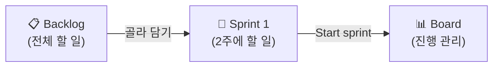
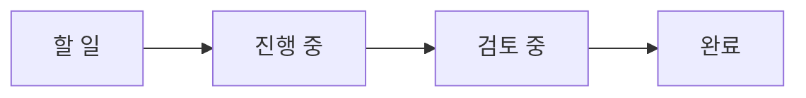

# 🟦 Jira · 4단계 — 스프린트 시작 + 보드 운영

> 🎯 **개요** — 이번 2주에 할 일만 골라 **스프린트**를 시작하고, **보드**에서 진행 상황을 옮깁니다.

🎬 상황 · 1주차 월요일
<ul>
<li>대표가 못 박습니다. "<b>2주 뒤, 플레이 되는 프로토타입</b>을 보여주세요."</li>
<li>백로그 전부를 2주에 하는 건 무리입니다.</li>
<li>이번 2주에 끝낼 핵심만 골라 <b>스프린트</b>로 묶어 시작합니다.</li>
<li>목표는 <b>M1 프로토타입</b>입니다.</li>
</ul>

📍 [← 3단계](Step3.md) · [5단계 →](Step5.md)

---

## 스프린트란?

**2주 동안 끝낼 작업 묶음**입니다. 백로그에서 이번에 할 것만 골라 담습니다.

## A. 스프린트 만들고 시작

1. Backlog 위쪽 **`스프린트 만들기`(Create sprint)** → 빈 Sprint 1 칸 생성
   - 🙋 스크럼 프로젝트는 **빈 스프린트(`PD 1 스프린트`)가 이미 만들어져 있을 수 있어요.** 있으면 그대로 사용(또 만들지 않아도 됩니다).
2. 백로그에서 **US-01·02·04·05·09**(합 15pt)를 Sprint 1로 **드래그**
   - 🙋 드래그가 잘 안 되면 **이슈 우클릭 → `업무 항목 이동`(Move work item) → `(스프린트 이름)`** 으로 넣어도 됩니다.
3. **`스프린트 시작`(Start sprint)** 클릭 → 기간(기본 **2주**), Sprint goal `M1 프로토타입` 입력 → **시작**

> 🙋 **`스프린트 시작`이 안 눌리면**: 스프린트에 이슈를 먼저 넣으세요(드래그 또는 위 우클릭 메뉴).

## B. 보드에서 운영

- 스프린트를 시작하면 화면이 **Board(보드)**로 바뀝니다.
- 카드를 **`할 일`(To Do) → `진행 중`(In Progress) → `검토 중`(In Review) → `완료`(Done)** 로 드래그하면 됩니다. (컬럼 구성은 프로젝트마다 다를 수 있어요)

> 📷 실제 보드 화면을 본떠 만든 안내 그림 · 공식 문서: https://support.atlassian.com/jira-software-cloud/docs/enable-sprints/

---

## 🎮 현장 감각 — 게임 PM은 이렇게

> **Pixel Dungeon 맥락** — 게임 스프린트의 목표는 항상 **'플레이 가능한 증분(playable build)'** 입니다. M1 프로토타입처럼 **손에 잡히는 데모**를 2주마다 만들죠. 보드의 '검토 중'은 게임팀에선 **코드리뷰·아트 컨펌** 단계로 쓰입니다.

**⚠️ 흔한 실수**
- 스프린트에 너무 많이 담아 매번 미달 → **벨로시티**만큼만 약속.
- 스프린트 **목표(goal) 없이** 시작 → 우선순위가 흔들림.

**🎤 면접 한 줄**
> *"2주 스프린트로 **'플레이 가능한 프로토타입'** 이라는 명확한 목표를 잡고, 보드로 매일 진행 상태를 가시화했습니다."*

---

## ✅ 확인

- [ ] Sprint 1이 **시작**되어 Board에 이슈가 보인다
- [ ] 이슈를 다른 상태 컬럼으로 옮길 수 있다

---

👉 다음: **[5단계 · Timeline 일정](Step5.md)**
