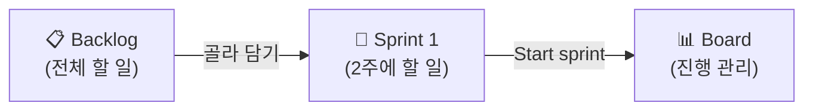

# 🟦 Jira · 4단계 — 스프린트 시작 + 보드 운영

> 🎯 이번 단계 목표: **2주 스프린트를 만들어 시작하고, 보드에서 운영한다.** (약 15분)
> 📍 [← 3단계](Step3.md) · 다음 [5단계 →](Step5.md)

---

## 스프린트란?

**2주 동안 끝낼 작업 묶음**입니다. 백로그에서 이번에 할 것만 골라 담습니다.

## A. 스프린트 만들고 시작

1. Backlog 위쪽 **`Create sprint`** → 빈 Sprint 1 칸 생성
2. 백로그에서 **US-01·02·04·05·09**(합 15pt)를 Sprint 1로 **드래그**
3. **`Start sprint`** 클릭 → 기간(7/06~7/17), Sprint goal `M1 프로토타입` 입력 → 시작

> 🙋 **`Start sprint`가 안 눌리면**: 스프린트에 이슈를 먼저 드래그해 넣으세요.

## B. 보드에서 운영

- 스프린트를 시작하면 화면이 **Board**로 바뀝니다.
- 카드를 **`To Do` → `In Progress` → `Done`** 으로 드래그하면 됩니다.

> 🖼️ 공식 스크린샷 자리 — 스프린트 시작 / 보드
> 출처: https://support.atlassian.com/jira-software-cloud/docs/enable-sprints/

---

## ✅ 확인

- [ ] Sprint 1이 **시작**되어 Board에 이슈가 보인다
- [ ] 이슈를 다른 상태 컬럼으로 옮길 수 있다

---

👉 다음: **[5단계 · Timeline 일정](Step5.md)**
