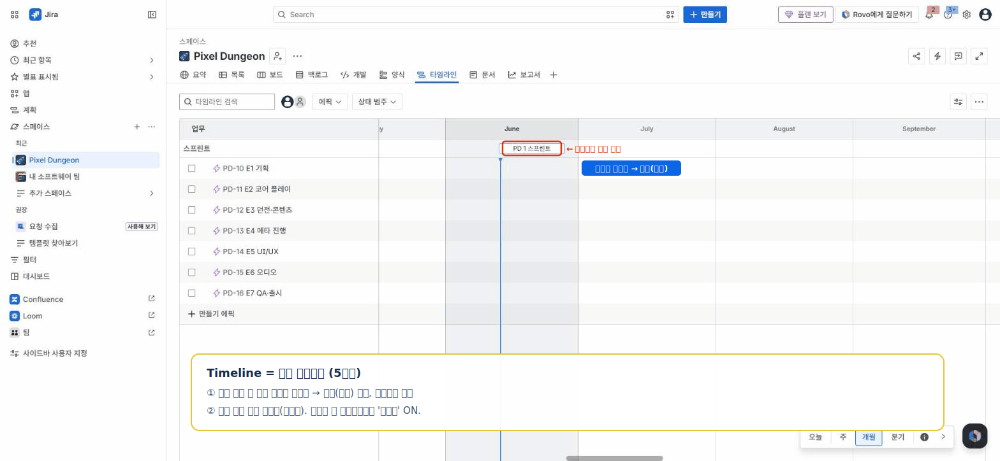

# 🟦 Jira · 5단계 — Timeline으로 일정 잡기

> 🎯 **개요** — 에픽들의 기간·순서·마일스톤을 **Timeline(무료 간트)** 에 그려 전체 일정을 한눈에 만듭니다.

🎬 상황 · 1주차 금요일
<ul>
<li>대표가 부릅니다. "다음 주 <b>투자자 미팅</b>이 있어요."</li>
<li>"'8주 안에 이렇게 만든다'는 <b>로드맵</b> 한 장 만들어 줄래요?"</li>
<li>에픽 일정과 마일스톤(M1~M4)을 Timeline에 막대로 그립니다.</li>
</ul>

📍 [← 4단계](Step4.md) · [6단계 →](Step6.md)

---

## Timeline = 무료로 쓰는 간트차트

Asana·Trello에선 유료인 간트를, Jira는 **무료로** 제공합니다. 그래서 간트는 여기서 배워두면 이득이에요.

1. 상단 탭 **`타임라인`(Timeline)** 열기
2. 각 에픽 행의 **빈 칸을 가로로 드래그**해 막대(기간)를 먼저 만들고, 막대 **좌우 끝을 드래그**해 조절 (아래 표대로) — 처음엔 막대가 없습니다
3. 막대 끝을 다음 에픽 앞에 연결 → **의존성(화살표)** *(오른쪽 위 보기 설정에서 `종속성`이 켜져 있어야 보임)*
4. **스프린트 막대는 시작하면 자동 표시**됩니다. *(팀관리형 타임라인엔 별도 '마일스톤' 토글이 없어요 — M1~M4는 일정상의 기준 시점으로 이해하세요.)*

| 에픽 | 기간 | 마일스톤 |
|---|---|---|
| E1 기획 | 7/06–7/17 | |
| E2 코어 | 7/06–7/24 | **M1**(7/17) |
| E3 던전 | 7/20–7/31 | **M2**(7/31) |
| E5 UI·메타 | 7/27–8/14 | **M3**(8/14) |
| E7 QA·출시 | 8/10–8/28 | **M4**(8/28) |

완성하면 이런 모습입니다 👇

> 📷 위 그림은 데모 사이트에서 직접 캡처한 실제 화면입니다 · 공식 문서: https://www.atlassian.com/agile/tutorials/how-to-do-scrum-with-jira

---

## ✅ 확인

- [ ] 에픽들이 시간축 막대로 배치돼 있다
- [ ] 마일스톤(M1~M4)이 표시된다

---

👉 다음: **[6단계 · 리포트 & 마무리](Step6.md)**
