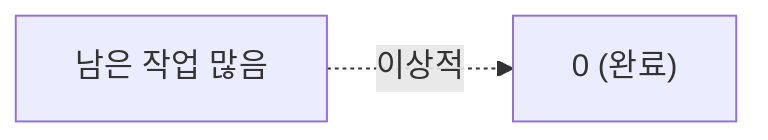
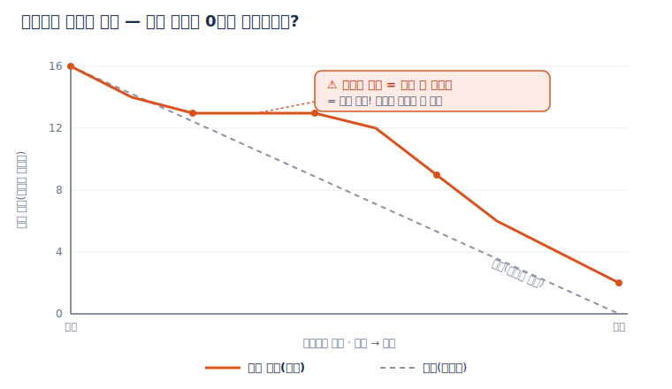

# 🟦 Jira · 6단계 — 리포트(번다운)

> 🎯 **개요** — 번다운 차트로 스프린트 진척을 읽고, 지연을 일찍 잡는 법을 익힙니다.

🎬 상황 · 스프린트 6일차
<ul>
<li>스프린트 중반인데 작업이 줄어드는 느낌이 들지 않습니다.</li>
<li>감으로 "괜찮겠지" 하면 출시가 늦어집니다.</li>
<li><b>번다운 차트</b>로 실제 진척을 확인하고, 위험하면 팀에 공유해 조정합니다.</li>
</ul>

📍 [← 5단계](Step5.md) · [7단계 →](Step7.md)

---

## A. 번다운 차트

스프린트가 돌아가면 상단 탭 **`보고서`(Reports)** → **`더 많은 보고서`(More reports)** → **`스프린트 번다운 차트`** 를 엽니다. (벨로시티는 **`속도 보고서`**)

- **Burndown(번다운)**: 남은 작업이 0으로 줄어드는 그래프. **평평하면 = 일이 안 줄고 있다(위험!)**
- **Velocity(벨로시티)**: 스프린트마다 끝낸 포인트. 다음 스프린트 용량 예측에 사용.

> 💡 외울 필요 없어요. "PM은 번다운으로 지연을 일찍 잡는다" 정도면 충분.

> 📷 실제 보고서 화면을 본떠 만든 안내 그림 · 공식 문서: https://www.atlassian.com/agile/tutorials/sprints

---

## B. Jira의 강점 정리

- **백로그·스프린트·리포트**가 강해 중대형 개발에 적합 → 업계 표준
- 가볍게 시작할 땐 Trello가 더 낫다는 것도 함께 알아두기

> 다음 **7단계(QA)** 까지가 **실무**예요. 그 뒤 **응용 단계**(8~10단계)에서 검색·자동화·대시보드로 효율을 높입니다.

---

## 🎮 현장 감각 — 게임 PM은 이렇게

> **Pixel Dungeon 맥락** — 번다운이 **평평하면**, 게임 개발 특유의 **'재미를 찾느라 작업이 안 줄어드는'** 위험 신호입니다. 이럴 땐 **지난 스프린트에 실제로 끝낸 양**(벨로시티)을 기준으로 다음 2주에 무리 없이 담을 분량을 정하고, 막판에 다 같이 밤새는 일(크런치)이 벌어지기 전에 미리 **"이번엔 여기까지"로 범위를 줄여**요.

**⚠️ 흔한 실수**
- 번다운을 **보고만 하고** 범위를 안 줄임 → 차트가 보고용 장식이 됨.
- **한 번의** 벨로시티로 과신 → 보통 **3스프린트 평균**으로 예측.

**🎤 면접 한 줄**
> *"**번다운 차트**로 스프린트 중반에 지연을 일찍 알아채고, **실제로 끝낸 양의 추세(벨로시티)** 를 근거로 다음 스프린트 범위를 조정했습니다."*

---

## ✅ 확인

- [ ] Reports에서 번다운/벨로시티를 찾을 수 있다
- [ ] 번다운이 "평평하면 위험"이라는 의미를 안다

---

👉 다음: **[7단계 · QA·이슈 관리](Step7.md)** — 실무의 마지막, **QA 프로세스**입니다.
