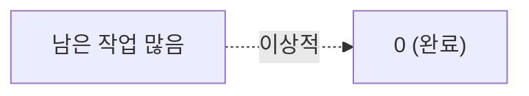

# 🟦 Jira · 6단계 — 리포트 & 마무리

> 🎯 **개요** — 번다운 차트로 스프린트 진척을 읽고, 지연을 일찍 잡는 법을 익힙니다.

🎬 상황 · 스프린트 6일차
<ul>
<li>스프린트 중반인데 작업이 줄어드는 느낌이 들지 않습니다.</li>
<li>감으로 "괜찮겠지" 하면 출시가 늦어집니다.</li>
<li><b>번다운 차트</b>로 실제 진척을 확인하고, 위험하면 팀에 공유해 조정합니다.</li>
</ul>

📍 [← 5단계](Step5.md) · [직접 해보기 →](Practice.md)

---

## A. 번다운 차트 (1분이면 이해)

스프린트가 돌아가면 왼쪽 **`Reports`** 에서 차트를 봅니다.

- **Burndown(번다운)**: 남은 작업이 0으로 줄어드는 그래프. **평평하면 = 일이 안 줄고 있다(위험!)**
- **Velocity(벨로시티)**: 스프린트마다 끝낸 포인트. 다음 스프린트 용량 예측에 사용.

> 💡 외울 필요 없어요. "PM은 번다운으로 지연을 일찍 잡는다" 정도면 충분.

> 🖼️ 공식 스크린샷 자리 — 번다운 차트
> 출처: https://www.atlassian.com/agile/tutorials/sprints

---

## B. Jira의 강점 정리

- **백로그·스프린트·리포트**가 강해 중대형 개발에 적합 → 업계 표준
- 가볍게 시작할 땐 Trello가 더 낫다는 것도 함께 알아두기

---

## ✅ 셀프 체크 — Jira 합격선

- [ ] 팀관리형 스크럼 프로젝트를 만들 수 있다
- [ ] 에픽→스토리(→서브태스크)로 분해할 수 있다
- [ ] 백로그를 채우고 스프린트를 **시작**할 수 있다
- [ ] Timeline에 일정을 그리고 번다운의 의미를 안다

---

## 🎤 면접에서 이렇게 말하세요

- *"Jira로 **팀관리형 스크럼**을 세팅하고, **에픽 7개 아래 스토리·서브태스크**로 WBS를 만들었습니다."*
- *"**2주 스프린트**를 구성·시작하고 **보드**에서 상태를 관리했으며, **Timeline**으로 마일스톤·의존성을, **번다운**으로 진척을 추적했습니다."*
- *"Jira는 확장성·리포트가 강해 스튜디오 정식 개발에 적합하다고 봅니다."*

> 🔑 "에픽→스토리→스프린트→번다운" 흐름을 한 문장으로 말하면 애자일을 이해한 PM으로 보입니다.

---

## ➡️ 다음

- 손으로 직접: **[직접 해보기](Practice.md)**
- 다음 툴: **[Asana 가이드](../03_Asana/Guide.md)** — 같은 작업을 더 직관적인 Asana로.
