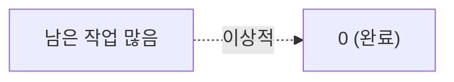

# 🟦 Jira · 6단계 — 리포트(번다운)

> 🎯 **개요** — 번다운 차트로 스프린트 진척을 읽고, 지연을 일찍 잡는 법을 익힙니다.

🎬 상황 · 스프린트 6일차
<ul>
<li>스프린트 중반인데 작업이 줄어드는 느낌이 들지 않습니다.</li>
<li>감으로 "괜찮겠지" 하면 출시가 늦어집니다.</li>
<li><b>번다운 차트</b>로 실제 진척을 확인하고, 위험하면 팀에 공유해 조정합니다.</li>
</ul>

📍 [← 5단계](Step5.md) · [7단계 →](Step7.md)

---

## A. 번다운 차트

스프린트가 돌아가면 왼쪽 **`Reports`** 에서 차트를 봅니다.

- **Burndown(번다운)**: 남은 작업이 0으로 줄어드는 그래프. **평평하면 = 일이 안 줄고 있다(위험!)**
- **Velocity(벨로시티)**: 스프린트마다 끝낸 포인트. 다음 스프린트 용량 예측에 사용.

> 💡 외울 필요 없어요. "PM은 번다운으로 지연을 일찍 잡는다" 정도면 충분.

> 🖼️ 공식 스크린샷 자리 — 번다운 차트
> 출처: https://www.atlassian.com/agile/tutorials/sprints

---

## B. Jira의 강점 정리

- **백로그·스프린트·리포트**가 강해 중대형 개발에 적합 → 업계 표준
- 가볍게 시작할 땐 Trello가 더 낫다는 것도 함께 알아두기

> 여기까지가 **실무 단계**입니다. 이어서 **응용 단계**에서 검색·자동화·대시보드로 효율을 높입니다.

---

## ✅ 확인

- [ ] Reports에서 번다운/벨로시티를 찾을 수 있다
- [ ] 번다운이 "평평하면 위험"이라는 의미를 안다

---

👉 다음: **[7단계 · JQL & 필터](Step7.md)** — 여기서부터 **🟣 응용 단계**입니다.
