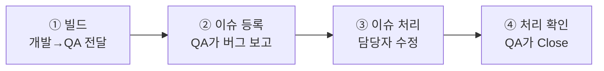
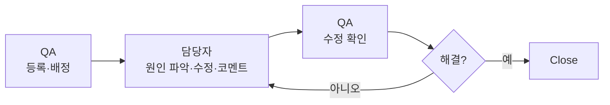

# 🟦 Jira · 7단계 — QA·이슈(버그) 관리

> 🎯 **개요** — **작업(Task)** 과 다른 **이슈(버그)** 를, QA팀이 어떻게 **등록·전달·처리·확인**하는지 익힙니다. 출시 전 QA 기간의 실제 흐름이에요.

🎬 상황 · QA 기간 시작
<ul>
<li>개발이 한 차례 끝나고 <b>QA 기간</b>에 들어갔습니다.</li>
<li>QA팀이 빌드를 받아 테스트하다 <b>버그</b>를 발견합니다.</li>
<li>"스테이지 클리어 후 상점 UI가 안 열려요." → 이걸 <b>이슈로 등록</b>해 개발에 전달해야 합니다.</li>
</ul>

📍 [← 6단계 · 리포트](Step6.md) · [8단계 · JQL →](Step8.md)

---

## A. 작업(Task) vs 이슈(Bug) — 뭐가 다른가

| 구분 | 작업(Task/Story) | 이슈(Bug) |
|---|---|---|
| 누가·언제 | PM·개발이 **계획 단계**에서 | **QA팀**이 QA 기간에 |
| 무엇 | "만들 것" (US-01 이동 등) | "잘못된 것" (버그·결함) |
| 출발점 | 백로그 | 테스트 중 발견 |
| Jira 타입 | **Story / Task** | **Bug** |

> 🙋 Jira에선 Story·Task·Bug가 모두 "이슈 타입"이지만, 우리는 **계획된 작업**과 **QA가 발견한 버그**를 구분합니다. **이 페이지의 "이슈"는 버그**를 뜻해요.

## B. QA 프로세스 4단계

- **① 빌드** — 개발이 빌드 → **빌드 검증 테스트**(실행·기본 동작만 빠르게) 통과 시 **버전(예: `v2.1.3.28`)+경로**를 QA에 전달. *(실행도 안 되는 빌드 전달은 시간낭비·신뢰 손상)*
- **② 이슈 등록** — QA가 준비된 **TC(테스트 케이스)** 로 테스트 → 버그 발견 시 **Bug 이슈 등록**(아래 C).
- **③ 이슈 처리** — QA가 담당자에게 배정 → 담당자가 원인 파악·수정·코멘트 → QA에 재배정.
- **④ 처리 확인** — QA가 수정 빌드에서 해결 확인 → **Close**. 안 고쳐졌으면 코멘트 남기고 재배정.

## C. 이슈(버그) 등록 — 최소 필수 항목 ★

테스트 중 버그가 나오면 **이슈 타입을 `Bug`** 로 등록합니다. 아래 항목은 **최소한** 들어가야 합니다:

| 항목 | 설명 | 예시 |
|---|---|---|
| **제목** | 한 줄 요약 (버전 포함 권장) | `[v1.0.3] 스테이지 클리어 후 상점 UI가 안 열림` |
| **작성자(Reporter)** | 이슈 등록자 | 안중재 |
| **버전(Affects version)** | 발생한 빌드 버전 | v1.0.3 |
| **환경(Environment)** | 테스트 기기·OS | 갤럭시 S26 울트라 |
| **우선순위/심각도** | Priority / Severity | Low / Minor |
| **내용(Description)** | 무슨 현상인지 | 스테이지 클리어 후 메인 홈으로 이동하면 상점 UI 버튼이 동작하지 않음 |
| **재현 스텝(Steps)** | 어떻게 하면 재현되나 | 1. 스테이지 클리어 → 메인 홈 이동  2. 상점 이동 UI 버튼 클릭 |
| **기대 결과(Expected)** | 정상이라면 어땠어야 | 상점 버튼을 누르면 상점으로 이동해야 함 |
| **참고자료(Attachment)** | 이미지·영상 | `issue022.mp4` *(첨부 용량 제한 주의, 약 10MB)* |

> 🎯 **핵심 3종은 무조건**: **① 재현 스텝 · ② 기대 결과 · ③ 실제 현상(내용)**. 이게 없으면 개발이 재현을 못 해 "확인 불가"로 반려됩니다.

**Jira에서**: `만들기` → 이슈 타입 **`Bug`** 선택 → 위 항목을 필드·설명에 입력 → 첨부. *(심각도 필드가 기본에 없으면 라벨이나 설명 머리에 `Severity: Minor`로 표기)*

## D. 이슈 처리 & 확인 — 누구 손을 거치나

1. **배정** — QA가 등록한 이슈를 담당자에게 할당. 담당자를 모르면 **팀장에게 할당** → 팀장이 소통 후 적임자에게 재배정.
2. **처리** — 담당자가 확인·원인 파악 → **코멘트로 기록** → 수정 후 **QA에 재배정**.
3. **확인** — QA가 수정 빌드에서 해결 확인 → **Close**. 재발 시 코멘트 남기고 작업 담당자에게 재배정.

---

## E. 응용으로 키우기 — JQL·자동화·대시보드 (다음 단계)

버그가 쌓이면 손으로 관리하기 어렵습니다. 바로 다음 **응용 단계**가 QA를 키워줍니다:

- **[8단계 · JQL·필터](Step8.md)** → `issuetype = Bug AND statusCategory != Done AND priority = Highest` 로 **출시 블로커 버그**만 저장해 매일 봄.
- **[9단계 · 자동화](Step9.md)** → `Bug 생성 → QA 라벨·담당 자동 지정`, `재발(Reopen) → 팀장 알림`.
- **[10단계 · 대시보드](Step10.md)** → **심각도별 버그 분포(파이)** + **미해결 버그 수(결과 필터)** 로 **QA 현황판**.

> 🔁 이렇게 **실무(이 페이지) → 응용(8~10단계)** 으로 이어집니다.

---

## 🎮 현장 감각 — 게임 PM은 이렇게

> **Pixel Dungeon 맥락** 
> 출시 직전 QA 기간엔 버그가 쏟아집니다. 
> 이때 "어떻게 하면 다시 나타나는지"(재현 스텝)가 또렷한 버그일수록 개발이 빨리 고칩니다. 
> PM은 '출시를 막는 치명적인 버그부터' 순서를 정하고, 버그가 QA→개발→QA로 오가는 흐름이 막히지 않게 챙깁니다.

**⚠️ 흔한 실수**
- "안 돼요"만 쓰고 **재현 스텝·환경 누락** → 개발이 재현 못 해 반려.
- 버그를 **작업(Story)** 타입으로 등록 → 타입은 **`Bug`** 로 (필터·리포트가 갈림).
- 우선순위/심각도 없이 등록 → 무엇부터 고칠지 안 보임.

**🎤 면접 한 줄**
> *"QA 기간에 **Bug 이슈를 재현 스텝·기대 결과·환경**까지 갖춰 등록하고, **배정→수정→재확인→Close**까지 이슈 생명주기를 운영했습니다."*

---

## ✅ 확인

- [ ] **작업(Task)** 과 **이슈(Bug)** 의 차이를 설명할 수 있다
- [ ] 버그 이슈의 **최소 필수 항목**(제목·버전·환경·우선순위/심각도·내용·재현 스텝·기대 결과·첨부)을 안다
- [ ] **빌드→등록→처리→확인** 4단계를 말할 수 있다

---

## ➡️ 다음

- 다음: **[8단계 · JQL & 필터](Step8.md)** — 여기서부터 **🟣 응용 단계**(필터·자동화·대시보드로 버그를 키웁니다).
- 핵심: 작업은 "만들 것", 이슈는 "고칠 것" — **타입(Bug)과 재현 스텝**이 생명입니다.
