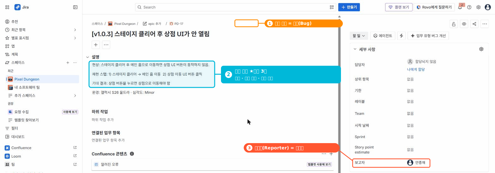

# 🟦 Jira · 7단계 — JQL & 저장된 필터

> 🎯 **개요** — 원하는 이슈만 빠르게 찾는 **검색(JQL)** 과, 자주 보는 화면을 **저장하는 필터**를 익힙니다.

<div class="scenario">
<span class="who">🎬 상황 · 스프린트 2회차</span>
<ul>
<li>이슈가 수백 개로 늘었습니다.</li>
<li>개발자는 "내 작업만", QA는 "이번 스프린트 버그만" 보고 싶어합니다.</li>
<li>매번 눈으로 찾는 대신, <b>검색으로 거르고 저장</b>해 한 번에 봅니다.</li>
</ul>
</div>

📍 [← 6단계](Step6.md) · [8단계 →](Step8.md)

---

## A. 쉬운 검색 (Basic)

1. 상단 돋보기(검색) 또는 왼쪽 메뉴 **`필터`(Filters) → `업무 항목 검색`** 열기 *(예전 UI: Filters → View all issues)*
2. **Basic** 모드에서 프로젝트·담당자·상태·라벨 드롭다운으로 거릅니다 (코드 몰라도 됨)

## B. JQL (Advanced) — 외우지 말고 예시로

`Basic` 옆 **JQL** 로 전환하면 한 줄로 정밀 검색이 됩니다.

```
project = PD AND assignee = currentUser() AND statusCategory != Done   # 내 미완료
project = PD AND issuetype = Bug AND sprint in openSprints()           # 이번 스프린트 버그
project = PD AND parent = PD-11                          # 특정 에픽(E2)의 작업 — 팀관리형은 parent(에픽 키), "Epic Link"는 회사관리형만
```

## C. 필터 저장 & 공유

1. 검색 결과 위 **`필터 저장`(Save as)** → 이름(예: `내 미완료`) 저장
2. 팀과 **공유(Share)** → 모두가 같은 화면을 봄
3. 저장한 필터는 **보드·대시보드**에서 재사용



> 출처: https://support.atlassian.com/jira-software-cloud/docs/use-advanced-search-with-jira-query-language-jql/

---

## 🎮 현장 감각 — 게임 PM은 이렇게

> **Pixel Dungeon 맥락** — 라이브 게임은 이슈가 **수백~수천 개**입니다. "이번 패치 **블로커만**", "내 담당 **버그만**"을 JQL로 즉시 걸러 **일일 스탠드업·핫픽스** 대응 속도를 올립니다. 저장 필터는 곧 **대시보드 가젯의 재료**가 됩니다.

**⚠️ 흔한 실수**
- 팀관리형에서 회사관리형 필드(`"Epic Link"`)를 써서 오류 → **`parent`** 사용.
- 필터를 **저장만 하고 공유 안 함** → 팀이 제각각 다른 화면을 봄.

**🎤 면접 한 줄**
> *"**JQL**로 '내 미완료', '이번 스프린트 버그' 같은 뷰를 **저장·공유**해 팀이 같은 기준으로 작업을 봤습니다."*

---

## ✅ 확인

- [ ] Basic으로 "내 작업"을 걸러낼 수 있다
- [ ] 검색을 **필터로 저장**해 다시 열 수 있다

---

👉 다음: **[8단계 · 자동화(Automation)](Step8.md)**
