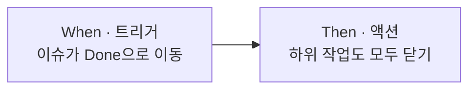
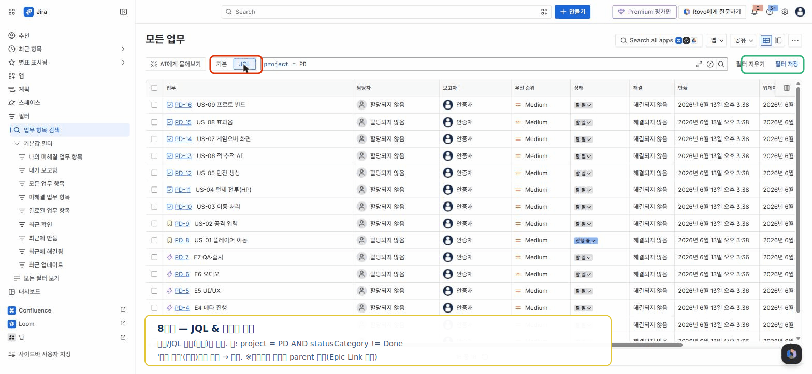

# 🟦 Jira · 8단계 — 자동화(Automation)

> 🎯 **개요** — 반복되는 잡무를 **규칙**으로 자동 처리해, 사람이 깜빡해도 굴러가게 만듭니다.

🎬 상황 · 출시 한 달 전
<ul>
<li>똑같은 잡무가 반복됩니다. "리뷰 끝났는데 Done으로 안 옮김", "버그인데 담당 배정을 깜빡".</li>
<li>사람은 잊지만, <b>규칙은 잊지 않습니다.</b></li>
<li>자동화 규칙으로 이런 일을 자동 처리합니다.</li>
</ul>

📍 [← 7단계](Step7.md) · [9단계 →](Step9.md)

---

## A. 규칙 만들기

1. **스페이스 설정(Project settings) → 자동화(Automation) → 흐름 만들기(Create rule) → 처음부터 만들기**
   - 🙋 새 Jira는 'rule'을 **'흐름(flow)'** 으로 부릅니다. 빌더에서 **Add a trigger / condition / action** 으로 구성.
2. **언제(Trigger) → 조건(If) → 무엇을(Then)** 순서로 구성 (Trello의 Butler와 같은 개념)

## B. 바로 쓰는 규칙 예시

| 언제(Trigger) | 무엇을(Action) |
|---|---|
| 이슈가 `Done`으로 이동 | 하위 작업(서브태스크)도 자동 완료 |
| **Bug** 타입 이슈 생성 | 담당자를 QA로 자동 지정 |
| 스프린트 종료 | 미완료 이슈를 다음 스프린트로 이동 |
| 7일간 변화 없음 | 담당자에게 알림 코멘트 |

> 출처: https://support.atlassian.com/cloud-automation/docs/jira-cloud-automation/

> 💡 무료 플랜도 기본 자동화가 가능합니다(실행 횟수 제한). "반복되면 규칙으로"가 핵심.

---

## 🎮 현장 감각 — 게임 PM은 이렇게

> **Pixel Dungeon 맥락** — 라이브 운영의 반복 잡무(**버그 라벨링·QA 배정·스프린트 롤오버**)를 규칙으로 돌리면, PM은 **콘텐츠·일정**에 집중할 수 있습니다. Trello의 **Butler**와 같은 개념이에요.

**⚠️ 흔한 실수**
- 조건(If) 없이 광범위하게 적용 → "왜 자동으로 바뀌었지?" 혼란.
- 규칙을 과하게 만들어 **무료 플랜 실행 횟수**를 초과.

**🎤 면접 한 줄**
> *"반복되는 **상태 전이·담당 배정**을 자동화 규칙으로 처리해 휴먼 에러와 잡무를 줄였습니다."*

---

## ✅ 확인

- [ ] 트리거 → 액션 구조를 이해한다
- [ ] 규칙을 1개 만들어 동작을 확인했다

---

👉 다음: **[9단계 · 대시보드 & 마무리](Step9.md)**
