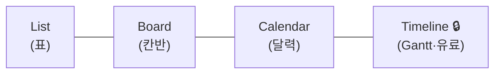

# 🟧 Day 3 — Asana 가이드 (직관적 작업·일정 관리)

> **목표**: Asana에서 게임 프로젝트를 **섹션→태스크→서브태스크**로 구성하고, **List·Board·Calendar** 뷰를 전환하며, **마일스톤**으로 주요 지점을 표시한다.
> **산출물(D3b)**: 다중 뷰를 갖춘 Asana 프로젝트. 실습은 [`Practice.md`](Practice.md)

> 💡 Asana는 **비개발 직군(기획·아트·QA·마케팅·퍼블리싱)과의 협업**에서 강점입니다. UI가 직관적이라 학습이 빠릅니다.

---

## 1. Asana를 언제 쓰나

- 깔끔한 UX로 **누구나 5분이면 적응** → 크로스팀 협업에 강함.
- List/Board/Calendar를 **무료로** 자유롭게 전환.
- 한계: **Timeline(Gantt)은 유료(Starter+)**. 무료에선 Calendar로 일정 감각을 익히고, 필요 시 14일 체험판으로 Timeline 1회 체험.

---

## 2. 핵심 구조

```
Workspace / Team
   └─ Project(프로젝트)   ← "Pixel Dungeon Run"
        └─ Section(섹션)   ← 에픽/단계 (E2 코어, E3 던전…)
             └─ Task(태스크)      ← 작업 1건 (US-01…)
                  └─ Subtask(서브태스크) ← 세부 단계
```

완성된 List 뷰는 이런 모습입니다 👇


> 🖼️ 공식 스크린샷 자리 — Asana: List 뷰(섹션·태스크)
> 공식 출처: https://academy.asana.com/structure-work-with-projects-and-tasks

| 구조 | 개념(로제타) | Jira에선 |
|---|---|---|
| Section | 에픽/단계 | Epic |
| Task | 작업 1건 | Story/Task |
| Subtask | 세부 | Sub-task |
| Milestone | 마일스톤 | Version/릴리스 |
| 뷰(List/Board/Calendar) | 표/칸반/달력 | Backlog/Board |

---

## 3. STEP 0 — 계정 만들기 (무료 Personal)

1. https://asana.com → **Get started**
2. 이메일/구글로 가입 → 조직/워크스페이스 생성(`GameDev Academy`)
3. 무료 **Personal** 플랜: 최대 10명, List/Board/Calendar 사용 가능

> ⚠️ 무료엔 **Timeline/Gantt 없음**. Day 4 Redmine·Day 2 Jira에서 Gantt를 채웁니다.

---

## 4. STEP 1 — 프로젝트 만들기

1. 좌측 **+ → Project → Blank project**(빈 프로젝트)
2. 이름 `Pixel Dungeon Run`, 기본 레이아웃 **List** 선택 → Create

> 🖼️ 공식 스크린샷 자리 — Asana: 프로젝트 생성
> 공식 출처: https://academy.asana.com/structure-work-with-projects-and-tasks

---

## 5. STEP 2 — 섹션(=에픽) 만들기

섹션은 태스크를 단계/에픽으로 묶습니다.

1. **+ Add section**(또는 태스크 이름 끝에 콜론 `:`을 붙이면 섹션이 됨)
2. 섹션 생성: `E2 코어 플레이` `E3 던전·콘텐츠` `E5 UI/UX` `E6 오디오` `E7 QA·출시`

> 🖼️ 공식 스크린샷 자리 — Asana: 섹션으로 워크플로 나누기
> 공식 출처: https://asana.com/inside-asana/sections

---

## 6. STEP 3 — 태스크(작업) 추가

1. 섹션 아래 **Add task** → 시나리오 스토리 입력 (`US-01 플레이어 자동 전진` …)
2. 섹션별로 배치: 코어=US-01~04, 던전=US-05~06, UI=US-07, 오디오=US-08, 출시=US-09

> 🖼️ 공식 스크린샷 자리 — Asana: 태스크 만들기
> 공식 출처: https://help.asana.com/s/article/create-tasks-in-asana

---

## 7. STEP 4 — 태스크 디테일

태스크를 클릭하면 우측 상세 패널이 열립니다.

| 필드 | 활용 |
|---|---|
| **Assignee** | DEV/ART/QA 배정 |
| **Due date** | 마감일(시나리오 일정) |
| **Custom field** | `Priority`(High/Med/Low), `Story Points` 추가 |
| **Description** | 작업 설명/완료 기준 |
| **Attachment** | 기획서·레퍼런스 |

- 커스텀 필드: 프로젝트 상단 **Customize → Add field**로 `Priority` 드롭다운 생성 → 각 태스크에 지정.

---

## 8. STEP 5 — 서브태스크 (WBS 심화)

1. **US-05** 태스크 열기 → **Add subtask**
2. 서브태스크 3개: `바닥 생성` / `플랫폼 배치` / `난이도 점증`
3. 각 서브태스크도 담당자/마감 지정 가능

> 🖼️ 공식 스크린샷 자리 — Asana: 서브태스크
> 공식 출처: https://help.asana.com/s/article/subtasks

---

## 9. STEP 6 — 뷰 전환 (Asana의 강점)

상단 탭에서 같은 데이터를 다른 방식으로 봅니다.

| 뷰 | 무료? | 용도 |
|---|:--:|---|
| **List** | ✅ | 표 형태, 필드 한눈에 |
| **Board** | ✅ | 섹션=컬럼 **칸반** |
| **Calendar** | ✅ | 마감일을 달력에 |
| **Timeline** | ❌ 유료 | Gantt(의존성·기간) |
| **Dashboard** | ❌ 유료 | 차트 리포트 |

1. **Board** 탭 → 섹션이 칸반 컬럼으로 바뀜(태스크 드래그로 단계 이동)
2. **Calendar** 탭 → 마감일이 달력에 표시(일정 감각)



> 💡 무료의 **Calendar**로 "마감 분포"를 보고, Gantt가 꼭 필요하면 **14일 체험판** 또는 Jira/Redmine을 쓰는 것이 현실적 선택입니다.

---

## 10. STEP 7 — 마일스톤

1. List 뷰에서 **Add task 옆 드롭다운 → Add milestone**
2. 마일스톤 생성: `M1 프로토타입`(7/17), `M2 알파`(7/31) …
3. 마일스톤은 다이아몬드(◆)로 표시되어 주요 지점을 강조

> 🖼️ 공식 스크린샷 자리 — Asana: 마일스톤
> 공식 출처: https://asana.com/guide/help/premium/milestones

---

## 11. STEP 8 — Rules(자동화) 맛보기

- 프로젝트 **Customize → Rules**에서 간단 자동화(무료도 기본 제공).
- 예: "태스크가 `Done` 섹션으로 이동하면 → 완료 표시" / "마감일 지나면 담당자에게 알림".

---

## 12. 개념 매핑 복습

| Asana | = PM 개념 | 다른 툴 |
|---|---|---|
| Section→Task→Subtask | **WBS** | Jira Epic→Story→Sub |
| Board 뷰 | **Kanban** | Trello 리스트 |
| Calendar 뷰 | 일정(간이) | — |
| Milestone | 마일스톤 | Jira Version / Redmine Version |
| Timeline(유료) | **Gantt** | Redmine 내장 Gantt |

---

## 13. ⚠️ 함정 노트

- **Timeline을 무료로 기대** → 없음. Calendar/체험판/타 툴로 대체.
- **섹션을 프로젝트로 분리** → 같은 게임은 **한 프로젝트 + 여러 섹션**.
- **커스텀 필드 미설정** → 우선순위/포인트가 안 보임. `Priority` 필드 먼저 추가.
- **마일스톤을 일반 태스크로** → Add milestone으로 만들어야 ◆로 강조됨.

---

## 14. 다음 단계

[`Practice.md`](Practice.md)에서 다중 뷰 프로젝트를 직접 만듭니다.

### 📚 참고한 공식 문서
- [프로젝트·태스크 구조화](https://academy.asana.com/structure-work-with-projects-and-tasks) · [태스크 만들기](https://help.asana.com/s/article/create-tasks-in-asana)
- [서브태스크](https://help.asana.com/s/article/subtasks) · [섹션](https://asana.com/inside-asana/sections)
- [마일스톤](https://asana.com/guide/help/premium/milestones) · [프로젝트 뷰(무료/유료)](https://asana.com/features/project-management/project-views) · [요금제](https://asana.com/pricing)
