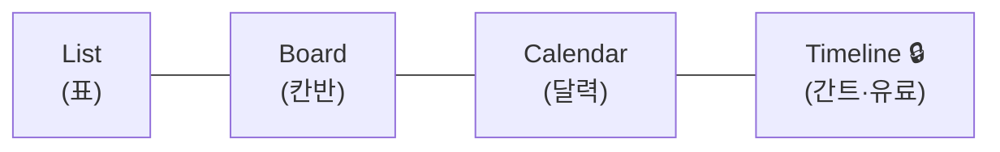

# 🟧 Asana 완전 가이드 — 가장 직관적인 작업관리, 처음이라면 이대로

> 📌 **수업 교안이 아니라 혼자 따라 하는 참고 가이드입니다.** 이 문서대로 따라 하면 **면접에서 "Asana로 프로젝트를 구성하고 여러 뷰로 관리할 줄 안다"** 고 말할 수 있는 수준이 됩니다.
>
> ⏱️ 예상 시간: 처음이면 **40~60분** · 🧰 준비물: 인터넷, 이메일 1개 · 💳 무료(Personal, 최대 10명)
>
> 💡 **Asana의 강점**: UI가 깔끔해 누구나 빨리 적응합니다. 특히 **기획·아트·마케팅 등 비개발 직군과 협업**할 때 빛납니다.

---

## 🎯 이 가이드를 끝내면 할 수 있게 되는 것

- [ ] Asana 프로젝트를 만들고 **섹션 → 태스크 → 서브태스크** 로 구성한다
- [ ] 태스크에 **담당자·마감일·커스텀 필드(우선순위)** 를 넣는다
- [ ] **List · Board · Calendar** 세 가지 뷰를 전환하며 본다
- [ ] **마일스톤(◆)** 으로 주요 지점을 표시한다
- [ ] 무료 플랜의 **Timeline(간트) 한계**를 이해하고 대안을 안다

---

## 🧭 시작 전에 — Asana가 뭐예요? (1분)

Jira가 "개발팀 전용 본격 도구"라면, Asana는 **누구나 쓰는 깔끔한 할 일 관리**입니다. 같은 데이터를 **표(List)·칸반(Board)·달력(Calendar)** 으로 자유롭게 바꿔 볼 수 있는 게 최대 강점입니다.

```
Workspace / Team
   └─ Project(프로젝트)   = "Pixel Dungeon Run"
        └─ Section(섹션)   = 단계/분류 (에픽 역할)
             └─ Task(태스크)      = 작업 1개
                  └─ Subtask(서브태스크) = 더 잘게
```

완성된 List 뷰는 이렇게 생겼습니다 👇


> 💡 연습 프로젝트는 [Pixel Dungeon Run](../00_Overview/03_Game_Project_Scenario.md). 필요한 데이터는 이 문서에 다시 적어두었습니다.

> ⚠️ **미리 알아둘 점**: 무료(Personal)에는 **Timeline(간트)이 없습니다.** 대신 **Calendar(달력)** 로 일정 감각을 익히고, 간트가 꼭 필요하면 Jira·Redmine을 쓰면 됩니다. (이건 단점이 아니라 "툴 선택 기준"입니다)

---

## STEP 0. 계정 만들기 (5분)

1. 브라우저에서 **https://asana.com** 으로 가서 **`Get started`**(시작하기)를 누릅니다.
2. 이메일/구글로 가입하고, 메일 인증을 마칩니다.
3. 조직/워크스페이스 이름을 물으면 `GameDev Academy` 라고 적습니다.
4. 무료 **Personal** 플랜으로 진행합니다. (가입 흐름 중 팀원 초대는 **Skip** 해도 됩니다)

> 🙋 **막히면**: 가입 직후 "첫 프로젝트 만들기" 튜토리얼이 뜨면 따라가도 되고, 닫고 STEP 1로 가도 됩니다.

> ✅ **여기까지 됐으면**: 왼쪽에 Home·My tasks 등의 메뉴가 보입니다.

---

## STEP 1. 프로젝트 만들기 (3분)

1. 왼쪽 메뉴의 **`+`** 또는 **`Create`** → **`Project`**(프로젝트)를 누릅니다.
2. **`Blank project`**(빈 프로젝트)를 선택합니다. (템플릿 말고)
3. 이름 `Pixel Dungeon Run` 을 입력하고, 기본 레이아웃은 **`List`** 로 둡니다 → **Create project**.

> 🖼️ 공식 스크린샷 자리 — Asana: 프로젝트 생성
> 공식 출처: https://academy.asana.com/structure-work-with-projects-and-tasks

> ✅ **여기까지 됐으면**: 빈 List 화면과 상단에 **List · Board · Timeline · Calendar** 탭이 보입니다.

---

## STEP 2. 섹션(분류) 만들기 (4분)

섹션은 태스크를 단계/에픽으로 묶는 칸막이입니다.

1. 화면에서 **`Add section`**(섹션 추가)을 누릅니다.
   - 💡 빠른 방법: 빈 줄에서 이름을 적고 **끝에 콜론 `:`** 을 붙이면 섹션이 됩니다.
2. 섹션 5개를 만듭니다:
   `E2 코어 플레이` · `E3 던전·콘텐츠` · `E5 UI/UX` · `E6 오디오` · `E7 QA·출시`

> 🖼️ 공식 스크린샷 자리 — Asana: 섹션
> 공식 출처: https://asana.com/inside-asana/sections

> ✅ **여기까지 됐으면**: 접을 수 있는 섹션 헤더 5개가 생깁니다.

---

## STEP 3. 태스크(작업) 넣기 (8분)

1. 섹션 아래 **`Add task`**(태스크 추가)를 눌러 아래를 입력합니다. (섹션별로)

| 태스크 | 섹션 | 담당 | 마감 |
|---|---|:--:|:--:|
| US-01 자동 전진 | E2 코어 플레이 | DEV | 7/08 |
| US-02 점프(탭) | E2 코어 플레이 | DEV | 7/09 |
| US-03 슬라이드 | E2 코어 플레이 | DEV | 7/10 |
| US-04 충돌/게임오버 | E2 코어 플레이 | DEV | 7/11 |
| US-05 절차적 생성 | E3 던전·콘텐츠 | DEV | 7/24 |
| US-06 점수 집계 | E3 던전·콘텐츠 | DEV | 7/26 |
| US-07 결과 화면 | E5 UI/UX | ART | 8/05 |
| US-08 효과음 | E6 오디오 | ART | 7/15 |
| US-09 프로토타입 빌드 | E7 QA·출시 | DEV | 7/17 |

2. 태스크를 클릭하면 오른쪽에 상세 패널이 열립니다. 거기서 **Assignee(담당자)** 와 **Due date(마감일)** 를 지정합니다.

> 🖼️ 공식 스크린샷 자리 — Asana: 태스크 만들기
> 공식 출처: https://help.asana.com/s/article/create-tasks-in-asana

> ✅ **여기까지 됐으면**: 섹션별로 태스크가 정리되고, 담당·마감이 표시됩니다.

---

## STEP 4. 우선순위(커스텀 필드) 추가 (5분)

"중요도"를 제목에 적지 말고, **필드로 관리**하는 게 프로답습니다.

1. 프로젝트 상단 오른쪽 **`Customize`**(맞춤설정) 또는 List 헤더의 **`+`** → **`Add field`**.
2. 이름 `Priority`, 종류는 **Drop-down(드롭다운)**, 옵션 `High / Medium / Low` 를 만듭니다.
3. 각 태스크에 우선순위를 지정합니다. (US-01~05·09=High, 06·07=Medium, 08=Low)

> 💡 왜? 필드로 관리하면 나중에 **정렬·필터**가 됩니다. 제목에 "(중요)"라고 쓰면 못 합니다.

> ✅ **여기까지 됐으면**: 각 태스크 행에 Priority 값이 보입니다.

---

## STEP 5. 서브태스크로 더 잘게 (3분)

1. **US-05 절차적 생성** 태스크를 엽니다.
2. 상세 패널에서 **`Add subtask`**(서브태스크 추가)를 눌러 3개를 만듭니다:
   `바닥 생성` / `플랫폼 배치` / `난이도 점증`

> 🖼️ 공식 스크린샷 자리 — Asana: 서브태스크
> 공식 출처: https://help.asana.com/s/article/subtasks

---

## STEP 6. 뷰 전환하기 — Asana의 진짜 강점 (5분)

상단 탭만 누르면 **같은 데이터가 다른 모습**으로 바뀝니다.

1. **`Board`** 탭 → 섹션이 **칸반 컬럼**으로 변합니다. 태스크를 다른 섹션으로 드래그해 보세요.
2. **`Calendar`** 탭 → 마감일이 **달력**에 표시됩니다. 일정이 한눈에 들어옵니다.

| 뷰 | 무료? | 쓸모 |
|---|:--:|---|
| List | ✅ | 표 형태, 필드 한눈에 |
| Board | ✅ | 섹션=칸반 |
| Calendar | ✅ | 마감일 달력 |
| Timeline(간트) | ❌ 유료 | 일정·의존성 |



> 💡 무료의 **Calendar** 로 일정 감각을 익히고, 간트가 필요하면 14일 체험판 또는 Jira/Redmine을 쓰는 게 현실적입니다.

---

## STEP 7. 마일스톤(◆) 표시 (3분)

1. List 뷰에서 **`Add task`** 옆 작은 **드롭다운(▾)** → **`Add milestone`**(마일스톤 추가).
2. `M1 프로토타입`(7/17), `M2 알파`(7/31)를 만듭니다.
3. 마일스톤은 **다이아몬드(◆)** 로 강조 표시됩니다.

> 🙋 **막히면**: 그냥 태스크로 만들면 ◆가 안 생깁니다. 반드시 **Add milestone** 으로 만드세요.

> 🖼️ 공식 스크린샷 자리 — Asana: 마일스톤
> 공식 출처: https://asana.com/guide/help/premium/milestones

---

## 🆘 막혔을 때

| 증상 | 해결 |
|---|---|
| Timeline이 회색/잠김(🔒) | 무료엔 없음(유료). Calendar로 대체 |
| 섹션을 프로젝트로 따로 만들었다 | 같은 게임은 **한 프로젝트 + 여러 섹션** |
| 우선순위가 정렬이 안 된다 | 제목이 아니라 **커스텀 필드**로 관리 |
| 마일스톤이 일반 태스크로 됐다 | Add task ▾ → **Add milestone** 사용 |
| 영어가 어렵다 | 우상단 프로필 → My settings → Display → 언어, 또는 크롬 번역 |

---

## 📖 용어 미니사전

| 영어 | 우리말 | 쉽게 |
|---|---|---|
| Project | 프로젝트 | 일의 묶음 1개 |
| Section | 섹션 | 단계/분류 칸막이 |
| Task | 태스크 | 작업 1개 |
| Subtask | 서브태스크 | 더 잘게 쪼갠 것 |
| Custom field | 커스텀 필드 | 우선순위 등 추가 정보 칸 |
| Milestone | 마일스톤 | 주요 목표 지점(◆) |
| View | 뷰 | 같은 데이터를 보는 방식(List/Board/Calendar) |

---

## ✅ 셀프 체크

- [ ] 프로젝트 + 섹션 5개를 만들 수 있다
- [ ] 태스크에 담당·마감·우선순위(필드)를 넣을 수 있다
- [ ] 서브태스크를 만들 수 있다
- [ ] List/Board/Calendar 뷰를 전환할 수 있다
- [ ] 마일스톤을 ◆로 표시할 수 있다

> 직접 만들어 보는 미션 → [`Practice.md`](Practice.md)

---

## 🎤 면접에서 이렇게 말하세요

- *"Asana로 게임 프로젝트를 **섹션→태스크→서브태스크** 구조로 구성하고, **담당자·마감·커스텀 필드(우선순위)** 로 관리했습니다."*
- *"같은 데이터를 **List·Board·Calendar 뷰로 전환**하며 봤습니다. 상황에 맞는 보기를 골라 쓸 수 있는 게 Asana의 강점이라 생각합니다."*
- *"**마일스톤**으로 주요 지점을 표시해 진척을 관리했습니다."*
- *"무료 Asana는 **간트(Timeline)가 없어서**, 일정 중심 프로젝트면 Redmine·Jira를, 비개발 직군과의 협업이면 Asana를 선택한다는 기준도 가지고 있습니다."*

> 🔑 면접 팁: "**뷰 전환**"과 "**비개발 직군 협업에 강하다**"는 Asana만의 포인트입니다. 이 둘을 언급하면 좋습니다.

---

## ➡️ 다음으로
- 직접 만들기: [`Practice.md`](Practice.md)
- 다음 툴: [`04_Redmine/Guide.md`](../04_Redmine/Guide.md) — 직접 **서버를 띄워** 쓰는 오픈소스 도구로, 무료 **간트**를 경험합니다.

### 📚 참고한 공식 문서
- [프로젝트·태스크 구조화](https://academy.asana.com/structure-work-with-projects-and-tasks) · [태스크 만들기](https://help.asana.com/s/article/create-tasks-in-asana)
- [서브태스크](https://help.asana.com/s/article/subtasks) · [섹션](https://asana.com/inside-asana/sections) · [마일스톤](https://asana.com/guide/help/premium/milestones)
- [프로젝트 뷰(무료/유료)](https://asana.com/features/project-management/project-views) · [요금제](https://asana.com/pricing)
