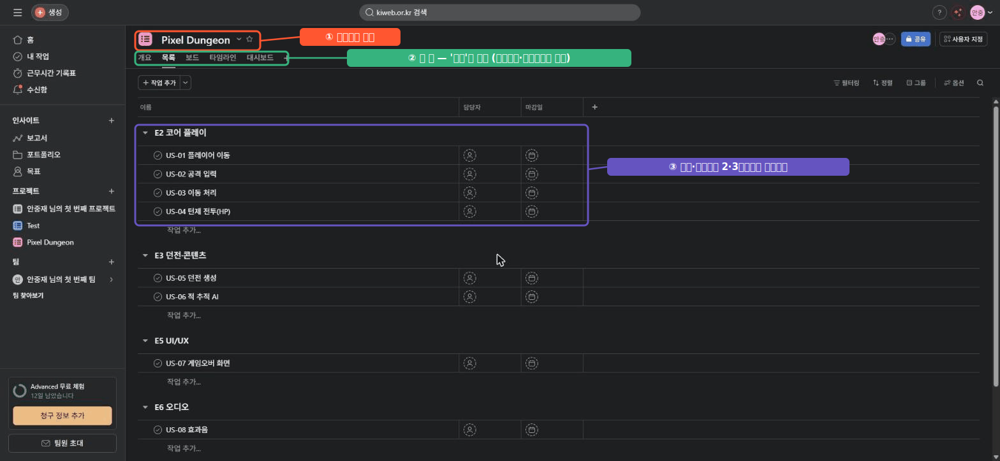

# 🟧 Asana · 1단계 — 계정과 프로젝트 만들기

> 🎯 **개요** — Asana에서 팀이 함께 쓸 **프로젝트**를 만듭니다. 가입은 1분, 무료(Personal)로 충분해요.

🎬 상황 · 입사 첫날
<ul>
<li>오늘은 게임 회사 PM 입사 첫날입니다.</li>
<li>이 팀은 <b>기획·아트·마케팅 등 비개발 직군</b>이 많아 직관적인 Asana를 씁니다.</li>
<li>대표가 말합니다. "PM님, <b>Asana에 프로젝트부터</b> 하나 만들어 주세요."</li>
</ul>

📍 [← 개요](Guide.md) · [2단계 →](Step2.md)

---

## A. 계정 만들기 (무료 Personal)

1. **https://asana.com** → **`Get started`**(시작하기)
2. **이메일** 또는 **구글**로 가입 → 받은 메일에서 **인증**
3. 워크스페이스 이름 `GameDev Academy` 입력 → 무료 **`Personal`** 플랜으로 진행
4. 가입 중 **팀원 초대·첫 프로젝트 자동생성**은 **`Skip`**(건너뛰기) 해도 됩니다

> 🙋 **영어가 부담되면** 크롬에서 우클릭 → "한국어로 번역". 버튼 위치는 같습니다.
> 💳 무료 **Personal**은 소규모 협업까지 무료입니다. 혼자 연습엔 차고 넘쳐요.

> 🖼️ 공식 스크린샷 자리 — Asana 가입

---

## B. 프로젝트 만들기

1. 왼쪽 사이드바 **`프로젝트` 옆 `+` → `새 프로젝트`** (또는 상단 `+ 생성` → 프로젝트)
2. **워크플로 갤러리**가 열리면 우상단 **`+ 빈 프로젝트`(Blank project)** 클릭
3. **이름** `Pixel Dungeon` 입력 → 액세스는 기본(비공개) → **`계속`**
4. **`프로젝트 보기 선택`** 화면이 나오면 그대로 **`프로젝트 생성`**

> 🙋 **레이아웃을 미리 고르는 칸은 없어요.** 만들면 기본이 **목록(List)** 뷰입니다. Calendar는 6단계에서 `+`로 추가합니다.
> 🙋 보기 선택에 **`타임라인·대시보드`가 기본 체크**돼 있는데 이건 **유료**입니다(무료는 잠김). 신경 쓰지 않아도 됩니다. 무료/유료 경계는 8단계에서 정리합니다.

> ▲ 완성된 `Pixel Dungeon` 프로젝트의 기본 **목록(List)** 뷰입니다. 
> ①제목 ②뷰 탭(목록이 기본) ③섹션·태스크 자리 — 섹션·태스크는 2·3단계에서 채웁니다.

---

## 🎮 현장 감각 — 게임 PM은 이렇게

> **Pixel Dungeon 맥락** 
> Asana는 비개발 직군과의 협업에 강합니다. 
> 기획·아트·마케팅이 Jira의 복잡한 용어 없이도 바로 적응합니다. 
> 그래서 "개발 외 인원이 많은 팀"의 첫 협업툴로 자주 선택됩니다.

**⚠️ 흔한 실수**
- 회사 이메일이 없다고 가입을 미룸 → **개인 구글/이메일**로 무료 가입 OK.
- 처음부터 **유료 기능**(Timeline·커스텀필드)을 찾다 막힘 → 무료로 되는 것부터.

**🎤 면접 한 줄**
> *"팀 구성(비개발 직군 비중)을 고려해 **직관적인 Asana**로 협업 환경을 세팅했습니다."*

---

## ✅ 확인

- [ ] 무료 **Personal** 계정으로 로그인된다
- [ ] `Pixel Dungeon` 프로젝트가 만들어졌다
- [ ] 상단에 **개요·목록(List)·보드(Board)** 탭이 보인다 (Calendar는 6단계에서 `+`로 추가)

---

👉 다음: **[2단계 · 섹션으로 분류](Step2.md)**
