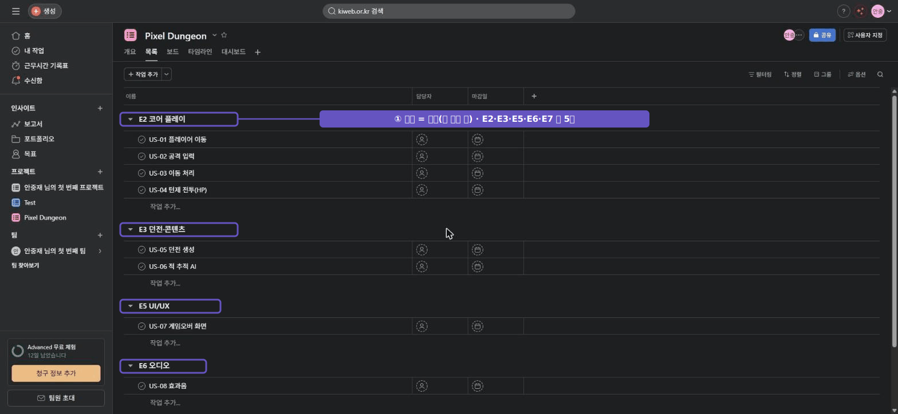

# 🟧 Asana · 2단계 — 섹션으로 분류

> 🎯 **개요** — 작업을 **섹션**(에픽 역할)으로 나눠 전체 그림을 먼저 잡습니다.

🎬 상황 · 둘째 날
<ul>
<li>기획팀이 문서를 넘겼습니다.</li>
<li>"만들 기능은 크게 몇 덩어리예요 — 코어플레이·던전·UI·오디오·QA."</li>
<li>이 큰 덩어리를 먼저 <b>섹션</b>으로 만들어 분류 칸을 짭니다.</li>
</ul>

📍 [← 1단계](Step1.md) · [3단계 →](Step3.md)

---

## 섹션 = 분류 칸 (에픽 역할)

섹션은 태스크를 단계/분류로 묶는 칸막이입니다. Jira의 **에픽**과 같은 역할을 **무료로** 해요.

## A. 섹션 5개 만들기

1. 목록(List) 맨 아래 **`+ 색션 추가`(Add section)** 클릭 → 이름 입력 → Enter
   - 🙋 이름 끝에 콜론 `:` 을 붙이는 옛 방법은 지금은 **태스크로** 만들어지니, 꼭 **`색션 추가` 버튼**을 쓰세요.
2. 아래 5개를 차례로 만듭니다:

`E2 코어 플레이` · `E3 던전·콘텐츠` · `E5 UI/UX` · `E6 오디오` · `E7 QA·출시`

> 🙋 **E1·E4는 왜 건너뛰나요?** 
> 전체 기획서의 에픽은 E1~E7로 7개입니다. 
> 그중 **E1 기획**과 **E4 메타 진행**(장비·스킬·저장/로드)은 이번 프로토타입 범위가 아닙니다. 
> 만들 작업(US)이 없으니 섹션도 만들지 않습니다. 
> 번호는 기획서 기준 그대로 둡니다 → 그래야 **`US-07=E5`** 가 Jira·Trello에서 똑같이 맞습니다.

> ▲ 섹션은 **에픽(큰 분류 칸)** 역할입니다 — E2·E3·E5·E6·E7 총 5개. (E7 QA·출시는 더 아래에)

---

## 🎮 현장 감각 — 게임 PM은 이렇게

> **Pixel Dungeon 맥락** 
> 섹션은 기획서의 대분류를 그대로 옮기는 자리입니다. 
> 섹션부터 잡으면 "전체가 몇 덩어리인지"가 한눈에 보입니다. 
> 그래서 팀과 범위를 합의하기 쉽습니다.

**⚠️ 흔한 실수**
- 섹션 없이 태스크를 **평면으로 쭉** 나열 → 30개만 넘어도 길을 잃음.
- 섹션을 너무 잘게 → 섹션은 **에픽 크기**(2~4주 묶음) 감각으로.

**🎤 면접 한 줄**
> *"작업을 **섹션(에픽 단위)** 으로 먼저 분류해 전체 범위를 구조화한 뒤 태스크를 채웠습니다."*

---

## ✅ 확인

- [ ] 섹션 5개가 순서대로 있다
- [ ] 섹션이 "큰 분류(에픽)" 역할을 한다는 걸 안다

---

👉 다음: **[3단계 · 태스크로 작업 등록](Step3.md)**
