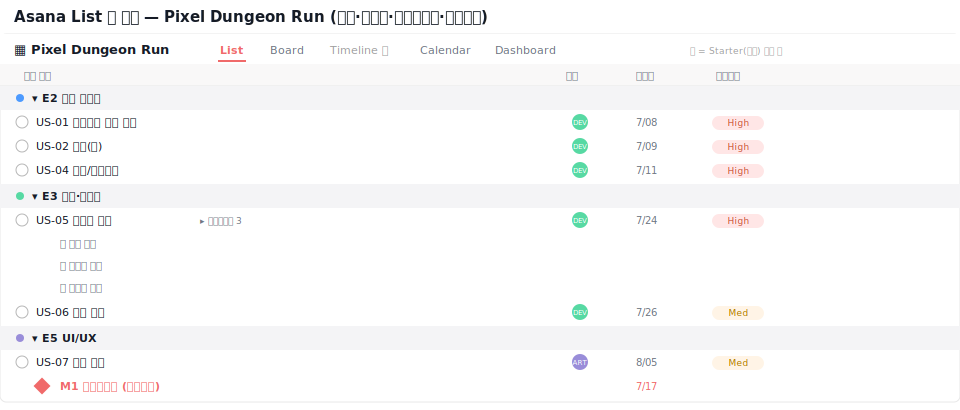

# 🟧 Asana · 2단계 — 섹션과 태스크

> 🎯 이번 단계 목표: **섹션(분류)으로 나누고, 태스크(작업)를 올린다.**
> 📍 [← 1단계](Step1.md) · 다음 [3단계 →](Step3.md)

---

## A. 섹션 만들기

섹션은 태스크를 단계/에픽으로 묶는 칸막이입니다.

1. **`Add section`** 클릭 (또는 빈 줄에서 이름 끝에 콜론 `:` 붙이면 섹션이 됨)
2. 섹션 5개:
   `E2 코어 플레이` · `E3 던전·콘텐츠` · `E5 UI/UX` · `E6 오디오` · `E7 QA·출시`

> 🖼️ 공식 스크린샷 자리 — 섹션
> 출처: https://asana.com/inside-asana/sections

---

## B. 태스크 올리기

섹션 아래 **`Add task`** 로 작업을 추가합니다.

| 태스크 | 섹션 |
|---|---|
| US-01 자동 전진 / US-02 점프 / US-03 슬라이드 / US-04 충돌 | E2 코어 플레이 |
| US-05 절차적 생성 / US-06 점수 집계 | E3 던전·콘텐츠 |
| US-07 결과 화면 | E5 UI/UX |
| US-08 효과음 | E6 오디오 |
| US-09 프로토 빌드 | E7 QA·출시 |

완성하면 이런 모습입니다 👇

> 🖼️ 공식 스크린샷 자리 — 태스크 만들기
> 출처: https://help.asana.com/s/article/create-tasks-in-asana

---

## ✅ 확인

- [ ] 섹션 5개가 있다
- [ ] 태스크 9개가 섹션별로 배치돼 있다

---

👉 다음: **[3단계 · 태스크 꾸미기](Step3.md)**
