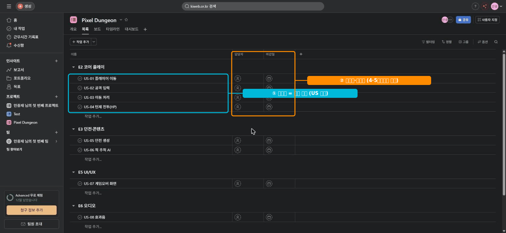

# 🟧 Asana · 3단계 — 태스크로 작업 등록

> 🎯 **개요** — 섹션 안에 실제 작업(**태스크**)을 채우고, **담당·마감**을 넣습니다.

🎬 상황 · 셋째 날
<ul>
<li>분류 칸(섹션)은 만들었습니다.</li>
<li>이제 개발자가 바로 손댈 수 있는 <b>실제 작업</b>이 필요합니다.</li>
<li>유저 스토리 9개를 태스크로 올리고, 누가·언제 할지 정합니다.</li>
</ul>

📍 [← 2단계](Step2.md) · [4단계 →](Step4.md)

---

## A. 태스크 9개 만들기

섹션 아래 **`Add task`**(태스크 추가)로 작업을 추가합니다. 아래 9개를 섹션에 맞춰 입력:

| 태스크 | 섹션 |
|---|---|
| US-01 플레이어 이동 / US-02 공격 입력 / US-03 이동 처리 / US-04 턴제 전투(HP) | E2 코어 플레이 |
| US-05 던전 생성 / US-06 적 추적 AI | E3 던전·콘텐츠 |
| US-07 게임오버 화면 | E5 UI/UX |
| US-08 효과음 | E6 오디오 |
| US-09 프로토 빌드 | E7 QA·출시 |

완성하면 이런 모습입니다 👇

## B. 담당·마감 넣기 (무료)

각 태스크를 클릭하면 오른쪽 **상세 패널**이 열립니다.
- **`Assignee`**(담당): DEV / ART 등 (혼자면 본인)
- **`Due date`**(마감일): 시나리오 일정대로

> 🙋 **시작일도 무료예요.** `Due date` 칸에서 **`시작일(Start date) 추가`** 를 켜면 "언제부터~언제까지" **기간**이 됩니다. 며칠 걸리는 작업은 시작일을 넣어야 Calendar·정렬에서 길이가 보입니다.

## C. 끝낸 일은 ✓ 완료 처리 (Mark complete)

태스크 왼쪽(또는 상세 패널 위)의 **둥근 원 ⭕ 을 클릭**하면 **완료**됩니다 — 초록 체크 ✅ 로 바뀌고 제목에 줄이 그어져요.

- 다시 누르면 **미완료**로 되돌아갑니다.
- 완료한 태스크는 목록에서 **흐려지거나 숨겨집니다**. 목록 상단 **`완료된 태스크`(Completed/Incomplete) 필터**로 다시 볼 수 있어요.
- "**무엇이 끝났나**"가 보여야 진척이 읽힙니다 — 담당·마감만큼 중요한 기본 동작입니다.

> 🙋 만들기만 하고 완료 표시를 안 하면, 보드가 "끝나지 않은 일 더미"처럼 보입니다. **끝나면 그때그때 ✓**.

---

## 🎮 현장 감각 — 게임 PM은 이렇게

> **Pixel Dungeon 맥락** 
> 태스크 제목을 유저 스토리(US-xx, "무엇을 왜") 형태로 적으면, 개발·아트가 "어떤 가치인지" 바로 이해합니다. 
> 담당·마감은 무료에서 다 되는 가장 기본 관리축입니다.

**⚠️ 흔한 실수**
- 담당(Assignee)을 **공란**으로 → "누가 할지 모르는 일"이 쌓임.
- 마감(Due date) 없이 등록 → Calendar·정렬이 비어 보임(6·7단계에서 효과 큼).

**🎤 면접 한 줄**
> *"작업을 **유저 스토리 태스크**로 등록하고 **담당·마감**을 채워, 누가 언제 무엇을 하는지 한눈에 보이게 했습니다."*

---

## ✅ 확인

- [ ] 태스크 9개가 섹션별로 배치돼 있다
- [ ] 모든 태스크에 **담당·마감**이 있다
- [ ] 끝낸 태스크를 **원형 체크(✓)** 로 완료 처리해봤다

---

👉 다음: **[4단계 · 태스크 깊이 — 설명·서브태스크·첨부](Step4.md)**
