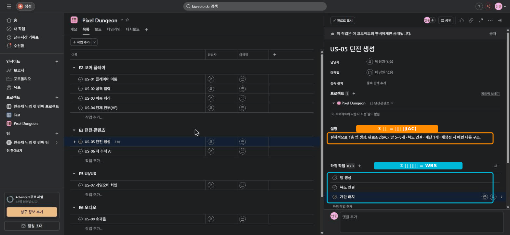

# 🟧 Asana · 4단계 — 태스크 깊이: 설명·서브태스크·첨부

> 🎯 **개요** — 태스크를 열어 **설명(완료조건)·서브태스크(WBS)·첨부**로 "진짜 작업"으로 만듭니다.

🎬 상황 · 1주차
<ul>
<li>개발자가 묻습니다. "'US-05 던전 생성'… 이거 정확히 뭘 어디까지 하면 끝이에요?"</li>
<li>제목만으론 부족합니다. <b>설명·완료조건·세부 작업</b>이 필요합니다.</li>
<li>태스크를 열어 안을 채웁니다.</li>
</ul>

📍 [← 3단계](Step3.md) · [5단계 →](Step5.md)

---

## A. 설명(Description) — 오해를 없애는 한 칸

태스크를 클릭 → 상세 패널의 **`Description`**(설명)에 "무엇을, 어디까지"를 적습니다.

예) `US-05 던전 생성`
> 절차적으로 1층 맵 생성. **완료조건(AC)**: 방 5~8개 · 복도 연결 · 계단 1개 · 재생성 시 매번 다른 구조.

## B. 서브태스크 — 잘게 쪼개기 (WBS, 무료)

- **US-05** 태스크 열기 → **`Add subtask`**(서브태스크 추가) → 3개: `방 생성` / `복도 연결` / `계단 배치`
- 서브태스크에도 담당·마감을 줄 수 있어요.

## C. 첨부(Attach)

- 태스크 우측 위 **`...`(더보기) → `파일 첨부`** (또는 댓글 칸의 클립 아이콘)로 기획 이미지·레퍼런스를 붙입니다.

> ▲ US-05 상세 패널 — ① 설명에 **완료조건(AC)**, ② 하위 작업으로 **WBS**(방 생성·복도 연결·계단 배치)를 만든 모습입니다.

---

## 🎮 현장 감각 — 게임 PM은 이렇게

> **Pixel Dungeon 맥락** 
> 설명의 완료조건(AC) 한 줄이 "다 됐다"의 기준을 통일합니다. 
> 게임은 "재미"가 모호해서 AC가 특히 중요합니다. 
> 서브태스크는 큰 작업(던전 생성)을 하루치 단위로 쪼개 진척이 보이게 합니다.

**⚠️ 흔한 실수**
- 제목만 쓰고 **설명 공란** → 개발·아트가 제각각 해석 → 재작업.
- 서브태스크를 **남발** → 너무 잘게 쪼개면 관리 비용이 더 큼.

**🎤 면접 한 줄**
> *"태스크마다 **완료조건(AC)** 을 적고 큰 작업은 **서브태스크로 WBS**를 만들어, '끝'의 기준을 팀과 통일했습니다."*

---

## ✅ 확인

- [ ] 주요 태스크에 **설명(완료조건)** 이 있다
- [ ] US-05에 서브태스크 3개가 있다

---

👉 다음: **[5단계 · 태그로 분류·협업](Step5.md)**
