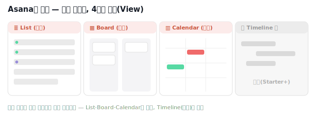

# 🟧 Asana · 4단계 — 뷰 전환 (Asana의 강점)

> 🎯 이번 단계 목표: **같은 데이터를 List·Board·Calendar로 바꿔 본다.** (약 8분)
> 📍 [← 3단계](Step3.md) · 다음 [5단계 →](Step5.md)

---

상단 탭만 누르면 **같은 데이터가 다른 모습**으로 바뀝니다. 이게 Asana의 가장 큰 매력이에요.

1. **`Board`** 탭 → 섹션이 **칸반 컬럼**으로 변합니다. 태스크를 다른 섹션으로 드래그해 보세요.
2. **`Calendar`** 탭 → 마감일이 **달력**에 표시됩니다. 일정이 한눈에 들어와요.

| 뷰 | 무료? | 쓸모 |
|---|:--:|---|
| **List** | ✅ | 표 형태, 필드 한눈에 |
| **Board** | ✅ | 섹션 = 칸반 |
| **Calendar** | ✅ | 마감일 달력 |
| **Timeline** | ❌ 유료 | 간트(의존성·기간) |

> 💡 무료의 **Calendar**로 "마감 분포"를 보고, 간트가 꼭 필요하면 14일 체험판이나 Jira/Redmine을 쓰는 게 현실적입니다.

---

## ✅ 확인

- [ ] Board 뷰에서 섹션이 칸반 컬럼으로 보인다
- [ ] Calendar 뷰에서 마감일이 달력에 표시된다

---

👉 다음: **[5단계 · 마일스톤 & 마무리](Step5.md)**
