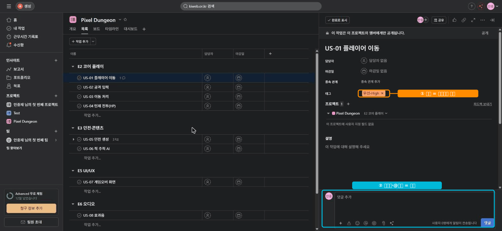

# 🟧 Asana · 5단계 — 태그로 분류 + 협업

> 🎯 **개요** — **무료 태그**로 우선순위·유형을 분류하고, **코멘트·@멘션**으로 함께 일합니다.

🎬 상황 · 우선순위와 소통
<ul>
<li>대표가 "급한 것부터 알려줘요"라고 합니다 — <b>우선순위 표시</b>가 필요합니다.</li>
<li>아트팀에게 "이 화면 레퍼런스 확인해 주세요"라고 <b>콕 집어</b> 요청해야 합니다.</li>
<li>무료 기능만으로 분류와 소통을 해결합니다.</li>
</ul>

📍 [← 4단계](Step4.md) · [6단계 →](Step6.md)

---

## A. 우선순위는 태그(Tag)로 — 무료의 정석

> ⭐ **중요** — "우선순위 **커스텀 필드**"는 **유료(Starter+)** 입니다. 무료에선 **태그(Tags)** 로 같은 효과를 냅니다. (제목에 "(중요)"라고 쓰는 건 ✗ — 정렬·필터가 안 돼요.)

1. 태스크를 열고 → 우측 위 **`...`(더보기) → `태그 추가`** (단축키 `Tab`+`T`) → 상세 패널에 **`태그` 칸**이 생깁니다
2. 칸에 입력해 만들기: `우선-High` / `우선-Medium` / `우선-Low` → **`'…' 태그 생성`** → **색 선택**
3. 태그를 누르면 **그 태그가 달린 작업 전체를 모아** 볼 수 있습니다. 유형 태그도 유용: `버그` / `아트` / `기획`.

## B. 협업 — 코멘트·@멘션·상태 업데이트 (Asana의 강점, 무료)

- **코멘트**: 태스크 하단에 의견·결정을 남깁니다 → "왜 이렇게 했지?"가 기록으로 남음.
- **@멘션**: 코멘트에 `@이름` → 그 사람에게 알림. "콕 집어" 요청·확인.
- **Status update**(프로젝트 상단): 주간 현황을 한 줄로 공유.

> ▲ US-01에 ① **우선-High 태그**(무료 우선순위 분류) + ② **코멘트·@멘션**(협업)을 단 모습입니다.

## C. 받은 편지함(Inbox) — 알림은 어디로 오나

@멘션이나 배정을 받으면, 그 알림은 상대의 **왼쪽 맨 위 `Inbox`(받은 편지함)** 로 갑니다.

- 나를 멘션한 글, 나에게 배정된 태스크, 내가 따라보는(Follow) 태스크의 변경이 **한곳에 모입니다**.
- 항목을 **보관(Archive)** 하면 정리되고, 클릭하면 그 태스크로 바로 이동합니다.
- 나를 **협력자(Collaborator)** 로 추가하면, 담당이 아니어도 그 태스크 변경 알림을 Inbox로 받습니다.

> 🙋 협업은 **@멘션(보내기) → Inbox(받기)** 가 한 쌍입니다. 멘션만 알고 "어디서 받나"를 모르면 절반만 아는 거예요. 하루를 **Inbox 확인**으로 시작하면 놓치는 일이 없습니다.

---

## 🎮 현장 감각 — 게임 PM은 이렇게

> **Pixel Dungeon 맥락** 
> Asana의 진짜 무기는 비개발 직군과의 매끄러운 소통입니다. 
> 아트·기획이 코멘트·@멘션으로 바로 대화하니 별도 메신저를 덜 거칩니다. 
> 무료에선 분류=태그가 커스텀 필드를 대신합니다.

**⚠️ 흔한 실수**
- 우선순위를 **제목에 글자로** → 정렬·필터 불가. **태그**로.
- 결정을 메신저에서만 하고 **태스크에 안 남김** → 나중에 근거를 못 찾음. **코멘트로 기록**.

**🎤 면접 한 줄**
> *"무료 플랜에선 **태그로 우선순위·유형을 분류**하고, **코멘트·@멘션**으로 비개발 직군과 맥락을 잃지 않고 협업했습니다."*

---

## ✅ 확인

- [ ] 태스크에 **우선순위 태그**가 달려 있다
- [ ] 코멘트에 **@멘션**으로 누군가를 호출해 봤다
- [ ] **Inbox(받은 편지함)** 에서 내 알림을 확인해봤다

---

👉 다음: **[6단계 · 뷰 전환 (List·Board·Calendar)](Step6.md)**
