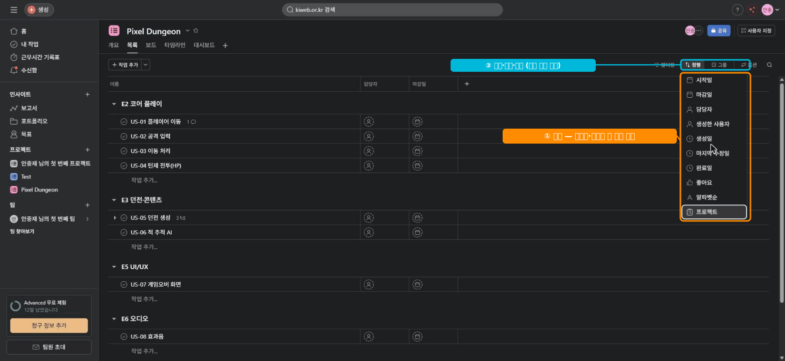

# 🟧 Asana · 7단계 — 정리·검색 (정렬·그룹·My Tasks)

> 🎯 **개요** — 태스크가 많아져도 **정렬·그룹·My Tasks·검색**으로 원하는 것만 빠르게 봅니다. (모두 무료)

🎬 상황 · 작업이 수십 개
<ul>
<li>태스크가 늘면서 화면이 빽빽해졌습니다.</li>
<li>"내가 맡은 것만", "이번 주 마감만" 보고 싶습니다.</li>
<li>매번 눈으로 찾는 대신 <b>정렬·그룹·My Tasks</b>로 거릅니다.</li>
</ul>

📍 [← 6단계](Step6.md) · [8단계 →](Step8.md)

---

## A. 정렬·그룹·필터 (List 뷰, 무료)

List 뷰 상단의 **`Sort`(정렬) · `Group by`(그룹) · `Filter`(필터)** 를 씁니다.
- **Sort by Due date** → 마감 임박 순으로 정렬.
- **Group by Assignee** → 사람별로 묶어 "누가 얼마나" 한눈에.
- **Filter** → 특정 태그(예: `우선-High`)만 골라 보기.

## B. My Tasks — 내 일만 모아 보기

- 왼쪽 사이드바 **`My Tasks`** → 여러 프로젝트에 흩어진 **내게 배정된 작업**이 한 곳에 모입니다.
- Today / Upcoming / Later로 자동 정리 → 매일 아침 여기부터 시작.

## C. 검색

- 상단 **검색창**에 키워드 → 빠른 검색(무료).
- 🙋 **고급 검색·저장된 검색**은 유료(Starter+)입니다. 무료는 기본 검색 + 필터로 충분.

> ▲ **`정렬`(Sort) 메뉴** — 마감일·담당자·알파벳순 등으로 정렬합니다. 옆의 `그룹`·`옵션`까지 모두 **무료 정리 도구**예요.

## D. 한 걸음 더 — 멀티홈잉 · 반복 태스크 (무료)

**멀티홈잉(Multi-homing)** — 태스크 1개를 **여러 프로젝트에 동시에** 둘 수 있어요. 상세 패널 위쪽 프로젝트 이름 옆 **`프로젝트에 추가`(Add to projects)** 를 누릅니다.
- 예: `US-08 효과음` 을 **개발 보드**와 **사운드 외주 보드** 양쪽에 두면, 한쪽에서 상태를 바꿔도 **같은 태스크**라 함께 갱신됩니다(복사본이 아님).
- `My Tasks`가 여러 프로젝트의 내 일을 한곳에 모아 주는 것도 같은 원리입니다.

**반복 태스크(Set to repeat)** — 마감일 칸에서 **`반복`(Repeat)** 을 켜면, 완료할 때 다음 주기로 자동 생성됩니다.
- 예: `주간 빌드 점검`(매주 금), `정기 QA 패스`(격주) 같은 **운영 리듬**을 잊지 않게.

> 🙋 멀티홈잉은 "한 일을 여러 팀이 함께 보는" Asana 고유의 강점이에요. 복사해 두 개를 만들면 따로 놀지만, 멀티홈잉은 **하나가 여러 곳에 비치는** 것이라 어긋나지 않습니다.

---

## 🎮 현장 감각 — 게임 PM은 이렇게

> **Pixel Dungeon 맥락** 
> PM은 매일 My Tasks로 "오늘 내가 챙길 것"을, Group by Assignee로 "팀원별 부하"를 봅니다. 
> 무료만으로도 일일 운영이 충분히 돌아갑니다.

**⚠️ 흔한 실수**
- 마감(Due date)을 안 넣어서 **정렬·My Tasks가 비어** 보임 → 3단계로 돌아가 채우기.
- 정렬·필터를 안 쓰고 **스크롤로** 찾기 → 작업이 늘면 한계.

**🎤 면접 한 줄**
> *"**My Tasks와 정렬·필터**로 매일 우선순위를 정리하고, 팀원별 부하를 점검했습니다."*

---

## ✅ 확인

- [ ] List를 마감·담당 기준으로 정렬/그룹 할 수 있다
- [ ] My Tasks에서 내 작업을 모아 본다
- [ ] 태스크를 **여러 프로젝트에 두거나(멀티홈잉)·반복**으로 만들 수 있다

---

👉 다음: **[8단계 · 무료의 한계 & 마무리](Step8.md)**
