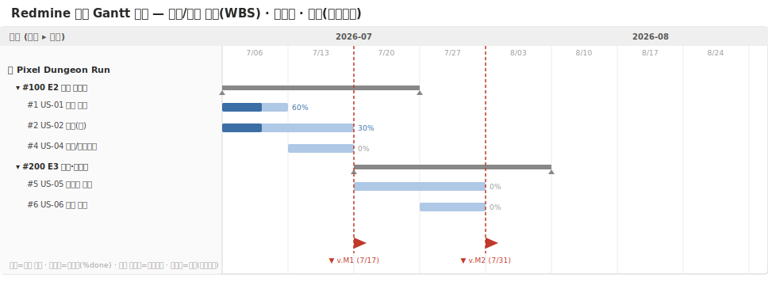
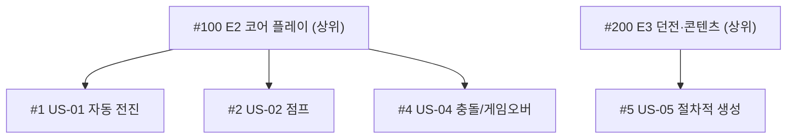

# 🟥 Redmine 완전 가이드 — 직접 설치하는 오픈소스, 처음이라면 이대로

> 📌 **수업 교안이 아니라 혼자 따라 하는 참고 가이드입니다.** 이 문서대로 따라 하면 **면접에서 "Redmine을 직접 설치하고 이슈·WBS·간트로 프로젝트를 관리할 줄 안다"** 고 말할 수 있는 수준이 됩니다.
>
> ⏱️ 예상 시간: 처음이면 **60~90분**(설치 포함) · 🧰 준비물: 인터넷 · 💳 무료(오픈소스)
>
> 💡 **다른 툴과 가장 다른 점**: 앞의 3개는 "가입"만 했지만, Redmine은 **내 컴퓨터에 서버를 직접 띄웁니다.** 예산이 없거나 사내 서버에 둬야 하는 회사에서 PM이 자주 만나는 환경입니다. 처음엔 낯설지만, 한 번 해보면 큰 자신감이 됩니다.

---

## 🎯 이 가이드를 끝내면 할 수 있게 되는 것

- [ ] Redmine을 **직접 설치(Docker)** 해서 띄운다
- [ ] 프로젝트를 만들고 **모듈**을 켠다
- [ ] **상위/하위 이슈** 로 WBS를 만든다
- [ ] **버전(마일스톤)** 과 로드맵을 구성한다
- [ ] 시작/마감/진행률로 **내장 간트 차트**를 완성한다
- [ ] Redmine에 **칸반이 없다는 한계**와 대안을 안다

---

## 🧭 시작 전에 — Redmine이 뭐예요? (1분)

Trello·Jira·Asana는 회사(클라우드)가 서버를 돌려줍니다. **Redmine은 무료·오픈소스라서, 내가(또는 회사가) 서버를 직접 운영**합니다. 대신 **돈이 안 들고 데이터를 내 서버에 둘 수 있으며, 간트차트가 무료로 내장**돼 있습니다.

```
Redmine 서버 (내 PC: http://localhost:3000)
   └─ Project(프로젝트)  = "Pixel Dungeon Run"
        ├─ Tracker(트래커)  = 이슈 종류 (Bug/Feature/Support)
        ├─ Issue(이슈)       = 작업 1개 (상위/하위로 WBS)
        ├─ Version(버전)     = 마일스톤 (M1~M4)
        └─ Gantt             = 시작/마감/진행률로 자동 생성
```

완성된 간트는 이렇게 생겼습니다 👇



> 💡 연습 프로젝트는 [Pixel Dungeon Run](../00_Overview/03_Game_Project_Scenario.md).

---

## STEP 0. Redmine 띄우기 — 가장 큰 관문 (15~25분)

**Docker** 라는 프로그램을 쓰면, 복잡한 설치 없이 명령어 한 줄로 Redmine을 띄울 수 있습니다. 차근차근 해봅시다.

### 0-1. Docker Desktop 설치
1. **https://www.docker.com/products/docker-desktop/** 에서 본인 OS(Windows/Mac)용을 받아 설치합니다.
2. 설치 후 **Docker Desktop을 실행**합니다. (고래 아이콘이 켜지고 "Engine running" 이면 준비 완료)

> 🙋 **Windows에서 막히면**: 설치 중 "WSL2"를 설치하라는 안내가 나오면 그대로 따르세요. 재부팅이 필요할 수 있습니다.

### 0-2. Redmine 실행 (명령어 한 줄)
1. **터미널**을 엽니다. (Windows = `PowerShell`, Mac = `터미널`)
2. 아래를 **복사해서 붙여넣고 Enter**:
```bash
docker run -d --name redmine -p 3000:3000 redmine:6.1
```
3. 처음엔 이미지를 내려받느라 1~3분 걸립니다. 끝나면 긴 글자(컨테이너 ID)가 한 줄 출력됩니다.
4. 브라우저에서 **http://localhost:3000** 으로 접속합니다.

> 🙋 **이게 무슨 명령어예요?**
> - `docker run` = 실행 / `-d` = 백그라운드 / `--name redmine` = 이름 / `-p 3000:3000` = 3000번 포트로 접속 / `redmine:6.1` = 버전.
> 외울 필요 없습니다. "이 한 줄이면 Redmine이 뜬다"만 기억하세요.

> 🙋 **막히면**:
> - `http://localhost:3000` 이 안 뜨면 1분 더 기다렸다 새로고침(서버 켜지는 중).
> - "port is already allocated" 오류 → 3000번이 쓰이는 중. `-p 3001:3000` 으로 바꾸고 `http://localhost:3001` 접속.
> - Docker가 안 켜졌다는 오류 → Docker Desktop 먼저 실행.

### 0-3. (선택) 데이터 보존 버전
위 한 줄은 **컨테이너를 지우면 데이터가 사라집니다**(연습엔 OK). 데이터를 계속 쓰려면 `docker-compose.yml` 파일을 만들고:
```yaml
services:
  redmine:
    image: redmine:6.1
    ports: ["3000:3000"]
    environment:
      REDMINE_DB_POSTGRES: db
      REDMINE_DB_USERNAME: redmine
      REDMINE_DB_PASSWORD: redmine
      REDMINE_DB_DATABASE: redmine
    volumes: ["./redmine-files:/usr/src/redmine/files"]
    depends_on: [db]
  db:
    image: postgres:16
    environment:
      POSTGRES_DB: redmine
      POSTGRES_USER: redmine
      POSTGRES_PASSWORD: redmine
    volumes: ["./redmine-db:/var/lib/postgresql/data"]
```
그 폴더에서 `docker compose up -d` 를 실행합니다.

> 🖼️ 공식 스크린샷 자리 — Redmine: 첫 로그인 화면
> 공식 출처: https://hub.docker.com/_/redmine

> ✅ **여기까지 됐으면**: 브라우저에 Redmine 첫 화면이 보입니다. (이 관문만 넘으면 나머지는 쉽습니다!)

---

## STEP 1. 관리자 로그인 & 초기 설정 (5분)

1. 오른쪽 위 **`Sign in`**(로그인) → 아이디 `admin` / 비밀번호 `admin`.
2. 처음 로그인하면 **비밀번호 변경**을 요구합니다. 새 비밀번호를 정합니다.
3. 상단 **`Administration`**(관리) 으로 들어갑니다.
4. 만약 트래커/상태/역할이 비어 있으면, **`Load the default configuration`**(기본 구성 불러오기) 링크를 한 번 누릅니다. → 기본 트래커(Bug/Feature/Support) 등이 생깁니다.
5. (선택) **Administration → Settings → Display** 에서 언어를 한국어로 바꿀 수 있습니다.

> 🙋 **이걸 안 하면**: 트래커가 없어서 이슈를 못 만듭니다. **꼭 "Load the default configuration" 한 번** 눌러주세요.

> ✅ **여기까지 됐으면**: 관리자로 로그인되고 기본 데이터가 준비됩니다.

---

## STEP 2. 프로젝트 만들기 (4분)

1. 상단 **`Projects`** → **`New project`**(새 프로젝트).
2. Name `Pixel Dungeon Run`. (Identifier는 자동으로 `pixel-dungeon-run`)
3. 아래 **Modules(모듈)** 에서 다음을 체크합니다(중요!):
   `Issue tracking` · **`Gantt`** · `Calendar` · `Time tracking` · **`Roadmap`**(=Versions) · `Wiki`
4. **Trackers** 에서 Bug/Feature/Support 를 체크하고 **Create**.

> 🙋 **나중에 Gantt 탭이 없다면**: 이 모듈 체크를 빠뜨린 것입니다. 프로젝트 **Settings → Modules** 에서 다시 켜면 됩니다.

> 🖼️ 공식 스크린샷 자리 — Redmine: 프로젝트 생성/모듈
> 공식 출처: https://www.redmine.org/projects/redmine/wiki/RedmineProjectSettings

---

## STEP 3. 상위/하위 이슈로 WBS 만들기 (12분)

Redmine엔 "에픽"이란 단어는 없지만, **상위 이슈 아래 하위 이슈**를 두면 똑같이 WBS가 됩니다.

### 3-1. 상위 이슈(에픽 역할) 먼저
1. 프로젝트에서 **`New issue`**(새 이슈).
2. Tracker = `Feature`, Subject(제목) = `E2 코어 플레이` → Create.
3. 같은 방식으로 `E3 던전·콘텐츠` 도 만듭니다.

### 3-2. 하위 이슈
1. 다시 **New issue** → 제목 `US-01 자동 전진`.
2. **`Parent task`**(상위 작업) 칸에 `E2 코어 플레이` 를 지정합니다. ← 이게 핵심!
3. 같은 방식으로 US-01~04를 E2 아래, US-05~06을 E3 아래에 둡니다.



> 🖼️ 공식 스크린샷 자리 — Redmine: 이슈 + Parent task
> 공식 출처: https://www.redmine.org/projects/redmine/wiki/RedmineIssues

> ✅ **여기까지 됐으면**: 상위 이슈를 열면 아래에 **Subtasks 목록**이 보입니다 = WBS 완성.

---

## STEP 4. 버전(마일스톤) 만들기 (6분)

Redmine의 **Version = 마일스톤** 입니다.

1. 프로젝트 **`Settings`** → **`Versions`** → **`New version`**.
2. `M1 프로토타입` (Due date 7/17), `M2 알파` (7/31) 를 만듭니다.
3. 각 이슈를 열어 **`Target version`** 칸에 해당 버전을 지정합니다. (US-01·02·04→M1, US-05·06→M2)
4. 상단 **`Roadmap`** 탭에서 버전별 진척(%)이 자동 집계되는 걸 봅니다.

> 🖼️ 공식 스크린샷 자리 — Redmine: Roadmap
> 공식 출처: https://www.redmine.org/projects/redmine/wiki/RedmineRoadmap

---

## STEP 5. 간트 차트 완성하기 (8분)

간트는 이슈의 **시작일·마감일·진행률(% Done)** 로 자동으로 그려집니다.

1. 각 하위 이슈를 열어 **`Start date`**(시작), **`Due date`**(마감) 를 입력합니다. (아래 표)
2. **`% Done`**(진행률) 도 넣습니다.
3. 상단 **`Gantt`** 탭을 누르면 막대·진행률·상위하위·버전선이 표시됩니다.

| 이슈 | 시작 | 마감 | %Done |
|---|:--:|:--:|:--:|
| US-01 | 7/06 | 7/12 | 60 |
| US-02 | 7/06 | 7/19 | 30 |
| US-04 | 7/13 | 7/19 | 0 |
| US-05 | 7/20 | 7/31 | 0 |
| US-06 | 7/27 | 8/02 | 0 |

> 🙋 **간트가 비어 보이면**: 날짜를 안 넣은 것입니다. **시작/마감 날짜가 있어야** 막대가 그려집니다.
> 💡 Redmine 간트는 **드래그 편집이 안 됩니다**(보기 위주). 일정을 바꾸려면 이슈의 날짜를 수정하면 간트에 반영됩니다.

> 🖼️ 공식 스크린샷 자리 — Redmine: Gantt
> 공식 출처: https://www.redmine.org/projects/redmine/wiki/RedmineGantt

> ✅ **여기까지 됐으면**: 위 [간트 목업](../assets/redmine_gantt_mockup.svg)과 비슷한 화면이 나옵니다.

---

## STEP 6. (보너스) 시간 기록 & 칸반 한계 (5분)

- **시간 기록**: 이슈에서 **`Log time`**(시간 기록) → 소요 시간 입력. 추정 대비 실제를 비교할 수 있습니다.
- **칸반은?** Redmine **기본엔 칸반 보드가 없습니다.** 흉내내려면 상태(New/In Progress/Resolved/Closed)별 **저장된 필터**를 쓰거나, 진짜 드래그 보드가 필요하면 **Redmine Agile 플러그인**(설치 필요)을 씁니다. → 이 한계가 "왜 어떤 팀은 Jira를 쓰는가"의 이유입니다.

---

## 🆘 막혔을 때

| 증상 | 해결 |
|---|---|
| http://localhost:3000 안 뜸 | 1분 대기 후 새로고침 / Docker Desktop 실행 확인 |
| "port already allocated" | `-p 3001:3000` 으로 바꿔 실행, 3001로 접속 |
| 이슈를 못 만든다 | Administration → **Load the default configuration** |
| Gantt 탭이 없다 | 프로젝트 Settings → **Modules** 에서 Gantt 켜기 |
| 간트가 비어 있다 | 이슈에 **시작/마감/%Done** 입력 |
| 데이터가 사라졌다 | `docker run` 단독은 비영구. STEP 0-3(compose) 사용 |
| 영어가 어렵다 | Administration → Settings → Display → 한국어, 또는 크롬 번역 |

---

## 📖 용어 미니사전

| 영어 | 우리말 | 쉽게 |
|---|---|---|
| Issue | 이슈 | 작업/할 일 1개 |
| Tracker | 트래커 | 이슈 종류(Bug/Feature/Support) |
| Parent task | 상위 작업 | 위쪽 큰 이슈 |
| Version | 버전 | 마일스톤(목표 지점) |
| Roadmap | 로드맵 | 버전별 진척 모음 |
| Gantt | 간트 | 일정 막대 차트 |
| % Done | 진행률 | 얼마나 했는지(%) |
| Module | 모듈 | 프로젝트 기능 on/off |

---

## ✅ 셀프 체크

- [ ] Docker로 Redmine을 띄워 로그인할 수 있다
- [ ] 프로젝트를 만들고 모듈(Gantt 등)을 켤 수 있다
- [ ] 상위/하위 이슈로 WBS를 만들 수 있다
- [ ] 버전(마일스톤)을 만들고 이슈에 연결할 수 있다
- [ ] 날짜·진행률을 넣어 간트를 띄울 수 있다

> 직접 만들어 보는 미션 → [`Practice.md`](Practice.md)

---

## 🎤 면접에서 이렇게 말하세요

- *"Redmine을 **Docker로 직접 설치**해서 띄워봤습니다. 클라우드 도구와 달리 **자체 호스팅**이라, 예산 제약이나 사내 서버 환경에서 쓰는 도구라는 걸 이해하고 있습니다."*
- *"**상위/하위 이슈로 WBS**를 만들고, **버전을 마일스톤**으로 써서 로드맵을 구성했습니다."*
- *"이슈의 **시작·마감·진행률**로 **내장 간트차트**를 완성해 일정을 관리했습니다. 간트가 무료로 되는 게 Redmine의 장점입니다."*
- *"다만 **칸반 보드가 기본엔 없어서** 플러그인이 필요하다는 한계도 압니다. 그래서 칸반 중심이면 Trello/Jira를, 비용·자체호스팅이 중요하면 Redmine을 택합니다."*

> 🔑 면접 팁: "**직접 서버를 띄워봤다**"는 경험은 흔치 않아 강한 인상을 줍니다. Docker 한 줄이라도 해본 걸 꼭 언급하세요.

---

## ➡️ 다음으로
- 직접 만들기: [`Practice.md`](Practice.md)
- 마지막 단계: [`05_Capstone/Capstone.md`](../05_Capstone/Capstone.md) — 4개 툴을 다 해봤으니, **상황에 맞는 툴을 고르는** 캡스톤으로 마무리합니다.

### 📚 참고한 공식 문서
- [사용자 가이드](https://www.redmine.org/projects/redmine/wiki/Guide) · [이슈](https://www.redmine.org/projects/redmine/wiki/RedmineIssues)
- [Gantt](https://www.redmine.org/projects/redmine/wiki/RedmineGantt) · [Roadmap](https://www.redmine.org/projects/redmine/wiki/RedmineRoadmap)
- [Docker 이미지](https://hub.docker.com/_/redmine) · [프로젝트 설정](https://www.redmine.org/projects/redmine/wiki/RedmineProjectSettings)
