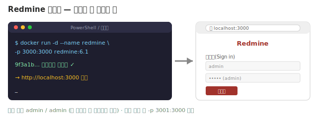

# 🟥 Redmine 가이드 — 개요

> **직접 설치하는 오픈소스** 툴입니다. 앞의 3개는 "가입"만 했지만, Redmine은 **내 컴퓨터에 서버를 띄웁니다.** 처음엔 낯설어도 한 번 해보면 큰 자신감이 돼요.
> 💳 무료(오픈소스) · 🧰 Docker
> 💼 이 트랙에서 Redmine의 **핵심 기능을 모두** 익힙니다 (이슈 · 상위/하위 WBS · 버전/마일스톤 · 내장 Gantt · 사용자 정의 쿼리 · 시간 추적 · 위키). 회사가 Redmine을 쓴다면 자신 있게 "써봤습니다"라고 말할 수 있게.

---

## 🧩 Redmine이 뭐예요?

Trello·Jira·Asana는 회사(클라우드)가 서버를 돌려주지만, **Redmine은 무료·오픈소스라 내가(또는 회사가) 서버를 직접 운영**합니다. 대신 **돈이 안 들고, 데이터를 내 서버에 두며, 간트차트가 무료로 내장**돼 있어요.

| 단어 | 뜻 |
|---|---|
| **Issue** (이슈) | 작업/할 일 1개 |
| **Tracker** (트래커) | 이슈 종류 (Bug/Feature/Support) |
| **Version** (버전) | 마일스톤(목표 지점) |
| **Gantt** (간트) | 일정 막대 차트 (무료 내장!) |

---

## 🎯 이 가이드를 끝내면

- [ ] Docker로 Redmine을 직접 띄울 수 있다
- [ ] 이슈를 트래커·상태까지 갖춰 다루고, 상위/하위로 WBS를 만들 수 있다
- [ ] 버전(마일스톤)·로드맵·내장 간트로 일정을 관리할 수 있다
- [ ] 필터·저장된 쿼리, 시간 추적·이슈 관계까지 쓸 수 있다

---

## 📚 단계별로 배우기

**🟢 기초** — 띄우고, 이슈 한 장을 끝까지 다루기

| 단계 | 내용 |
|---|---|
| [**1단계 · Redmine 띄우기**](Step1.md) | Docker로 설치·실행 (관문!) |
| [**2단계 · 관리자 설정 & 프로젝트**](Step2.md) | 기본 구성·모듈·프로젝트 |
| [**3단계 · 이슈 다루기**](Step3.md) | 트래커·설명·상태·우선순위 |

**🔵 실무** — 구조·일정으로 굴리기

| 단계 | 내용 |
|---|---|
| [**4단계 · 상위/하위 WBS**](Step4.md) | Parent task로 계층 |
| [**5단계 · 버전 & 로드맵**](Step5.md) | 버전=마일스톤, 진척 자동 집계 |
| [**6단계 · 내장 간트**](Step6.md) | 날짜·진행률 → 무료 간트 |

**🟣 응용** — 운영·분석·협업

| 단계 | 내용 |
|---|---|
| [**7단계 · 사용자 정의 쿼리**](Step7.md) | 필터·그룹·저장된 쿼리 |
| [**8단계 · 시간 추적 & 관계**](Step8.md) | 추정 vs 실제·선행/막음 |
| [**9단계 · 위키·소식 & 마무리**](Step9.md) | 위키·소식·한계·면접 |

- [**직접 해보기**](Practice.md) — 혼자 처음부터 만들어보기

> 💡 연습용 프로젝트는 [Pixel Dungeon](../00_Overview/03_Game_Project_Scenario.md). 1단계(설치)만 넘으면 나머지는 쉬워요.

---

## 🎤 다 배우면 면접에서 이렇게

> *"Redmine을 **Docker로 직접 설치**해서, **상위/하위 이슈로 WBS**를 만들고 **버전을 마일스톤**으로 써서 **내장 간트차트**까지 완성했습니다. 자체 호스팅이라 예산·보안 제약이 큰 환경에 쓰는 도구라는 것도 압니다."*

---

👉 준비됐으면 **[1단계 · Redmine 띄우기](Step1.md)** 로 시작하세요.
