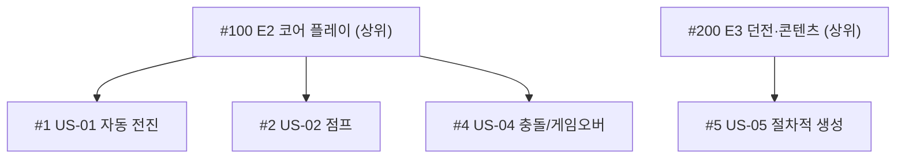

# 🟥 Day 4 — Redmine 가이드 (오픈소스 · 자체 호스팅 · 내장 Gantt)

> **목표**: Redmine을 **직접 띄우고**(Docker), 프로젝트·트래커·이슈를 만들고, **상위/하위 이슈(WBS)** 와 **버전(마일스톤)** 을 구성해 **무료 내장 Gantt**를 완성한다.
> **산출물(D4)**: 프로젝트 + Gantt. 실습은 [`Practice.md`](Practice.md)

> 💡 앞의 3개는 "가입"만 했지만, Redmine은 **서버를 직접 운영**합니다. 예산이 없거나 사내 서버에 둬야 하는 조직에서 PM이 자주 만나는 환경입니다.

---

## 1. Redmine을 언제 쓰나

- **무료·오픈소스(GPL)**. 라이선스 비용 0, 자체 서버에 설치 → 데이터 완전 통제.
- **Gantt가 내장**되어 무료로 일정 관리 가능(Jira Timeline과 함께 본 과정의 Gantt 핵심).
- 이슈 추적기로서 견고함(트래커·워크플로·시간기록).
- 한계: **설치/운영 부담**, **Kanban 보드가 코어에 없음**(플러그인 필요), UI가 다소 옛스러움.
- 현재 안정판: **6.1.2** (2026-03), 공식 **Docker 이미지** 제공.

---

## 2. 핵심 구조

```
Redmine 인스턴스 (내 서버: http://localhost:3000)
   └─ Project(프로젝트)   ← "Pixel Dungeon Run"
        ├─ Tracker(트래커)  ← 이슈 종류 (Bug / Feature / Support)
        ├─ Issue(이슈)       ← 작업 1건 (상위/하위로 WBS)
        ├─ Version(버전)     ← 마일스톤 (M1~M4) → Roadmap
        └─ Gantt             ← 시작/마감/진행률로 자동 생성
```

완성된 Gantt는 이런 모습입니다 👇


> 🖼️ 공식 스크린샷 자리 — Redmine: Gantt 차트
> 공식 출처: https://www.redmine.org/projects/redmine/wiki/RedmineGantt

---

## 3. STEP 0 — 실습 환경 준비 (가장 중요한 관문)

3가지 중 하나를 선택합니다. **교실에서는 A(Docker) 권장.**

### 옵션 A — Docker로 로컬 실행 (권장)

전제: [Docker Desktop](https://www.docker.com/products/docker-desktop/) 설치.

**(A-1) 가장 빠른 1줄 — 즉시 체험용(SQLite, 데이터 비영구)**
```bash
docker run -d --name redmine -p 3000:3000 redmine:6.1
```
- 브라우저에서 **http://localhost:3000** 접속
- 기본 관리자: **admin / admin** (첫 로그인 시 비밀번호 변경 요구)

**(A-2) 데이터 보존 + 팀 실습용 — docker compose (PostgreSQL)**
`docker-compose.yml` 파일을 만들고:
```yaml
services:
  redmine:
    image: redmine:6.1
    ports:
      - "3000:3000"
    environment:
      REDMINE_DB_POSTGRES: db
      REDMINE_DB_USERNAME: redmine
      REDMINE_DB_PASSWORD: redmine
      REDMINE_DB_DATABASE: redmine
    volumes:
      - ./redmine-files:/usr/src/redmine/files
    depends_on:
      - db
  db:
    image: postgres:16
    environment:
      POSTGRES_DB: redmine
      POSTGRES_USER: redmine
      POSTGRES_PASSWORD: redmine
    volumes:
      - ./redmine-db:/var/lib/postgresql/data
```
실행:
```bash
docker compose up -d
```

> 🖼️ 공식 스크린샷 자리 — Redmine: 첫 로그인 화면
> 공식 출처: https://hub.docker.com/_/redmine

> ✅ **확인 포인트**: http://localhost:3000 에서 Redmine 첫 화면이 뜨면 성공.

### 옵션 B — 호스팅형/공용 Redmine
- 학원이 제공하는 공용 Redmine 서버 접속정보를 받거나, 무료 체험을 제공하는 호스팅형 Redmine을 사용. (제공처·약관은 수시로 바뀌므로 강사가 확인)

### 옵션 C — 직접 설치(고급, 비권장)
- Ruby/DB를 직접 설치하는 방식은 시간이 많이 들어 1주 과정엔 부적합. Docker를 쓰세요.

> ⚠️ **이것이 Redmine의 본질적 차이점**입니다. Trello/Jira/Asana는 회사가 서버를 운영하지만, Redmine은 **여러분(조직)이 운영**합니다. 백업·업데이트·보안이 운영자 책임.

---

## 4. STEP 1 — 관리자 초기 설정

1. **admin / admin** 로그인 → 비밀번호 변경
2. 우상단 **Administration(관리)** 진입
3. 트래커·상태·역할이 비어 있으면 **"Load the default configuration(기본 구성 불러오기)"** 클릭 → 기본 트래커(Bug/Feature/Support)·상태·역할 생성
4. (선택) **Administration → Settings → Display**에서 언어를 한국어로

> 🖼️ 공식 스크린샷 자리 — Redmine: 관리자 > 기본 구성 불러오기
> 공식 출처: https://www.redmine.org/projects/redmine/wiki/RedmineInstall

---

## 5. STEP 2 — 프로젝트 생성 + 모듈

1. 상단 **Projects → New project**
2. Name `Pixel Dungeon Run`, Identifier `pixel-dungeon-run`(URL용, 자동)
3. **Modules(모듈)** 체크: `Issue tracking` `Gantt` `Calendar` `Time tracking` `Roadmap`(=Versions) `Wiki`
4. **Trackers**: Bug/Feature/Support 체크 → Create

> 🖼️ 공식 스크린샷 자리 — Redmine: 프로젝트 생성/모듈
> 공식 출처: https://www.redmine.org/projects/redmine/wiki/RedmineProjectSettings

---

## 6. STEP 3 — 트래커(이슈 종류) 이해

| 트래커 | 의미 | 게임 프로젝트 활용 |
|---|---|---|
| **Feature** | 새 기능 | US-01~09 대부분 |
| **Bug** | 결함 | QA가 등록하는 버그 |
| **Support** | 지원/문의 | 외부 요청·잡무 |

> 트래커는 Jira의 "이슈 타입"과 유사. 본 실습은 기능 작업이 많으니 대부분 **Feature**로 등록.

---

## 7. STEP 4 — 이슈 생성 + 상위/하위 (WBS의 핵심)

1. 프로젝트 → **New issue**
2. **상위 이슈(에픽 역할)** 먼저 생성: `E2 코어 플레이`(Tracker: Feature)
3. **하위 이슈** 생성: New issue → **Parent task** 필드에 `E2 코어 플레이` 지정 → `US-01 자동 전진`
4. 같은 방식으로 US-01~04를 E2의 하위로, US-05~06을 E3의 하위로



> 🖼️ 공식 스크린샷 자리 — Redmine: 이슈 + Parent task(상위 작업)
> 공식 출처: https://www.redmine.org/projects/redmine/wiki/RedmineIssues

> ✅ 상위 이슈를 열면 하단에 **Subtasks** 목록이 보입니다 = WBS 트리 완성.

---

## 8. STEP 5 — 멤버 & 역할

1. 프로젝트 **Settings → Members → New member**
2. 사용자에게 역할 부여: Manager(PM), Developer(DEV/ART), Reporter(QA) 등
3. 역할에 따라 이슈 생성·편집·시간기록 권한이 달라짐

> 혼자 실습이면 admin 1명으로 충분. 조별이면 팀원을 사용자로 추가 후 멤버로 등록.

---

## 9. STEP 6 — 버전(마일스톤) + 로드맵

Redmine의 **Version = 마일스톤**입니다.

1. **Settings → Versions → New version**: `M1 프로토타입`(Due date 7/17), `M2 알파`(7/31), `M3`, `M4`
2. 각 이슈의 **Target version** 필드에 해당 버전 지정
3. 상단 **Roadmap** 탭 → 버전별 진척(완료/전체 이슈, % )이 자동 집계

> 🖼️ 공식 스크린샷 자리 — Redmine: Roadmap(버전별 진척)
> 공식 출처: https://www.redmine.org/projects/redmine/wiki/RedmineRoadmap

---

## 10. STEP 7 — 시작/마감/진행률 → 내장 Gantt

Gantt는 이슈의 **Start date · Due date · % Done**으로 자동 생성됩니다.

1. 각 이슈에 **Start date / Due date** 입력(시나리오 일정)
2. **% Done**(진행률) 입력: US-01=60%, US-02=30%, 나머지 0%
3. 상단 **Gantt** 탭 클릭 → 막대·진행률·상위하위·버전선이 표시됨

> 위 [Gantt 목업](../assets/redmine_gantt_mockup.svg)이 바로 이 결과입니다.

> 💡 Redmine Gantt는 **드래그 편집이 안 됨**(읽기 위주). 일정 변경은 이슈의 날짜 필드를 수정 → Gantt에 반영.

---

## 11. STEP 8 — 시간 기록 (Time tracking)

1. 이슈에서 **Log time** → 소요 시간(시간 단위)·작업 분류(개발/디자인) 입력
2. 프로젝트 **Spent time** 탭에서 누적 시간·리포트 확인
3. 추정(Estimated time) 대비 실제(Spent time) 비교 → 일정 정확도 학습

---

## 12. STEP 9 — Kanban은? (정직한 한계)

- **Redmine 코어에는 칸반 보드가 없습니다.** 무료로 흉내내려면 상태(Status) 워크플로 + **저장된 쿼리(필터)** 로 "New/In Progress/Resolved/Closed"를 분리해 봅니다.
- 진짜 드래그 칸반이 필요하면 **Redmine Agile 플러그인**(커뮤니티 무료판/상용판 존재)을 설치 → 설치는 서버 운영 작업이라 본 과정에선 **개념 소개만**.

> 이 한계가 곧 "왜 팀에 따라 Jira를 고르는가"의 이유가 됩니다(Day 5 비교에서 다룸).

---

## 13. 개념 매핑 복습

| Redmine | = PM 개념 | 다른 툴 |
|---|---|---|
| 상위/하위 이슈 | **WBS** | Jira Epic→Story / Asana Section→Task |
| 내장 Gantt | **Gantt** | Jira Timeline |
| Version + Roadmap | 마일스톤 | Asana Milestone / Jira Version |
| Status 워크플로 | (의사 Kanban) | Trello 리스트 / Jira 보드 |
| Log time | 진척/공수 | (대부분 유료) |

---

## 14. ⚠️ 함정 노트

- **모듈 미체크** → Gantt/Roadmap 탭이 안 보임. 프로젝트 Settings → Modules 확인.
- **기본 구성 미로드** → 트래커/상태/역할이 비어 이슈 생성 불가. Administration → **Load default configuration**.
- **날짜/진행률 누락** → Gantt 막대가 안 그려짐. Start/Due/%Done 필수.
- **데이터 비영구**: `docker run`(SQLite) 단독은 컨테이너 삭제 시 사라짐. 보존하려면 compose+볼륨.
- **Kanban을 코어에서 기대** → 없음. 플러그인 또는 상태 필터로 대체.

---

## 15. 다음 단계

[`Practice.md`](Practice.md)에서 프로젝트+WBS+버전+Gantt를 직접 완성합니다.

### 📚 참고한 공식 문서
- [사용자 가이드](https://www.redmine.org/projects/redmine/wiki/Guide) · [이슈](https://www.redmine.org/projects/redmine/wiki/RedmineIssues)
- [Gantt](https://www.redmine.org/projects/redmine/wiki/RedmineGantt) · [Roadmap](https://www.redmine.org/projects/redmine/wiki/RedmineRoadmap)
- [프로젝트 설정](https://www.redmine.org/projects/redmine/wiki/RedmineProjectSettings) · [Docker 이미지](https://hub.docker.com/_/redmine) · [다운로드/버전](https://www.redmine.org/projects/redmine/wiki/download)
