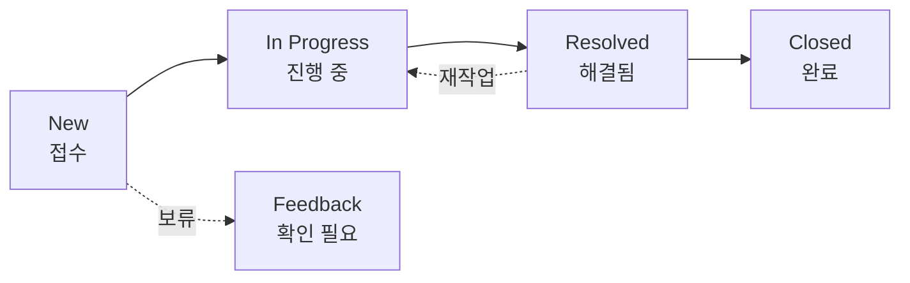

# 🟥 Redmine · 3단계 — 이슈(Issue) 다루기

> 🎯 **개요** — Redmine의 모든 것은 **이슈(Issue)** 한 장에서 시작합니다. 이슈 하나를 제대로 **만들고 · 채우고 · 상태를 바꿔** 끝까지 다뤄봅니다.

🎬 상황 · 첫 작업 등록
<ul>
<li>프로젝트는 만들었으니, 이제 실제 <b>할 일</b>을 올릴 차례입니다.</li>
<li>"플레이어 이동 기능을 만들자" — 이걸 <b>이슈 한 장</b>으로 등록합니다.</li>
<li>이슈가 New → 진행 중 → 완료로 흘러가는 한살이를 익힙니다.</li>
</ul>

📍 [← 2단계](Step2.md) · [4단계 →](Step4.md)

---

## A. 이슈 = 작업 1개

Trello의 카드, Asana의 태스크, Jira의 이슈와 **같은 역할**입니다 — "할 일 하나". Redmine에선 이슈마다 **고유 번호(#1, #2 …)** 가 자동으로 붙어 어디서나 그 번호로 부릅니다.

**`New issue`(새 이슈)** 를 누르고 아래를 채웁니다:

| 필드 | 뜻 | 예시 |
|---|---|---|
| **트래커(Tracker)** | 이슈 종류 | `Feature`(기능)·`Bug`(버그)·`Support`(지원) |
| **제목(Subject)** | 한 줄 요약 | `US-01 플레이어 이동` |
| **설명(Description)** | 무엇을·어디까지(완료조건) | 아래 B |
| **상태(Status)** | 지금 단계 | `New`(처음) |
| **우선순위(Priority)** | 급한 정도 | `Normal`(기본)·`High`·`Urgent` |
| **담당자(Assignee)** | 맡은 사람 | 본인 또는 팀원 |

> 🙋 **트래커 고르기** — "만들 것"은 `Feature`, "잘못된 것(결함)"은 `Bug`, "문의·요청"은 `Support`. 트래커가 뒤에서 **필터·통계의 기준**이 됩니다.

## B. 설명(Description)에 완료조건을 쓰기

제목은 "무엇"까지만 보입니다. **설명**에 "어디까지 하면 끝"을 적어야 개발이 헤매지 않아요. Redmine 설명칸은 **마크다운/Textile**을 지원합니다.

예) `US-01 플레이어 이동` 설명:
> **완료조건(AC)**: 방향키로 상하좌우 1칸 이동 · 벽 충돌 시 멈춤 · 턴제(한 번 입력=한 칸).

## C. 상태로 진행 표시하기 (이슈의 한살이)

이슈는 **상태(Status)** 를 바꾸며 흘러갑니다. 기본 흐름:

1. 일을 시작하면 이슈를 열어 **`상태`** 를 `In Progress`로
2. 다 하면 `Resolved` → 검토자가 확인하고 `Closed`
3. 진행 메모는 아래 **`코멘트`(Notes)** 에 남깁니다 → **`업데이트`(Submit)** 하면 **이력(History)** 에 누가·언제·무엇을 바꿨는지 전부 기록됩니다.

> 🙋 Redmine의 강점은 **이력**입니다. 상태·담당·필드를 바꿀 때마다 자동으로 남아, "이거 왜 이렇게 됐지?"를 나중에 추적할 수 있어요.

## D. 버그도 이슈 — 트래커만 `Bug`

QA가 결함을 찾으면 **트래커 `Bug`** 로 같은 방식으로 등록합니다.

예) 제목 `[v1.0.3] 스테이지 클리어 후 상점 UI가 안 열림` · 우선순위 `High`
> **재현**: 1) 스테이지 클리어 → 메인 홈  2) 상점 버튼 클릭 
> **기대**: 상점으로 이동해야 함 / **실제**: 버튼이 무반응

> 🔸 "만들 것(Feature)"과 "고칠 것(Bug)"은 트래커만 다를 뿐, 다루는 법은 똑같습니다.

---

## 🎮 현장 감각 — 게임 PM은 이렇게

> **Pixel Dungeon 맥락** 
> 도구가 달라도 "할 일 하나 = 이슈 한 장"이라는 원리는 같습니다. 
> Redmine은 이슈마다 번호(#12)가 붙어, 회의·커밋·문서 어디서든 "#12 끝났어요"처럼 부르기 좋습니다. 
> 상태를 그때그때 바꿔두면 보고를 따로 안 해도 진행이 보입니다.

**⚠️ 흔한 실수**
- 제목만 쓰고 **설명(완료조건) 공란** → 개발·아트가 제각각 해석해 재작업.
- 일하면서 **상태를 안 바꿈** → 보드가 거짓말이 됩니다. 시작하면 `In Progress`로.

**🎤 면접 한 줄**
> *"이슈에 **트래커·완료조건·우선순위**를 갖춰 등록하고, **상태(New→진행→완료)** 로 한살이를 관리했습니다."*

---

## ✅ 확인

- [ ] `Feature` 트래커로 `US-01 플레이어 이동` 이슈를 만들었다
- [ ] 설명에 **완료조건(AC)** 을 적었다
- [ ] 상태를 `In Progress`로 바꾸고 코멘트로 업데이트해봤다

---

👉 다음: **[4단계 · 상위/하위 이슈로 WBS](Step4.md)**
