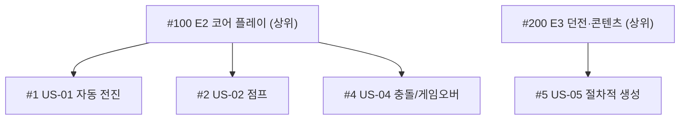

# 🟥 Redmine · 3단계 — 이슈와 WBS (상위/하위)

> 🎯 이번 단계 목표: **상위 이슈 아래 하위 이슈를 만들어 WBS를 구성한다.**
> 📍 [← 2단계](Step2.md) · 다음 [4단계 →](Step4.md)

---

Redmine엔 "에픽"이란 단어는 없지만, **상위 이슈 아래 하위 이슈**를 두면 똑같이 WBS가 됩니다.

## A. 상위 이슈(에픽 역할) 먼저

1. **`New issue`** → Tracker = `Feature`, Subject = `E2 코어 플레이` → Create
2. 같은 방식으로 `E3 던전·콘텐츠` 도

## B. 하위 이슈

1. **`New issue`** → Subject `US-01 자동 전진`
2. **`Parent task`**(상위 작업) 칸에 `E2 코어 플레이` 지정 ← 핵심!
3. US-01~04를 E2 아래, US-05~06을 E3 아래에 둡니다

> 🖼️ 공식 스크린샷 자리 — 이슈 + Parent task
> 출처: https://www.redmine.org/projects/redmine/wiki/RedmineIssues

> ✅ 상위 이슈를 열면 아래에 **Subtasks 목록**이 보입니다 = WBS 완성.

---

## ✅ 확인

- [ ] 상위 이슈 2개 + 하위 이슈가 있다
- [ ] 상위 이슈를 열면 하위 이슈 목록이 보인다

---

👉 다음: **[4단계 · 버전(마일스톤)](Step4.md)**
